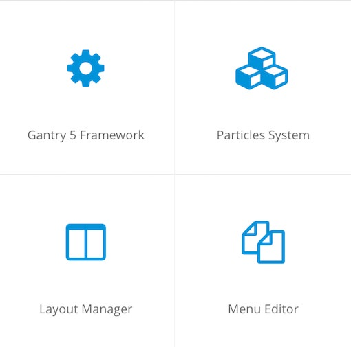
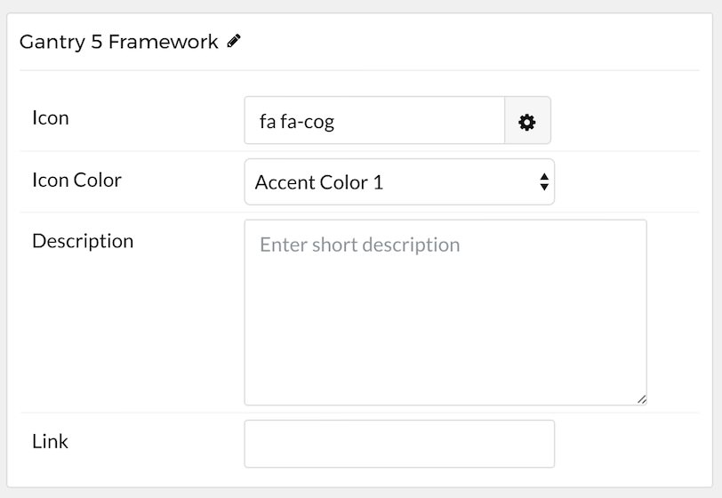

## Introduction

The **Grid Content** particle is a great way to create a clean and simple content with images and text. 

Grid Content items have a simple, yet robust layout that enables you to add a lot of different types of content in a single item. 

Here are the topics covered in this guide:

* [Configuration](#configuration)
    - [Main Options](#main-options)
    - [Item Options](#item-options)

## Configuration

### Main Options 

These options affect the main area of the particle, and not the individual items within. For example, if you want to display content that includes a title, headline, image, and link you can do so here, but if you want to display numerous individual items, each with their own text, images, and/or links, you can do so using the **Items** collection feature.

| Option         | Description                                                                                                                                              |
| :-----         | :-----                                                                                                                                                   |
| CSS Classes    | Enter the CSS class(es) you want to use in the content of the particle.                                                                                  |
| Title          | Enter the title of the particle, as it will appear on the front end.                                                                                     |
| Description    | Enter the text you wish to have appear as the description for the particle. This text appears below the title and headline.                              |
| Readmore Text  | Customize the text you want to have appear in the link button.                                                                                           |
| Readmore Link  | Customize the link you want the link button to go to.                                                                                                    |
| Readmore Style | Select a Button Style to use in the ReadMore button.                                                                                                     |
| Grid Column    | Set the number of column(s) you wish to have content appear on.                                                                                          |

### Item Options

These items make up the individual featured items in the particle. They sit apart from the particle's title, headline, image, and description. Each item can have its own properties, including images and written content.

| Option         | Description                                                                                                                                              |
| :-----         | :-----                                                                                                                                                   |
| Icon           | Select the icon you would like to have appear with the title area in the item.                                                                     |
| Icon Color     | Set the color you would like the icon to appear in.                                                                                                      |
| Description    | Enter a description for the item here, appears as paragraphed text.                                                                                      |
| Link           | Enter the url you want that link to go to.                                                                                                               |

