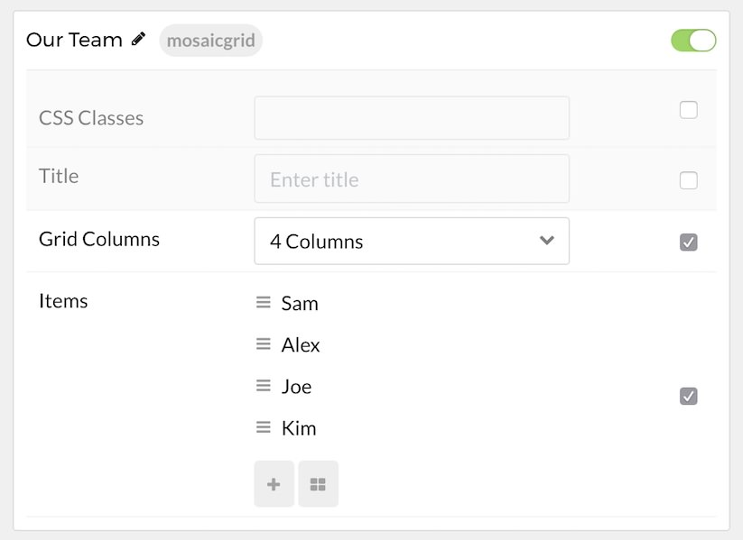
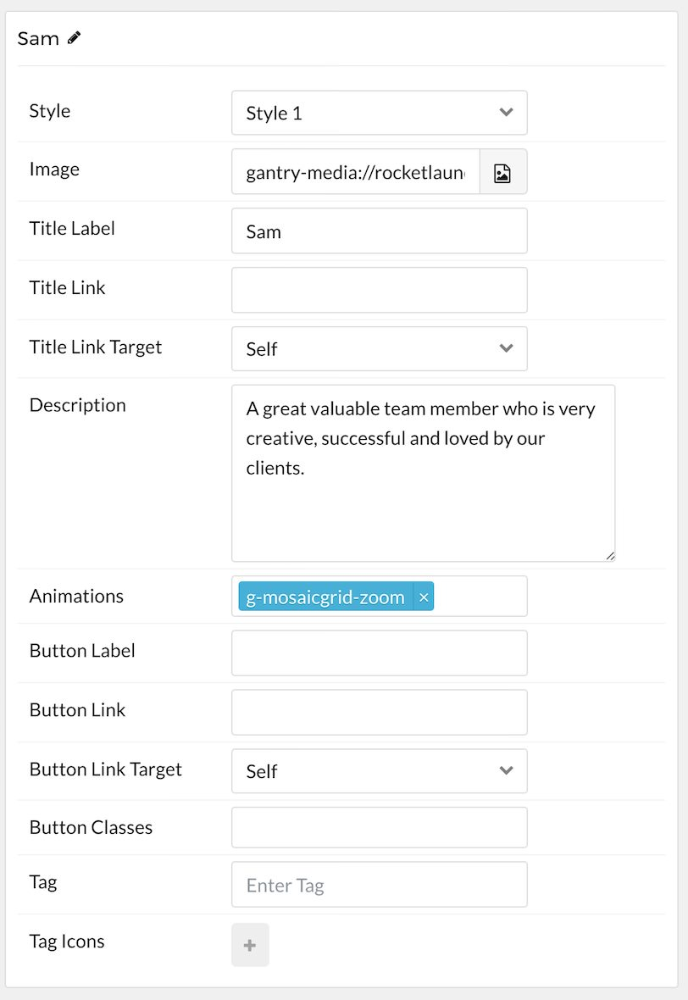

## Introduction

The **Mosaic Grid** particle 

Here are the topics covered in this guide:

* [Configuration](#configuration)
    - [Main Options](#main-options)
    - [Item Options](#item-options)
    - [Sub Item Options](#sub-item-options)

## Configuration

### Main Options 

These options affect the main area of the particle, and not the individual items within.

| Option        | Description                                                                               |
| :-----        | :-----                                                                                    |
| Particle Name | Sets the name for the particle that appears on the back end.                              |
| CSS Classes   | Enter any CSS class(es) that you would like to have apply to the particle's content here. |
| Title         | Enter a title here that will appear on the front end.                                     |
| Grid Columns  | Set the number of columns items appear in here.                                           |

### Item Options

Items in this particle are the actual individual columns. Any subitems you assign to these items are represented as rows in this column.

| Option             | Description                                                                            |
| :-----             | :-----                                                                                 |
| Style              | Select between available styles for the item.                                          |
| Image              | Select an image to add to the item.                                                    |
| Title Label        | Label the item, text in this field appears as the item's title.                        |
| Title Link         | Enter a URL here to make the title linkable.                                           |
| Title Link Target  | Choose between **self** and **new window** for the link's target.                      |
| Description        | This field is where the main content text for the item goes.                           |
| Animations         | Enter animation classes here which activate on hover. For example: `g-mosaicgrid-zoom` |
| Button Label       | Enter text to appear in the link button.                                               |
| Button Link        | Enter an URL where you would like the button to link to.                               |
| Button Link Target | Choose between **self** and **new window** for the button's target.                    |
| Button Classes     | Apply CSS class(es) to apply to the button.                                            |
| Tag                | Customize the tag for the item.                                                        |

### Sub Item Options

These options appear in the sub-items assigned to the columns. These are individual line items for the column.

| Option    | Description                                                  |
| :-----    | :-----                                                       |
| Icon      | Select a Font Awesome icon to apply to the item.             |
| Icon Text | If you would like text to accompany the icon, place it here. |
