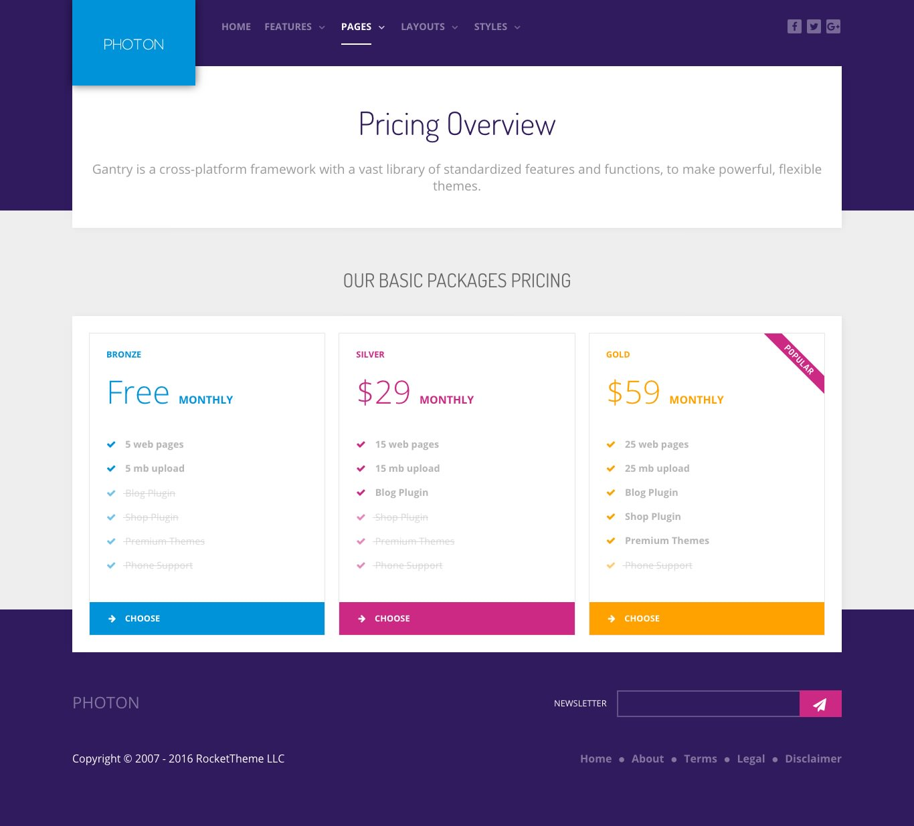

## Introduction

The **Pricing** example page demonstrates how you can create a beautiful page with the Photon theme. Here is some information to help you replicate this page as it appears in the demo.

## Modules and Particles

Below is a brief rundown of the widgets and particles used to make up the demo page.

:   1. **Header** Simple Content (particle) [7%, 5%, se]
    2. **FeatureBanner** Custom HTML (particle) [20%, 10%, se]
    3. **Feature** Pricing Table (particle) [50%, 10%, se]

* [Header](#above-section)
* [FeatureBanner](#featurebanner-section)
* [Feature](#feature-section)

# Header Section

This area of the page is a **Simple Content** particle. You will find the settings used in our demo below.

## Section Settings

| Field          | Setting |
| :-----         | :-----  |
| Layout         | Boxed   |
| CSS Classes    | Blank   |
| Tag Attributes | Blank   |

## Particle Settings

| Option                   | Setting                                                                                                                               |
| :-----                   | :-----                                                                                                                                |
| CSS Classes              | Blank                                                                                                                                 |
| Title                    | Blank                                                                                                                                 |
| Item 1 Name              | `Pricing Overview`                                                                                                                    |
| Item 1 Layout Style      | Blank                                                                                                                                 |
| Item 1 Created Date      | Blank                                                                                                                                 |
| Item 1 Content Title     | `Pricing Overview`                                                                                                                    |
| Item 1 Author            | Blank                                                                                                                                 |
| Item 1 Leading Content   | `Gantry is a cross-platform framework with a vast library of standardized features and functions, to make powerful, flexible themes.` |
| Item 1 Main Content      | Blank                                                                                                                                 |
| Item 1 Read More Label   | Blank                                                                                                                                 |
| Item 1 Read More Link    | Blank                                                                                                                                 |
| Item 1 Read More Classes | Blank                                                                                                                                 |
| Item 1 Target            | Self                                                                                                                                  |

## Block Settings

| Option         | Setting   |
| :-----         | :-----    |
| CSS ID         | Blank     |
| CSS Classes    | Blank     |
| Variations     | Blank     |
| Tag Attributes | Blank     |
| Fixed Size     | Unchecked |
| Block Size     | `100%`    |

# FeatureBanner Section

This area of the page is a **Custom HTML** particle. You will find the settings used in our demo below.

## Section Settings

| Field          | Setting |
| :-----         | :-----  |
| Layout         | Boxed   |
| CSS Classes    | Blank   |
| Tag Attributes | Blank   |

## Particle Settings

| Option                   | Setting                                                                                                                               |
| :-----                   | :-----                                                                                                                                |
| CSS Classes              | Blank                                                                                                                                 |
| Title                    | Blank                                                                                                                                 |
| Item 1 Name              | `Pricing Overview`                                                                                                                    |

**Custom HTML**

~~~ .html
<h3 class="g-title nomarginbottom nopaddingbottom">Our Basic Packages Pricing</h3>
~~~

## Block Settings

| Option         | Setting                            |
| :-----         | :-----                             |
| CSS ID         | Blank                              |
| CSS Classes    | `nomarginbottom` `nopaddingbottom` |
| Variations     | Blank                              |
| Tag Attributes | Blank                              |
| Fixed Size     | Unchecked                          |
| Block Size     | `100%`                             |

# Feature Section

This area of the page features a **Pricing Table** particle. You will find the settings used in our demo below.

## Section Settings

| Field          | Setting                   |
| :-----         | :-----                    |
| Layout         | Fullwidth (Boxed Content) |
| CSS Classes    | Blank                     |
| Tag Attributes | Blank                     |

## Particle Settings (First Pricing Table Particle)

| Option                 | Setting                                                                                                                            |
| :-----                 | :-----                                                                                                                             |
| Particle Name          | `Pricing Table`                                                                                                                    |
| CSS Classes            | `center` `g-title-large`                                                                                                           |
| Title                  | `Server Range Pricing`                                                                                                             |
| Header Text            | `Lorem ipsum dolor sit amet, consectetur adipiscing elit. Vestibulum nec leo dolor. Proin laoreet neque et nisi mollis consequat.` |
| Footer Text            | `  `                                                                                                                     |
| Grid Columns           | 3 Columns                                                                                                                          |
| Item 1 Name            | `Bronze`                                                                                                                           |
| Item 1 Accent Color    | Accent Color 1                                                                                                                     |
| Item 1 Custom Color    | Blank                                                                                                                              |
| Item 1 CSS Classes     | Blank                                                                                                                              |
| Item 1 Ribbon Text     | Blank                                                                                                                              |
| Item 1 Icon            | Blank                                                                                                                              |
| Item 1 Price           | `Free`                                                                                                                             |
| Item 1 Period          | `monthly`                                                                                                                          |
| Item 1 Description     | Blank                                                                                                                              |
| Item 1 Button Label    | `Choose`                                                                                                                           |
| Item 1 Button Link     | `#`                                                                                                                                |
| Item 1 Target          | Self                                                                                                                               |
| Button Classes         | Blank                                                                                                                              |
| Subitem 1 Name         | `Item 1`                                                                                                                           |
| Subitem 1 Text         | `5 web pages`                                                                                                                      |
| Subitem 1 Item Classes | `g-bold`                                                                                                                           |

## Block Settings

| Option         | Setting   |
| :-----         | :-----    |
| CSS ID         | Blank     |
| CSS Classes    | Blank     |
| Variations     | `Center`  |
| Tag Attributes | Blank     |
| Fixed Size     | Unchecked |
| Block Size     | `100%`    |