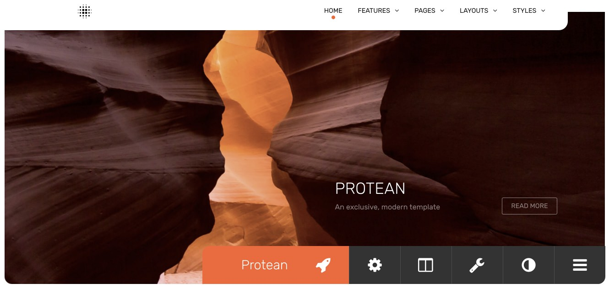

Introduction
-----

Protean is an exclusive, modern design suited for product showcases, company profiles, and professional portfolios. It features an array of easy-to-navigate particles designed to let you swipe, tab, and slide your way through your content.

Requirements
-----

* PHP 5.5.9 or higher
* Grav 1.1.9+

>> NOTE: Gantry v5.4.1+ is required for Protean to work correctly. For more details on the Gantry Framework, please visit its [Dedicated Website](http://gantry.org).

Key Features
-----

* Responsive Layout
* 6 Preset Styles
* Block Variations
* Custom Typography
* Unlimited Positions
* Popup Module
* Custom Particles
* Social Icons
* Mobile Menu
* Coming Soon Page
* Font Awesome Icons 
* YAML-based Configuration
* Twig Templating
* Powerful Particle System
* Visual Menu Editor
* MegaMenu Support
* Off-Canvas Panel
* Ajax Admin
* Layout Manager
* Inheritance System
* Fluid Width Option
* Fixed Width Option
* SCSS Support
* Sophisticated Fields
* Unlimited Undo/Redo
* Styles Panel

## Inheritance

Protean takes full advantage of Gantry’s new inheritance system, making it easier than ever to configure and manage your website through synced particles, atoms, sections, and layouts. Save time by using inheritance to avoid repetitive changes!

## Typography

Typography is an important instrument in not only the site design, but how your content is portrayed and utilized by your visitors. Therefore, Protean offers a rich selection of elegant typography to provide focus to varying content types.

## Responsive

Protean is a responsive theme which means it adapts to the viewing device's width, such as mobile, tablet or desktop. Mobile modes have a unique menu to aid usability. Support classes can also be used to display or hide various types of content for each device.
