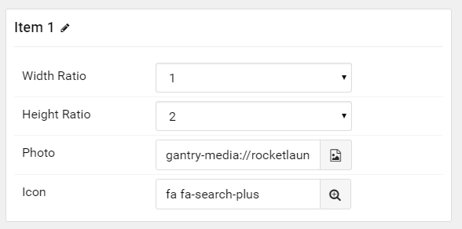

## Introduction

The **Photo Collage** particle displays images in a fun, modern collage.

Here are the topics covered in this guide:

* [Configuration](#configuration)
    - [Main Options](#settings)
    - [Item Options](#particle-item-options)
    - [Posts](#posts)
    - [Display](#display)

## Configuration

### Settings 

These options affect the main area of the particle, and not the individual items within.

| Option         | Description                                                                                         |
| :-----         | :-----                                                                                              |
| Particle Name  | This is the name of the particle used for back end management. It does not appear on the front end. |
| CSS Classes    | Enter any CSS class(es) you wish to have apply to the particle.                                     |
| Content Source | Choose between **Particle** and **Grav** as the Content Source.                                   |
| Title          | Enter a title for the particle that appears on the front end.                                       |
| Item Spacing   | Set a custom amount of spacing between items.                                                       |

### Particle Item Options

These items make up the individual featured items in the particle. 

| Option       | Description                                                   |
| :-----       | :-----                                                        |
| Width Ratio  | Set the width ratio. (Appears only on large desktops.)        |
| Height Ratio | Set the height ratio. (Appears on all devices except mobile.) |
| Photo        | Select a photo to display as the item.                        |
| Icon         | Set an icon to appear when you hover over the image.          |

### Posts

| Option             | Description                                                                                  |
| :-----             | :-----                                                                                       |
| Categories         | Select the categories of posts this particle will display.                                   |
| Posts              | Select the number of posts you would like the particle to fetch.                             |
| Sticky Posts       | **Hide** or **Show** **Sticky** posts.                                                       |
| Number of Posts    | Enter the maximum number of posts to display.                                                |
| Start From         | Enter offset specifying the first article to return. The default is '0' (the first article). |
| Order By           | Choose the type of factor to order by.                                                       |
| Ordering Direction | Choose between **Ascending** and **Descending** as the article ordering method.              |

### Display

This section configures how posts are displayed.

| Option      | Description                                                    |
| :-----      | :-----                                                         |
| Image       | Select which image in an article should be displayed.          |
| Title       | Choose whether or not the title of an article should be shown. |
| Title Limit | Set a character limit for titles.                              |

>> Note: When using Grav Content source, images can utilize the **Width** and **Height** options by creating a new Tag such as **width-2** and/or **height-2** for the page you are using.
