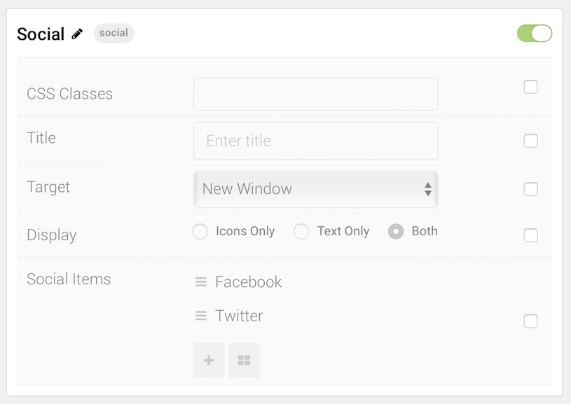

## Introduction

The **Social** particle displays social media links, along with icons, in a simple and easy-to-use way.

Here are the topics covered in this guide:

* [Configuration](#configuration)
    - [Main Options](#main-options)
    - [Item Options](#item-options)

## Configuration

### Main Options 

These options affect the main area of the particle, and not the individual items within.

| Option        | Description                                                                                 |
| :-----        | :-----                                                                                      |
| Particle Name | Enter the name you would like to assign to the particle. This only appears in the back end. |
| CSS Classes   | Enter the CSS class(es) you want to use in the content of the particle.                     |
| Title         | Enter a title for the particle.                                                             |
| Target        | Choose the target window you want any link(s) to go to.                                     |
| Display       | Choose to display only icons, text, or both.                                                |

### Item Options

These items make up the individual featured items in the particle.

| Option    | Description                                                                             |
| :-----    | :-----                                                                                  |
| Item Name | Enter the name you would like to assign to the item. This only appears in the back end. |
| Icon      | Select an icon to use for the item.                                                     |
| Text      | Enter any text you want to have appear in the item.                                     |
| Link      | Enter a URL you want the item to link to.                                               |

