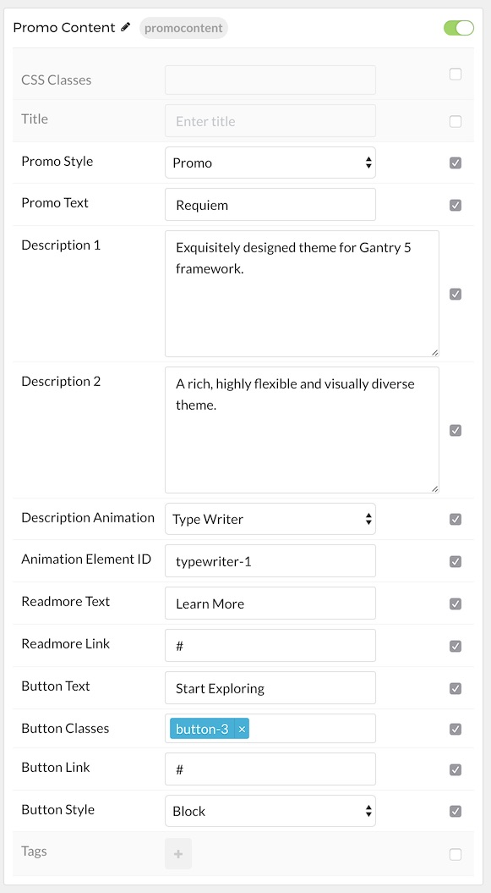
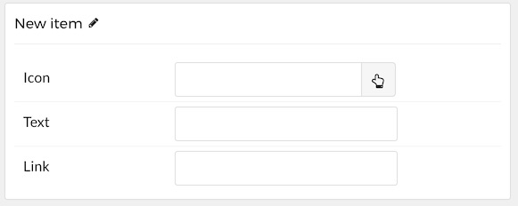

## Introduction

The **Promo Content** particle is a great way  

Here are the topics covered in this guide:

* [Configuration](#configuration)
    - [Main Options](#main-options)
    - [Item Options](#item-options)

## Configuration

### Main Options 

These options affect the main area of the particle, and not the individual items within. For example, if you want to display content that includes a title, headline, image, and link you can do so here, but if you want to display numerous individual items, each with their own text, images, and/or links, you can do so using the **Promo Items** collection feature.

| Option                | Description                                                                                                                                                      |
| :-----                | :-----                                                                                                                                                           |
| CSS Classes           | Enter the CSS class(es) you want to use in the content of the particle.                                                                                          |
| Title                 | Enter the title of the particle, as it will appear on the front end.                                                                                             |
| Icon                  | Set the icon that appears next to the title.                                                                                                                     |
| Promo Style           | Select a promo style between: **Standard**, **Promo**, **Super Promo**, and **SubPromo**.                                                                        |
| Promo Text            | Enter text to appear.                                                                                                                                            |
| Description 1         | Enter a description.                                                                                                                                             |
| Description 2         | Enter a secondary description.                                                                                                                                   |
| Description Animation | Select an animation setting. Choose between: **Type Writer** and **No Animation**                                                                                |
| Animation Element ID  | If you choose **Type Writer** animation, please put unique Element ID to differ it with another same particle. For example: `typewriter-1`, `typewriter-2`, etc. |
| Readmore Text         | Enter the text you wish to have appear as the description for the particle. This text appears below the title and headline.                                      |
| Readmore Link         | Customize the link you want the link readmore to go to.                                                                                                          |
| Button Text           | Enter a text label for the alt button.                                                                                                                           |
| Button Classes        | Enter any class(es) you want to have apply to the button.                                                                                                        |
| Button Link           | Enter a link the alt button will go to.                                                                                                                          |
| Button Style          | Choose between **Block**, **Inline**, and **Aside** as a button style.                                                                                           |

### Tag Options

These items make up the individual tags applied to the particle.

| Option | Description                                                                          |
| :----- | :-----                                                                               |
| Icon   | Select the icon you would like to have appear with the title area in the promo item. |
| Text   | Enter the text for the promo item.                                                   |
| Link   | Enter the url you want that link to go to.                                           |

