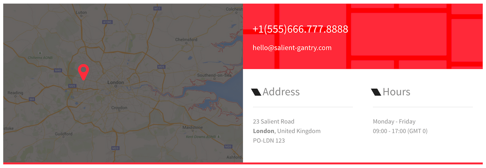
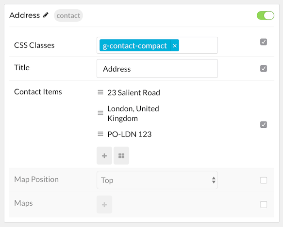
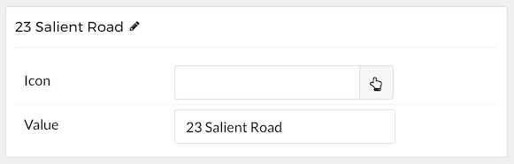
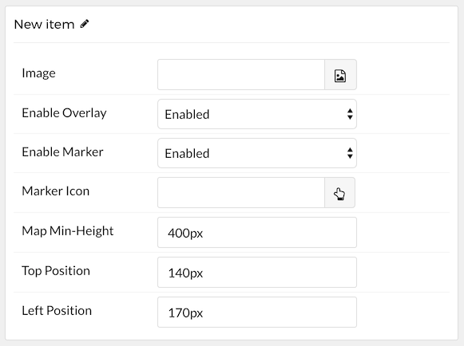

## Introduction

The **Contact** particle enables you to easily display contact information on your site..

Here are the topics covered in this guide:

* [Configuration](#configuration)
    - [Main Options](#main-options)
    - [Item Options](#item-options)
    - [Map Options](#map-options)

## Configuration

### Main Options 

These options affect the main area of the particle, and not the individual items within.

| Option        | Description                                                                                 |
| :-----        | :-----                                                                                      |
| Particle Name | Enter the name you would like to assign to the particle. This only appears in the back end. |
| CSS Classes   | Enter the CSS class(es) you want to use in the content of the particle.                     |
| Title         | Enter a title for the particle.                                                             |
| Map Position  | Determine where in the particle the map will appear.                                        |

### Item Options

These items make up the individual featured items in the particle.

| Option            | Description                                                                           |
| :-----            | :-----                                                                                |
| Item Name         | Enter the name you would like to assign to the item.                                  |
| Icon              | Select an icon to appear next to the item.                                            |
| Value             | Enter the information that makes up the item's value.                                 |

### Map Options

| Option         | Description                                                        |
| :-----         | :-----                                                             |
| Image          | Select an image to serve as the map.                               |
| Enable Overlay | **Enable** or **Disable** the map's overlay.                       |
| Enable Marker  | **Enable** or **Disable** the map's marker.                        |
| Marker Icon    | Select an icon to be used as the marker.                           |
| Map Min-height | Select a minimum height (in pixels) for the map.                   |
| Top Position   | Enter the number (in pixels) from the top the marker will appear.  |
| Left Position  | Enter the number (in pixels) from the left the marker will appear. |
