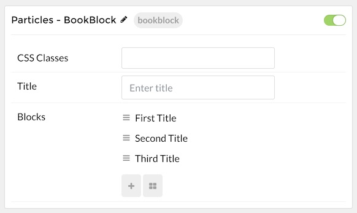
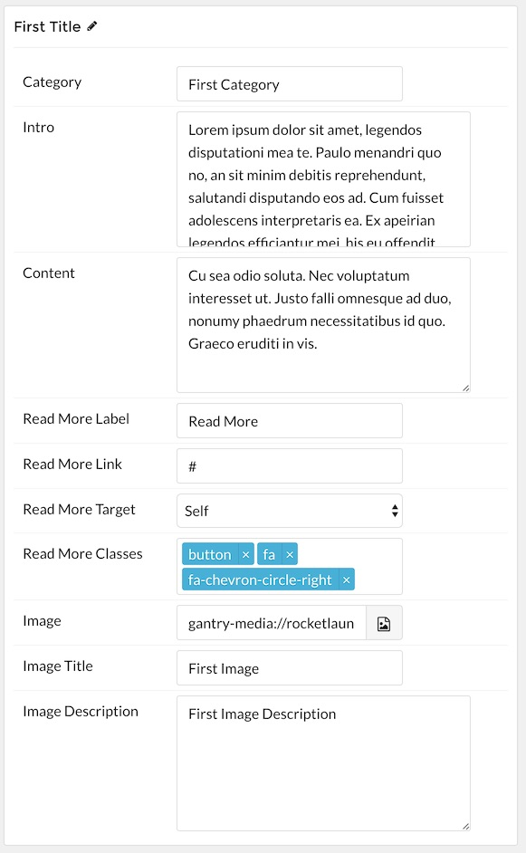

## Introduction

The **BookBlock** particle enables you to present content in a way that mimics a book, with its own page turning animation and plenty of room for written and visual content.

Here are the topics covered in this guide:

* [Layout](#layout)
    - [Particle Content](#particle-content)
* [Configuration](#configuration)
    - [Main Options](#main-options)
    - [Item Options](#item-options)

## Layout

BookBlock items have a simple, yet robust layout that enables you to add a lot of different types of content in a single item. Each item spans both sides - or pages if you prefer - of the particle's layout.

### Particle Content

:   1. **Item - Category** [5%, 2%, se]
    2. **Item - Intro** [27%, 2%, se]
    3. **Item - Content** [48%, 2%, se]
    4. **Item - Read More Label** [60%, 2%, se]
    5. **Item - Image** [2%, 53%, se]
    6. **Item - Image Title** [73%, 65%, se]
    7. **Item - Image Description** [85%, 66%, se]
    8. **Item - Name** [12%, 2%, se]

One important thing is that the name of the item becomes the big title you see in the upper-left area of the particle on the front end. This is in contrast to most particles where the name is a simple reference you only see on the back end.

The rest of this content is set up as an item. Items can be added in the **Block** section of the particle's settings panel. Find out more about [item settings for this particle here](#item-options)

## Configuration

### Main Options 

| Option          | Description                                                                                         |
| :-----          | :-----                                                                                              |
| CSS Classes     | Sets the CSS class for the content of the particle.                                                 |
| Title           | Sets the title of the particle, as it will appear on the front end.                                 |

### Item Options

| Option            | Description                                                                                     |
| :-----            | :-----                                                                                          |
| Category          | Enter the category you would like to appear in the particle.                                    |
| Intro             | Enter the introductory text you would like to appear in the particle.                           |
| Content           | Enter the content you would like to appear in the particle.                                     |
| Read More Label   | Enter the text you would like to have link to the link you set in the **Read More Link** field. |
| Image             | Select the image you would like to have appear on the right side of the particle.               |
| Image Title       | Enter a title for the image. This appears below the image.                                      |
| Image Description | Enter a description for the image. This appears right below the title under the image.          |
| Particle Name     | Enter a name for the item. This name appears on the front end.                                  |