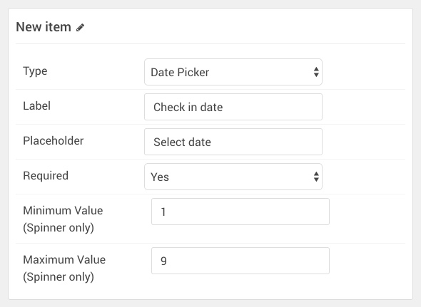

## Introduction

The **Booking Form** particle is a Simple Form powered form enabling visitors to contact you about booking and availability. This is especially useful for hotels, event venues, and other businesses that regularly take reservations.

Of course, like any particle, this can also be customized to connect to any number of different booking systems with a little know-how. By default, it uses the Simple Form service which is a clean, simple way to receive contact information and gather other details about your customer's interest in your products/services. Simple Form will email you each time the form is filled out and submitted by a visitor, along with the information you need to set up reservations.

You will need a Simple Form token in order for this particle to work. You can get one from [Simple Form's website](https://getsimpleform.com/) with your email address. They will email a token to you, and you can easily insert it into the **Simple Form Token** field of the particle. Once this is done, any submissions will be emailed to you as well as made available through the Simple Form website in a private link emailed along with your token.

Here are the topics covered in this guide:

* [Layout](#layout)
    - [Particle Content](#particle-content)
* [Configuration](#configuration)
    - [Main Options](#main-options)
    - [Item Options](#item-options)

## Layout

Booking Form particles generally host most of the important content in its items, with the ability to set a label, field type, and more.

### Particle Content

:   1. **Item - Label** [25%, 13%, sw]
    2. **Item - Type - Date Picker** [50%, 4%, se]
    3. **Item - Type - Number Input** [50%, 61%, se]
    4. **Submit Button 1** [50%, 81%, se]

## Configuration

### Main Options 

These options affect the main area of the particle, and not the individual items within. You can set the title of the particle, as well as give it an introductory paragraph here.

| Option            | Description                                                                                                                                                        |
| :-----            | :-----                                                                                                                                                             |
| Simple Form Token | Enter the token you received from the [Simple Form](https://getsimpleform.com/) website here. This tells the particle which account to send the submitted form to. |
| CSS Classes       | Add any CSS classes you wish to have apply to the particle.                                                                                                        |
| Submit Button 1   | This sets the text that appears in the initial submission button which brings up the email and name fields.                                                        |
| Submit Button 2   | This sets the text that appears in the final submit button that submits the form.                                                                                  |
| Name Label        | This is where you put the front end label that appears next to the **Name** field in the form prior to submitting.                                                 |
| Name Placeholder  | You can set a default placeholder text that appears in the **Name** field here unless altered by the visitor.                                                      |
| Email Label       | This is where you put the front end label that appears next to the **Email** field in the form prior to submitting.                                                |
| Email Placeholder | You can set a default placeholder text that appears in the **Email** field here unless altered by the visitor.                                                     |
| Thank You Message | Enter text that appears once the form is submitted here.                                                                                                           |
| Error Message     | Enter text that appears in the event of an error in the form here.                                                                                                 |

### Item Options

These items make up the individual featured items in the particle. They sit apart from the particle's title and introduction. Each item can have its own properties. 

These items are each part of the whole particle. Essentially, a single item is a single question you want to have answered by the visitor submitting the form. The date of arrival, departure, number of people, etc. are all individual items.

| Option        | Description                                                                                                                               |
| :-----        | :-----                                                                                                                                    |
| Name          | Set the name of the item you wish to use for backend reference. This does not appear on the front end.                                    |
| Type          | Set the type of picker the item will have. You can choose between **Text**, **Number Input** (with spinners), and **Date**.               |
| Label         | This is the label for the item that appears in the front end.                                                                             |
| Placeholder   | Placeholders are useful if you have a common default answer you want to place in the field in the event the user doesn't state otherwise. |
| Required      | This sets whether or not the item is required to be set by the user before the form can be submitted.                                     |
| Minimum Value | Only used for **Number Input** item types, this enables you to set a minimum value for the number spinner.                                |
| Maximum Value | Only used for **Number Input** item types, this enables you to set a maximum value for the number spinner.                                |

If you would like help customizing the email template that is sent to you whenever a visitor fills out the form, please check out our [documentation](howto_customize_email.md).

