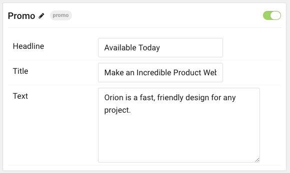

## Introduction

The **Promo** particle is a great way to create a simple, promotional image and text content block on your site.

Here are the topics covered in this guide:

- [Introduction](#introduction)
- [Configuration](#configuration)
  - [Main Options](#main-options)

## Configuration

### Main Options 

| Option        | Description                                                                                 |
| :------------ | :------------------------------------------------------------------------------------------ |
| Particle Name | Enter the name you would like to assign to the particle. This only appears in the back end. |
| Headline      | Enter a headline to appear over the main title.                                             |
| Title         | Enter a title to make up the largest text in the promo.                                     |
| Text          | Enter text to appear below the title.                                                       |
