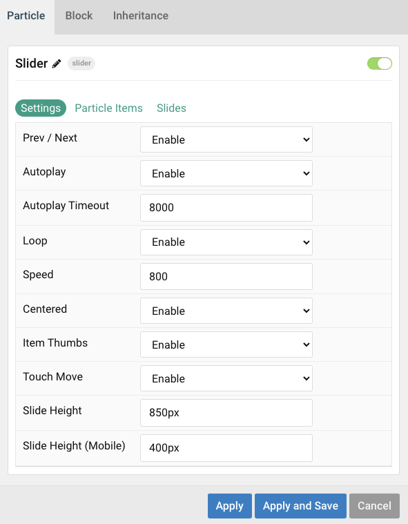
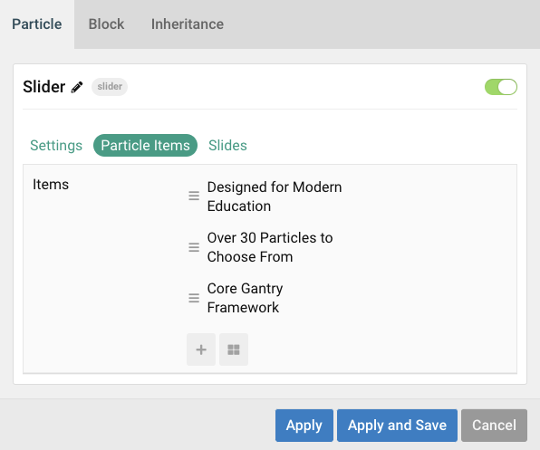

## Introduction

The **Slider** particle is a great way to display images in your website.

Here are the topics covered in this guide:

- [Configuration](#configuration)
  - [Settings](#settings)
  - [Particle Item Options](#particle-item-options)
  - [Articles](#articles)
  - [Display](#display)

## Configuration

### Settings 

These options affect the main area of the particle, and not the individual items within.

| Option           | Description                                                                                         |
| :-----           | :-----                                                                                              |
| Particle Name         | This is the name of the particle used for back end management. It does not appear on the front end.             |
| Autoplay              | **Enable** or **Disable** autoplay for the particle.                                                            |
| Autoplay Timeout      | Set the time (in milliseconds) between slides in autoplay mode.                                                 |
| Loop                  | **Enable** or **Disable** looping slides.                                                                       |
| Speed                 | Set the transition speed (in milliseconds).                                                                     |
| Centered              | **Enable** or **Disable** centered slides.                                                                      |
| Item Thumbs           | **Enable** or **Disable** slider thumbnails.                                                                    |
| Touch Move            | **Enable** or **Disable** touch movements.                                                                      |
| Slide Height            | Set the minimum slide height.                                                                                 |
| Slide Height (Mobile)            | Set the minimum slide height for mobile devices.                                                     |

### Particle Item Options

These items make up the individual featured items in the particle. Items in this section will only appear if **Particle** is selected as the **Content Source**.

| Option                 | Description                                                      |
| :-----                 | :-----                                                           |
| Headline             	 | This is the headline of the item.                                |
| Icon             	     | Select an icon to appear in the slide.                           |
| Image                  | Select an image to appear in the slide.                          |
| Link                   | Enter a URL you would like the item to link to.                  |
| Link label             | Set a link label.                                                |
| Link Target            | Choose the target tab you would like the URL to open to.         |