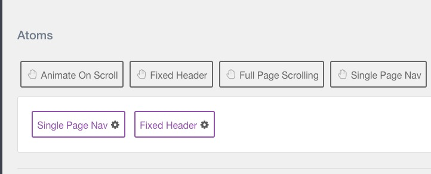

Single Page Nav Atom
---------

<a href="https://github.com/ChrisWojcik/single-page-nav">Single Page Nav</a> is a JS library that scrolls to a section on your one page website when you click on a menu item. 

For a demonstration, please visit our <a href="https://getgrav.org/#why_grav">GetGrav.org website</a>.

To initialize the library, go to your Base Outline > Page Settings and drag the Single Page Nav atom into the dock. You can then save the Page Settings.

>> NOTE: This atom works best with the Fixed Header atom so as to allow the user to visit additional sections on the page by clicking on each menu item.

By clicking on the atom, you will find the Global settings to be used for your Single Page Nav elements:

| Option           | Description                                                                                             |
| :-----           | :-----                                                                                                  |
| Section          | Define the ID or class of the section or menu where you want to target the single page nav. 			 |
| Offset           | Enable or disable offset (best used for fixed header nav).	                      	                     |
| Current Class    | The class to apply to the menu item link corresponding to the active section on the page.               |
| Update Hash      | Update URL with Hash in address bar when item is selected.                    						     |
| Speed            | Speed of the scroll on click (ms).                                                                      |
| Filter Class(es) | Name of selector in section or menu that should NOT use the Single Page Nav atom (separate multiple selectors by commas).     |

Setting Up
---------
Once the atom is in place, and you have decided what section you want to use (in this case we use the navigation section), then you can start setting up the menu items (or logo) with the corresponding sections on the page.

In this case in Grav, I've set the logo to the **#g-slideshow** section:

And I've set all the Pages for the menu to external_url as shown (via default.md):

Filter Class
---------

As shown in the settings screenshot, I've set `.g-social a` as one of the Filter Classes, so the social particle links will still work. Any link in the section that is not used for the purpose of this atom should be filtered.

Current Class
---------

The Current Class setting will specifically add a class to the menu item link when you are currently visting that section:

You can change the class name to whatever you want and then add any specific styling you would like to it.