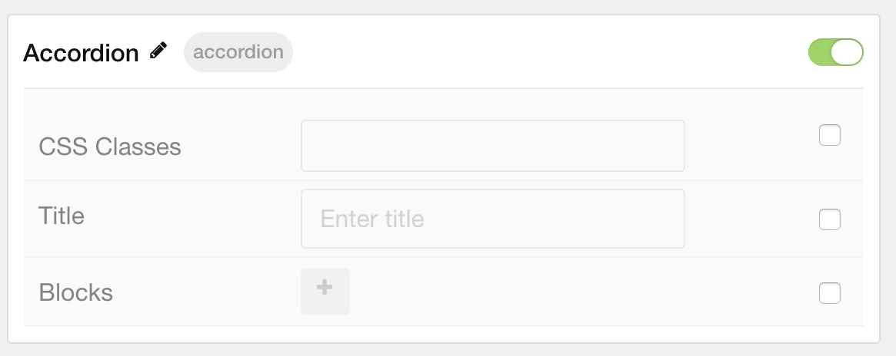

## Introduction

The **Accordion** particle enables you to display one or more items in a single column.

Here are the topics covered in this guide:

* [Configuration](#configuration)
    - [Main Options](#main-options)
    - [Item Options](#item-options)

### Main Options 

| Option         | Description                                                           |
| :-----         | :-----                                                                |
| CSS Classes    | Sets the CSS class for the content of the particle.                   |
| Title          | Sets the title of the particle, as it will appear on the front end.   |

### Item Options

| Option         | Description                                                               |
| :-----         | :-----                                                                    |
| Description    | Enables you to enter a descriptive paragraph to be displayed in the item. |
| Button Label   | Enter a text label that will appear as the link in the item.              |
| Button Link    | Set a link you would like the item to connect to.                         |
| Target         | Choose a target (self or new window) for the link.                        |
| Button Classes | Enter any CSS class(es) you would like to have apply to the button link.  |
