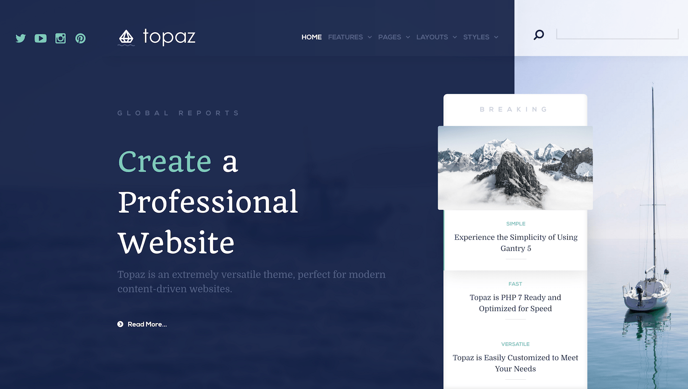

Introduction
-----

Topaz is a modern, professional theme that combines simplicity and elegance. It features a range of beautifully-designed particles that bring out the best in your content, a perfect choice for individuals, professionals and corporations alike.

Requirements
-----

* PHP 7.1 or higher
* Grav 1.1.9+

>> NOTE: Gantry v5.4.1+ is required for Topaz to work correctly. For more details on the Gantry Framework, please visit its [Dedicated Website](http://gantry.org).

Key Features
-----

### Included Particles

* Accordion
* Block Content
* BookBlock
* Contact Form
* Grav Content
* Grid Content
* Grid Statistic
* Image Grid
* Info List
* Logo / Image
* Menu
* Mobile Menu
* Newsletter
* Owl Carousel
* Pricing Table
* Simple Content
* Simple Counter
* Simple Menu 

### Theme Features

* Responsive Layout
* 6 Preset Styles
* Block Variations
* Custom Typography
* Unlimited Positions
* Custom Particles
* Social Icons
* Mobile Menu
* Coming Soon Page
* Font Awesome Icons 

### Gantry Core Features

* YAML-based Configuration
* Twig Templating
* Powerful Particle System
* Visual Menu Editor
* MegaMenu Support
* Off-Canvas Panel
* Ajax Admin
* Layout Manager
* Inheritance System
* Fluid Width Option
* Fixed Width Option
* SCSS Support
* Sophisticated Fields
* Unlimited Undo/Redo
* Styles Panel

## Particles

This theme features a versatile and diverse catalog of particles, to enrich your site content. Besides adding the brandnew BookBlock and Grav Pages particles, we have also restyled some of our existing particles, such as the Grid Statistic.

## Typography

Typography is an important instrument in not only the site design, but how your content is portrayed and utilised by your visitors. Therefore, Topaz offers a rich selection of elegant typography to provide focus to varying content types.

## Responsive

Topaz is a responsive theme which means it adapts to the viewing device's width, such as mobile, tablet or desktop. Mobile modes have a unique menu to aid usability. Support classes can also be used to display or hide various types of content for each device.
