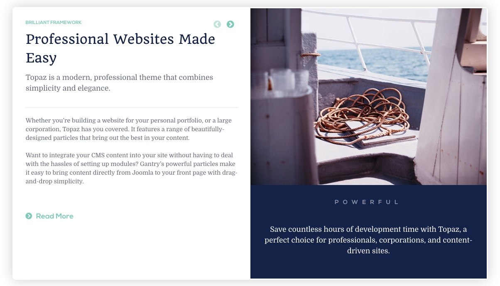
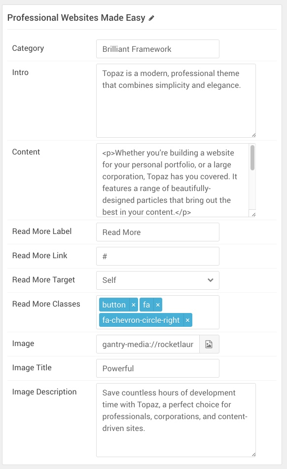
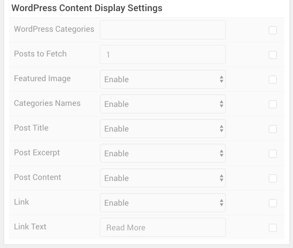

## Introduction

The **BookBlock** particle enables you to present content in a way that mimics a book, with its own page turning animation and plenty of room for written and visual content.

Here are the topics covered in this guide:

* [Layout](#layout)
    - [Particle Content](#particle-content)
    - [CMS Content](#cms-content)
* [Configuration](#configuration)
    - [Main Options](#main-options)
    - [Item Options](#item-options)
    - [CMS Options](#cms-options)

## Layout

BookBlock items have a simple, yet robust layout that enables you to add a lot of different types of content in a single item. Each item spans both sides - or pages if you prefer - of the particle's layout. There is, of course, a difference in how this content is sourced depending on whether you are using items created in the particle's settings panel, or from the CMS.

### Particle Content

:   1. **Item - Category** [5%, 5%, se]
    2. **Item - Intro** [27%, 5%, se]
    3. **Item - Content** [43%, 5%, se]
    4. **Item - Read More Label** [77%, 5%, se]
    5. **Item - Image** [5%, 53%, se]
    6. **Item - Image Title** [67%, 65%, se]
    7. **Item - Image Description** [75%, 53%, se]
    8. **Item - Name** [15%, 5%, se]

One important thing to note when using **Particle** as the **Content Source** is that the name of the item becomes the big title you see in the upper-left area of the particle on the front end. This is in contrast to most particles where the name is a simple reference you only see on the back end.

The rest of this content is set up as an item. Items can be added in the **Block** section of the particle's settings panel. Find out more about [item settings for this particle here](#item-options).

### CMS Content

:   1. **Item - Category** [5%, 5%, se]
    2. **Item - Intro** [27%, 5%, se]
    3. **Item - Content** [43%, 5%, se]
    4. **Item - Read More Label** [77%, 5%, se]
    5. **Item - Intro Image** [5%, 53%, se]
    6. **Item - Intro Image Alt Text** [67%, 65%, se]
    7. **Item - Intro Image Caption** [75%, 53%, se]
    8. **Item - Title** [15%, 5%, se]

When **Grav** is selected as the **Content Source**, the article's title becomes the big title in the upper-left area of the particle. The text under the image to the right is made up of the **Alt Text** and **Image Caption** for the **Intro Image** that is assigned to the article.

## Configuration

### Main Options 

| Option          | Description                                                                                         |
| :-----          | :-----                                                                                              |
| CSS Classes     | Sets the CSS class for the content of the particle.                                                 |
| Content Source  | Select **Particle** or **Grav** to determine where particle content is pulled from.               |
| Title           | Sets the title of the particle, as it will appear on the front end.                                 |

### Item Options

These items only appear on the front end if you select **Particle** as the **Content Source**.

| Option            | Description                                                                                                     |
| :-----            | :-----                                                                                                          |
| Category          | Enter the category you would like to appear in the particle.                                                    |
| Intro             | Enter the introductory text you would like to appear in the particle.                                           |
| Content           | Enter the content you would like to appear in the particle.                                                     |
| Read More Label   | Enter the text you would like to have link to the link you set in the **Read More Link** field.                 |
| Read More Link    | Enter a URL you would like the read more link to go to.                                                         |
| Read More Target  | Enter the target you would like the read more link to be opened to. You can choose: **Self** or **New Window**. |
| Read More Classes | Enter the CSS class(es) you would like to have applied to the item.                                             |
| Image             | Select the image you would like to have appear on the right side of the particle.                               |
| Image Title       | Enter a title for the image. This appears below the image.                                                      |
| Image Description | Enter a description for the image. This appears right below the title under the image.                          |
| Particle Name     | Enter a name for the item. This name appears on the front end.                                                  |

### CMS Options

These options are only useful if you select **Grav** as the **Content Source**.

| Option               | Description                                                                                                    |
| :-----               | :-----                                                                                                         |
| Grav Categories | Enter the categorie(s) you would like to appear in the particle.                                               |
| Posts to Fetch       | Enter the number of posts you would like to have loaded in the particle.                                       |
| Featured Image       | Enable or disable the featured image appearing in the particle.                                                |
| Categories Names     | Enable or disable the category of the article in the particle.                                                 |
| Post Title           | Enable or disable the title of the post appearing in the particle.                                             |
| Post Excerpt         | Enable or disable the content placed in the **Post Excerpt** area of the post to be displayed in the particle. |
| Post Content         | Enable or disable the main content of the post appearing under the image in the particle.                      |
| Link                 | Enable or disable the read more link.                                                                          |
| Link Text            | Enter the text you would like to appear in the Read More link.                                                 |
