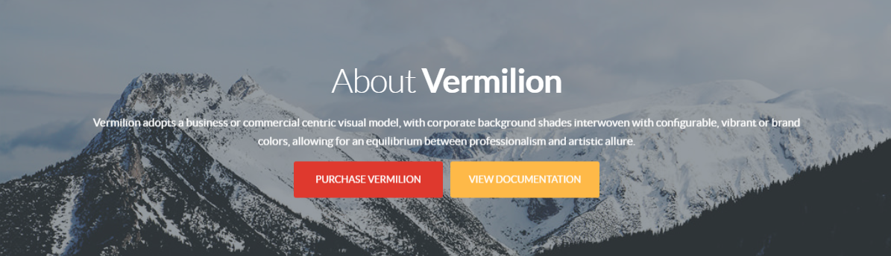

## Introduction

The **Showcase** particle introduces your brand to new visitors in a bold, revealing content block.

Here are the topics covered in this guide:

* [Configuration](#configuration)
    - [Main Options](#settings)
    - [Item Options](#particle-item-options)

## Configuration

### Settings 

These options affect the main area of the particle, and not the individual items within.

| Option        | Description                                                                                         |
| :-----        | :-----                                                                                              |
| Particle Name | This is the name of the particle used for back end management. It does not appear on the front end. |
| Promo         | Enter a Non-bold piece of promo text to appear as the big title for the particle.                   |
| Promo Bold    | Enter a bolded piece of promo text appearing as the big title for the particle.                     |
| Description   | Enter an HTML-enabled description to appear when you hover over the particle.                       |
| Link          | Enter the URL you would like the first button to go to.                                             |
| Link Text     | Enter any text you want to appear in the first button.                                              |
| Target        | Choose whether to have this link open in a **New Window** or **Self**.                              |
| Button Class  | Set a CSS Class for the second button. For example: `readon`.                                       |
| Link          | Enter the URL you would like the second button to go to.                                            |
| Link Text     | Enter any text you want to appear in the second button.                                             |
| Target        | Choose whether to have this link open in a **New Window** or **Self**.                              |
| Button Class  | Set a CSS Class for the second button. For example: `readon2`.                                      |