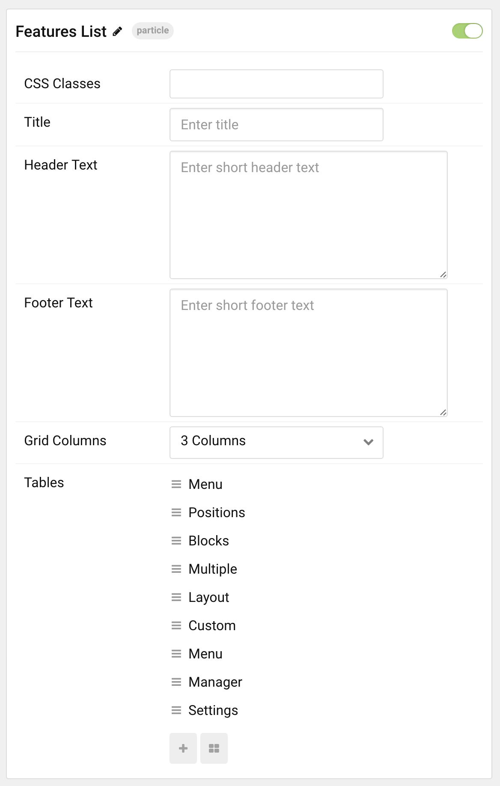
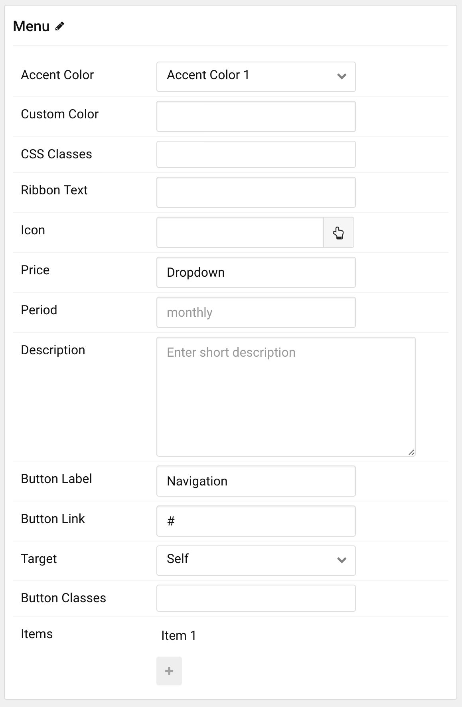

## Introduction

The **Feature List** particle is an excellent choice for any situation where you want to create a content block that lists features and other tidbits of featurelistrmation.

Here are the topics covered in this guide:

* [Configuration](#configuration)
    - [Main Options](#main-options)
    - [Item Options](#item-options)

## Configuration

### Main Options 

These options affect the main area of the particle, and not the individual items within. You can set the title of the particle, as well as give it an introductory paragraph here.

| Option      | Description                                                                     |
| :-----      | :-----                                                                          |
| CSS Classes | Set the CSS class(es) you would like to have apply at the particle level.       |
| Title       | Enter the title of the particle you would like to have appear on the front end. |
| Header Text | Set header text you would like to have appear on the front end.                 |
| Footer Text | Set footer text you would like to have appear on the front end.                 |
| Grid Column | Set the number of columns you want items to appear in.                          |

### Item Options

These items make up the individual featured items in the particle. They sit apart from the particle's title and introduction. Each item can have its own properties, including icons and written content.

| Option         | Description                                                                                                                      |
| :-----         | :-----                                                                                                                           |
| Accent Color   | Set the accent color you would like to have appear in the item.                                                                  |
| Custom Color   | Add a custom color you would lke to have appear in the item.                                                                     |
| CSS Classes    | Apply a CSS Class to the item in the particle.                                                                                   |
| Ribbon Text    | Adds a ribbon with text to your item. Great for highlighting sales or other special featurelistrmation.                                 |
| Icon           | Sets the primary Font Awesome icon for the item.                                                                                 |
| Price          | Add a price to the item.                                                                                                         |
| Period         | Add a term limit for the item.                                                                                                   |
| Description    | Add a text description for the item.                                                                                             |
| Button Label   | Enter text you would like to have appear as the button label.                                                                    |
| Button Link    | Enter the URL you would like to have the item link to.                                                                           |
| Target         | Sets the target for the item's link. You can choose to have it open as **Self** in the same tab, or **New Window** in a new tab. |
| Button Classes | Enter the CSS class(es) you would like to have apply to the individual button.                                                   |

### Sub-item Options

| Option       | Description                                    |
| :-----       | :-----                                         |
| Text         | Adds text to use with the sub-item.            |
| Item Classes | Add CSS classes that only affect the sub-item. |