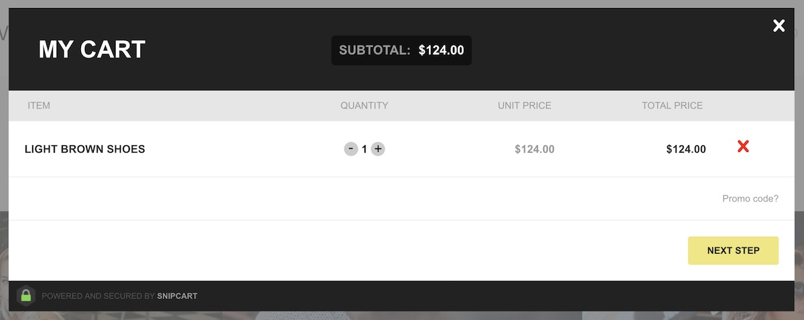

## Introduction

The **Shopping Cart** particle gives your website a powerful shopping cart powered by [Snipcart](https://snipcart.com/).

Here are the topics covered in this guide:

* [Configuration](#configuration)
    - [Main Options](#main-options)

## Configuration

### Main Options 

These options affect the main area of the particle, and not the individual items within.

| Option            | Description                                                                               |
| :-----            | :-----                                                                                    |
| Particle Name     | Sets the name for the particle that appears on the back end.                              |
| CSS Classes       | Enter any CSS class(es) that you would like to have apply to the particle's content here. |
| Title             | Sets the title for the particle that appears on the front end.                            |
| Total Items       | Enables you to **Hide** or **Show** the total number of items in the visitor's cart.      |
| Total Items Icon  | Enables you to set an Icon to appear with the item total.                                 |
| Total Price       | Enables you to **Hide** or **Show** the total price of the item(s) in the cart.           |
| Total Price Label | Enables you to enter text to appear with the item total.                                  |
| Total Price Icon  | Enables you to set an Icon to appear with the item price total.                           |
| API Key           | This is your Snipcart API key.                                                            |

This particle is powered by [Snipcart](https://snipcart.com/), an API key is necessary to add this functionality to your site and enable you to manage and track your store's performance. Here's how to get one:

* Sign in and log in to [Snipcart](https://snipcart.com/).
* [Add your domain](https://app.snipcart.com/dashboard/account/domains) to Snipcart.
* [Copy your API key](https://app.snipcart.com/dashboard/account/credentials) from Snipcart's Credentials page.
* Paste your API key to the **API Key** field in this particle and/or the **Product List** particle.

It's also important to note that your site needs to be publicly accessible in order for it to work. Snipcart needs to be able to communicate with your site. This could be achieved by pointing your browser to your domain as it is served remotely or a localhost that points to a domain name.

Snipcart gives you a test mode you can switch to live when you're ready to take live orders. Test mode enables you to test your cart. You can switch between these modes [here](https://app.snipcart.com).