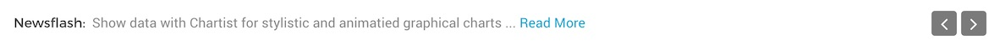
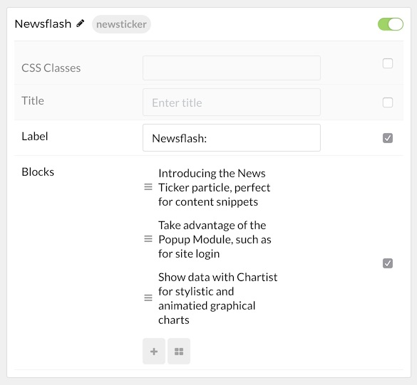

## Introduction

The **News Ticker** particle makes it easy to create a simple news ticker for your website.

Here are the topics covered in this guide:

* [Configuration](#configuration)
    - [Main Options](#main-options)
    - [Item Options](#item-options)

## Configuration

### Main Options 

These options affect the main area of the particle, and not the individual items within.

| Option        | Description                                                                                 |
| :-----        | :-----                                                                                      |
| Particle Name | Enter the name you would like to assign to the particle. This only appears in the back end. |
| CSS Classes   | Enter the CSS class(es) you want to use in the content of the particle.                     |
| Title         | Enter a title for the particle.                                                             |
| Label         | Adds text prior to the news notice. For example: `Newsflash:`                               |

### Item Options

These items make up the individual featured items in the particle.

| Option          | Description                                                                                                 |
| :-----          | :-----                                                                                                      |
| Item Name       | Enter the name you would like to assign to the item. This only appears in the back end.                     |
| Content         | Place any text content you want the item to say here. This is where your new item's headline would go.      |
| Read More Label | Text placed here acts as the label of the read more button.                                                 |
| Read More Link  | The URL you want the read more link to navigate to.                                                         |
| Target          | Set a target window for the URL in the Read More link to go to. Choose between **Self** and **New Window**. |
