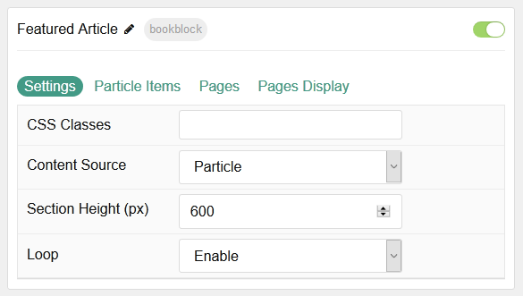
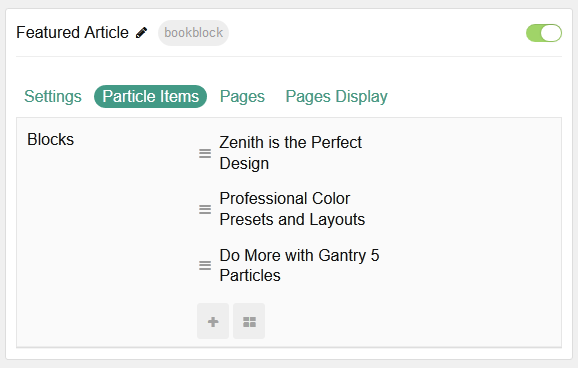
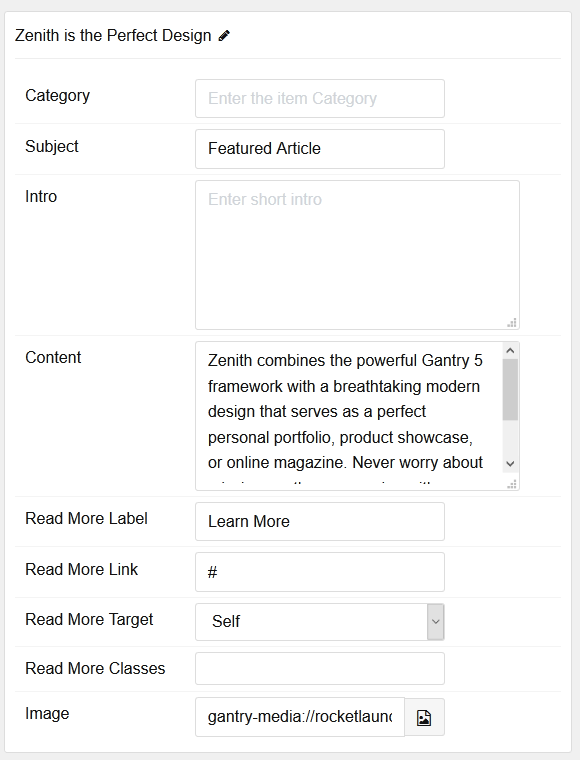
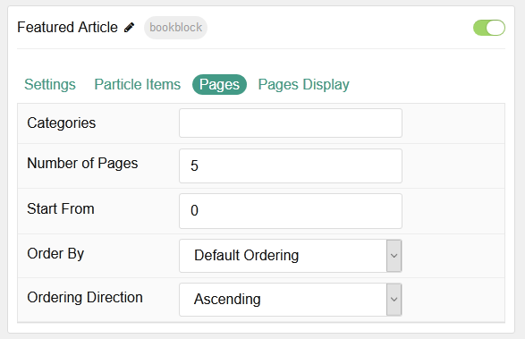
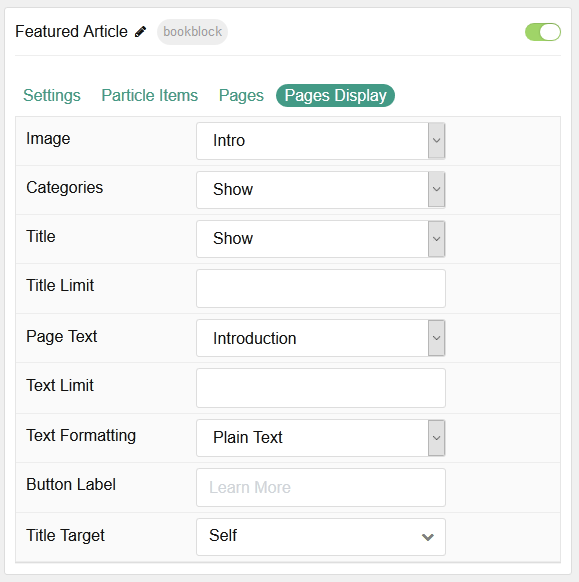

## Introduction

The **BookBlock** particle enables you to present content in a way that mimics a book, with its own page turning animation and plenty of room for written and visual content.

Here are the topics covered in this guide:

* [Configuration](#configuration)
    - [Main Options](#main-options)
    - [Item Options](#item-options)
    - [Posts](#posts)
    - [Posts Display](#posts-display)

## Configuration

### Main Options 

| Option         | Description                                                                           |
| :-----         | :-----                                                                                |
| CSS Classes    | Sets the CSS class for the content of the particle.                                   |
| Content Source | Select **Particle** or **Grav** to determine where particle content is pulled from. |
| Section Height | Set the height of the section (in pixels).                                            |
| Loop           | **Enable** or **Disable** looping.                                                    |

### Item Options

These items only appear on the front end if you select **Particle** as the **Content Source**.

| Option            | Description                                                                                     |
| :-----            | :-----                                                                                          |
| Categories        | Enter the categories you would like to appear in the particle.                                  |
| Subject           | Enter a subject for the item.                                                                   |
| Intro             | Enter the introductory text you would like to appear in the particle.                           |
| Content           | Enter the content you would like to appear in the particle.                                     |
| Read More Label   | Enter the text you would like to have link to the link you set in the **Read More Link** field. |
| Read More Link    | Enter a URL for the Read More link to take users to.                                            |
| Read More Target  | Select a target window for links to open into.                                                  |
| Read More Classes | Enter any CSS Class(es) that you want to have apply to the read more.                           |
| Image             | Select the image you would like to have appear on the right side of the particle.               |

### Posts

These options are only useful if you select **Grav** as the **Content Source**.

| Option             | Description                                                                         |
| :-----             | :-----                                                                              |
| Categories         | Enter the categorie(s) you would like to appear in the particle.                    |
| Number of Pages    | Select the number of pages you would like the particle to fetch.                    |
| Start From         | Set a starting count for the first item.                                            |
| Order by           | Choose how posts are ordered. You can set it to everything from Publish Date to ID. |
| Ordering Direction | Set **Ascending** or **Descending** ordering.                                       |

### Posts Display

These options are only useful if you select **Grav** as the **Content Source**.

| Option                   | Description                                                                                       |
| :-----                   | :-----                                                                                            |
| Image                    | **Enable** or **Disable** the image appearing in the particle.                                    |
| Categories Names         | **Enable** or **Disable** the category of the article in the particle.                            |
| Title                    | **Enable** or **Disable** the title of the article appearing in the particle.                     |
| Title Limit              | Set the limit (in characters) for the title being displayed.                                      |
| Content Type             | Choose between showing the **Content** or **Exerpt** text to display. You can also **Hide** text. |
| Content Limit Limit      | Set a limit of text (in characters) appearing in the item.                                        |
| Content Limit formatting | Choose between plain text and                                                                     |
| Button Label             | Enter the text you would like to appear in the Read More link.                                    |
| Link Target              | Select a target window for links to open into.                                                    |
