Key Features
============
-

>* __HTML5 and CSS3__ 
* __Fully Responsive__ 
* __Auto thumbnails generator__ 
* __Captions supporting HTML syntax__ 
* __Ajax Content listener__ 
* __Multiple media types supported:__  __Images: base64 encoded, jpg, gif, png, bmp, webp__ 
* __HTML5 Video and Audio__ 
* __TwitPic__ 
* __Instagram__ 
* __YouTube__ 
* __Vimeo__ 
* __Telly (ex TwitVid)__ 
* __Metacafe__ 
* __Dailymotion__ 
* __Spotify__ 
* __Google Maps__ 
* __Fit/Unfit Screen: If an image is too big it gets shrunk to fit the view-port but you can always click the Fit Screen icon to expand it and scroll.__ 
* __Albums to group related images__
* __Key Bindings for easy navigation: ← (Previous), → (Next), f Fitscreen/Unfitscreen, esc Close__

* * * 
* * * 
Rokbox1 versus Rokbox 2
=======================
-
Rockettheme strives to be __responsive__ to our customers needs. In keeping with this mission we introduced Kirigami, the August 2012 template release, as the first responsive RocketTheme template. Knowing that a lightbox can be an integral part of any template design, Djamil Legato's began creating RokBox2. It's key feature is being "natively" responsive to the platform it's being viewed on. So no more media queries or CSS'ing required to get a perfectly sized RokBox2 container to display your content on ANY device.  

Let's take a look at Rokbox1 displaying content in a responsive template, on a desktop screen:  
   

This is Rokbox1 displaying content in a responsive template, on a smartphone screen:  
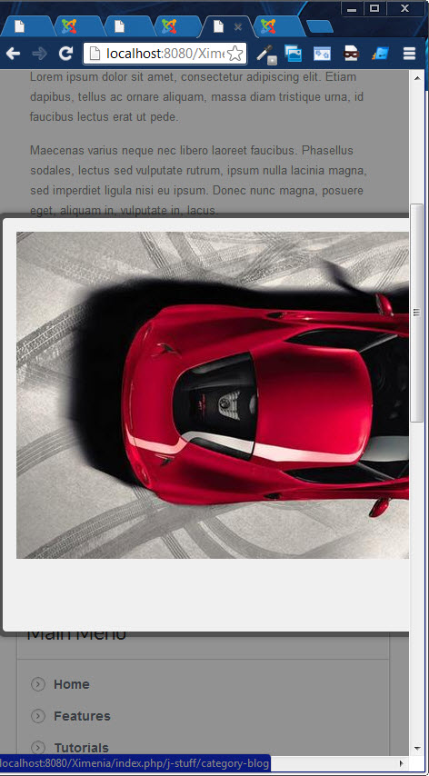   

No problem, RokBox2 to the rescue. Again on the desktop:   
   

Now on the smartphone screen:   
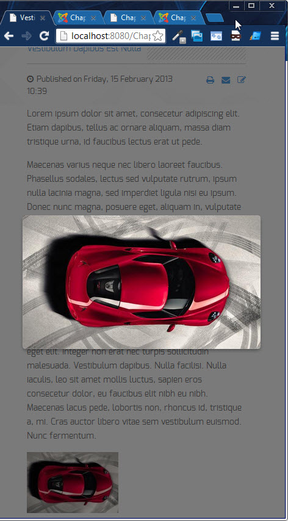   

Installing Rokbox 2
===================
-

Installing RokBox2 is just a matter of few minutes. RokBox2 consists of 3 plug-ins: Content, System and Editor Button. Make sure to have a look at all three plug-in manager pages to get an idea of what they do. It also provides a "Backward Compatibility" mode for RokBox1 style _{rokbox}_ __syntax__ _{/rokbox}_.
 
The one for content makes it easy to include media content in your pages. The one for system is the core of the plugin. The RokBox Editor Button allows injection of RokBox snippets into your Content.

You can install RokBox for Joomla! 2.5 & 3.0 in few steps, just go into the administrator panel and:  
* __Select from the top menu: Extend -> Extension Manager -> Install.__  
* __Click on Upload Package File "Choose File" button.__  
* __Select rokbox-2.zip from your local drive.__  
* __Click the "Upload & Install" button.__
 
RokBox is now installed. You can customize both plugins accessing from: Extend -> Plug-in Manager, where they are listed as "Content - RokBox" and "System - RokBox".

* * * 
Using RokBox2
==============

RokBox2 Window Layout
---------------------   
Let's familiarize ourselves with the new RokBox2 layout, shown below.   
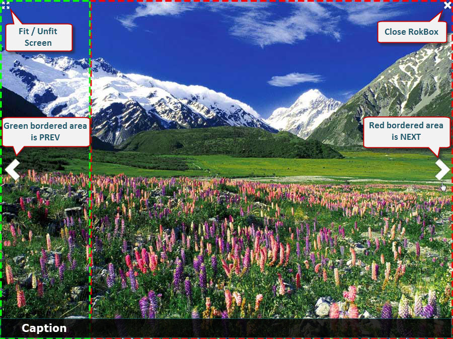

You can insert your RokBox2 code just about anywhere. Here is an example of a typical RokBox2 statement:
~~~ .html
<a data-rokbox href="/Chapelco25/images/rocketlauncher/rokbox2/rokbox_eg_2.jpg"
data-rokbox-album="RokBox2" data-rokbox-caption="rokbox_eg_1" data-rokbox-generate-thumbnail></a>
~~~

Let's see what they do:
* __data-rokbox__  - this initiates the generation of the Rokbox2 itself.

>* __data-rokbox-album__ - allows you to define the Rokboxed content as part of a user defined album.  
* __data-rokbox-caption__ - allows you to create a Caption at the bottom shaded area
* __data-rokbox-element__ - specifies the __DOM__ element you wish, e.g "#rt-popup"
* __data-rokbox-generate-thumbnail__ - introduced into the RokBox2 statement, this will auto-generate a thumbnail in the same folder as the original image. Thumbnail size settings are controlled in the Plug-in Manager: Content - RokBox.   

RokBox2 Syntax Creator
----------------------  
To start the Syntax Creator, just click the Rokbox button in your article editor.

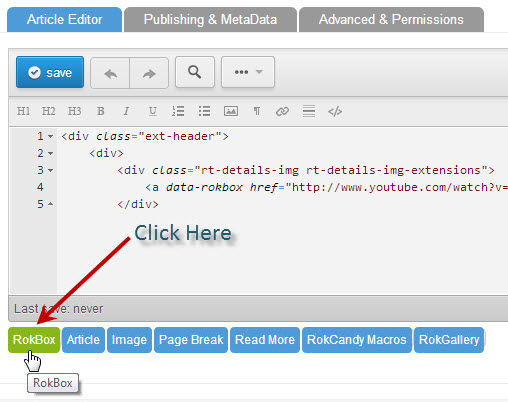

This will bring up the RokBox2 GUI interface to help you create the syntax required for a Rokbox.  


The Link and Content fields use the Media Manager window to allow you to select files or you can enter in the required information manually. Once your satisfied with the data entry just click __"Insert and Close"__. If you need to additional statements are needed then just click the  __"Insert and New"__ button.

RokBox2 Examples - Single image RokBox2 - auto generated thumb
---------------------- 

Here we will create a single image RokBox2 with an auto-generated thumbnail. Filling in the Syntax Creator with:   

| Field               | Data                                            |
|:--------------------|:-----------------------------------------------:|
|  Link               |  images/rocketlauncher/rokbox2/rokbox_eg_2.jpg  |
|  Dom Element        |  Blank                                          |
|  Album              |  RokBox2                                        |
|  Caption            |  rokbox_eg_1                                    |
|  Content:thumbnail  |  Blank                                          |
Click __"Insert and Close"__ and you will see this RokBox2 statement in your article:

``` .html
<a data-rokbox href="/Chapelco25/images/rocketlauncher/rokbox2/rokbox_eg_2.jpg"
data-rokbox-album="RokBox2" data-rokbox-caption="rokbox_eg_1" data-rokbox-generate-thumbnail></a>
```

This will result in a RokBox2 that looks like this:   
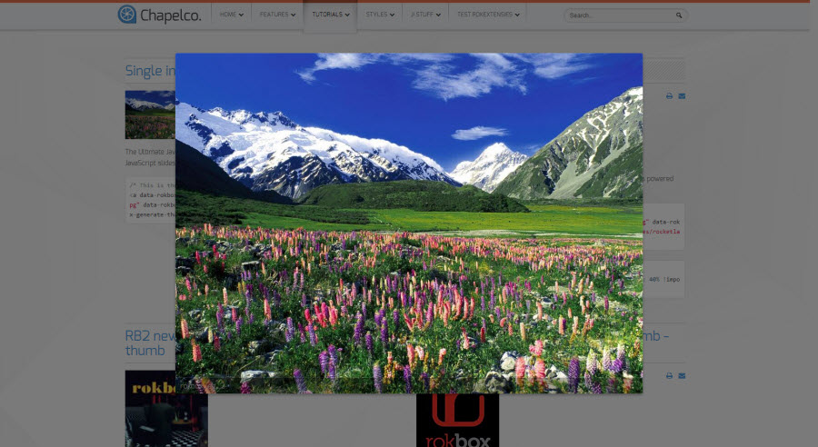  

RokBox2 Examples - Single image RokBox2 - user defined thumb
---------------------- 

Here we will create a single image RokBox2 with a user defined thumbnail. Filling in the Syntax Creator with:   

| Field               | Data                                              |
|:--------------------|:-------------------------------------------------:|
|  Link               |  images/rocketlauncher/rokbox2/rokbox_eg_3.jpg    |
|  Dom Element        |  Blank                                            |
|  Album              |  RokBox2                                          |
|  Caption            |  rokbox_eg_3                                      |
|  Content:thumbnail  |  images/rocketlauncher/rokbox2/rokbox-thumb-1.jpg |  

Click __"Insert and Close"__ and you will see this RokBox2 statement in your article:

``` .html
<a data-rokbox href="images/rocketlauncher/rokbox2/rokbox_eg_3.jpg" data-rokbox-album="RokBox2"
data-rokbox-caption="rokbox_eg_3"></a>
```

This will result in a RokBox2 that looks like this:   
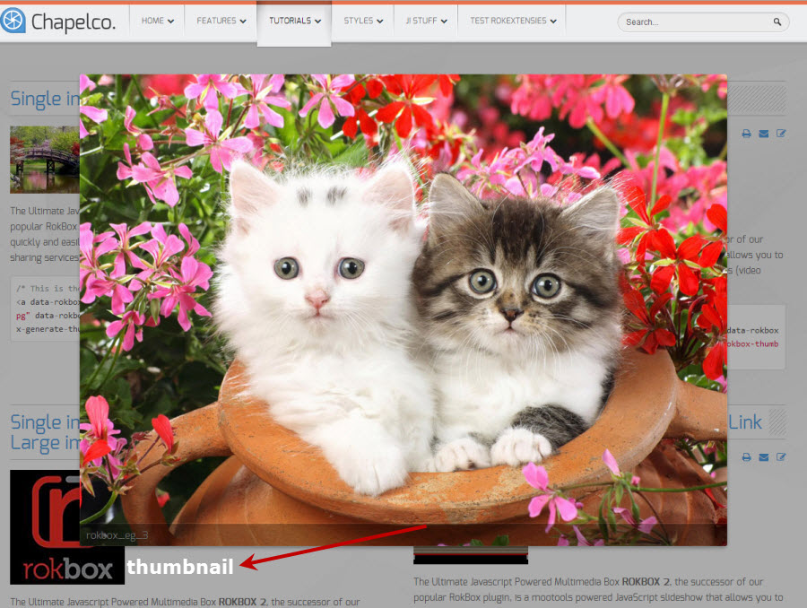   

RokBox2 Examples - Album slideshow using user selected thumb 
---------------------- 

Here we will create a multiple image RokBox2 to display as an Album slideshow using a user selected thumbnail. Filling in the Syntax Creator with:   

| Field               | Data                                                    |
|:--------------------|:-------------------------------------------------------:|
|  Link               |  images/rocketlauncher/rokbox2/ **rokbox_eg_2.jpg**     |
|  Dom Element        |  Blank                                                  |
|  Album              |  **springpics**                                         |
|  Caption            |  rokbox_eg_2                                            |
|  Content:thumbnail  |  images/rocketlauncher/rokbox2/ **rokbox-thumb-6.jpg**  |   

Click __"Insert and New"__ and you are ready to save the next statement line:

| Field               | Data                                                    |
|:--------------------|:-------------------------------------------------------:|
|  Link               |  images/rocketlauncher/rokbox2/ **rokbox_eg_3.jpg**     |
|  Dom Element        |  Blank                                                  |
|  Album              |  **springpics**                                         |
|  Caption            |  rokbox_eg_3                                            |
|  Content:thumbnail  |  Blank                                                  |  

Continue for the next four images. When finished our first statement will use the thumb as a launchpad for the Album slideshow using all images that are part of the album " **springpics** ".

The rest of the images shouldn't be visible on the page so we'll hide them from display using a <div> statement:

``` .html
<div style="display: none;">
<a data-rokbox data-rokbox-album="springpics" href="images/rocketlauncher/rokbox2/rokbox_eg_3.jpg"></a>
<a data-rokbox data-rokbox-album="springpics" href="images/rocketlauncher/rokbox2/rokbox_eg_4.jpg"></a>
<a data-rokbox data-rokbox-album="springpics" href="images/rocketlauncher/rokbox2/rokbox_eg_5.jpg"></a>
<a data-rokbox data-rokbox-album="springpics" href="images/rocketlauncher/rokbox2/rokbox_eg_6.jpg"></a>
<a data-rokbox data-rokbox-album="springpics" href="images/rocketlauncher/rokbox2/rokbox_eg_7.jpg"></a>
</div>
```

This will result in a RokBox2 multi-image Album slideshow that looks like this:   
   

I've staggered the images so you can get the idea.   

RokBox2 Examples - Single image RokBox2 - sized by CSS 
---------------------- 

Unlike the original Rokbox, RokBox2 doesn't allow user defined dimensions for the Rokbox. This was done in deference to wanting to keep RokBox2 compliant with our state-of-the-art Responsive templates. However you can easily size your RokBox2 window with some simple CSS. Filling in the Syntax Creator with:   

| Field               | Data                                                          |
|:--------------------|:-------------------------------------------------------------:|
|  Link               |  images/rocketlauncher/rokbox2/ **rokbox_eg_1.jpg**           |
|  Dom Element        |  Blank                                                        |
|  Album              |  **CSS sized**                                                |
|  Caption            |  rokbox_eg_1                                                  |
|  Content:thumbnail  |  images/rocketlauncher/rokbox2/ **rokbox-details-thumb.png**  |   

Click __"Insert and Close"__ and you will see this RokBox2 statement in your article:

``` .html
<a data-rokbox href="images/rocketlauncher/rokbox2/rokbox_eg_1.jpg" data-rokbox-album="CSS sized"
data-rokbox-caption="rokbox_eg_1"></a>
```
Now all the RokBox2 containers to this point have been sized at 100% of a template width of 1680px. This will display the natural size of our images which are all 960px x 700px. In keeping with responsive content layouts we will issue a CSS statement that constrains our RokBox2 container to a maximum width of 40%. So 1680px x 40% = 672px. As a result our images will be scaled down to our new RokBox2 containers sized at 672px x 490px.
Here's the CSS:
 ``` .css
.menu-rb2-tutorial .rokbox-container.rokbox-type-image {max-width: 40% !important;}
```

This will result in a RokBox2 that looks like this:   
  

RokBox2 Examples - RokBox2 - popup Member Login
---------------------- 

Here we will create a RokBox2 that opens to the popup version of the Login form. Filling in the Syntax Creator with:   

| Field               | Data                                              |
|:--------------------|:-------------------------------------------------:|
|  Link               |  #                                                |
|  Dom Element        |  #rt-popuplogin                                   |
|  Album              |  Blank                                            |
|  Caption            |  Login                                            |
|  Content:thumbnail  |  images/rocketlauncher/rokbox2/login.png          |  

Click __"Insert and Close"__ and you will see this RokBox2 statement in your article:

``` .html
<a data-rokbox href="#" data-rokbox-element="#rt-popuplogin" data-rokbox-caption="Login">
</a>
```

This will result in a RokBox2 that looks like this:   
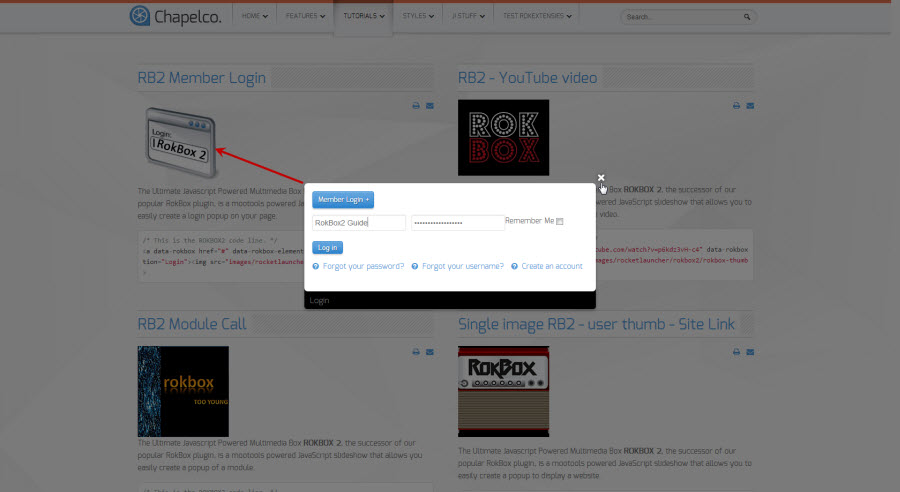  

RokBox2 Examples - RokBox2 - popup module
---------------------- 

Here we will create a RokBox2 that opens to a popup user created custom HTML module. Filling in the Syntax Creator with:   

| Field               | Data                                              |
|:--------------------|:-------------------------------------------------:|
|  Link               |  #                                                |
|  Dom Element        |  #rt-test-module                                  |
|  Album              |  Blank                                            |
|  Caption            |  RB2 Module Call                                  |
|  Content:thumbnail  |  images/rocketlauncher/rokbox2/rokbox-thumb-5.jpg |  

Click __"Insert and Close"__ and you will see this RokBox2 statement in your article:

``` .html
<a data-rokbox href="#" data-rokbox-element="#rt-test-module" data-rokbox-caption="RB2 Module Call">
</a>
```

This will result in a RokBox2 that looks like this:   
  

RokBox2 Examples - RokBox2 - YouTube video popup
---------------------- 

Here we will create a RokBox2 that opens to a popup YouTube video. Filling in the Syntax Creator with:   

| Field               | Data                                              |
|:--------------------|:-------------------------------------------------:|
|  Link               |  http://www.youtube.com/watch?v=p6kdz3vH-c4       |
|  Dom Element        |  Blank                                            |
|  Album              |  YouTube on RB2                                   |
|  Caption            |  Blank                                            |
|  Content:thumbnail  |  images/rocketlauncher/rokbox2/rokbox-thumb-4.jpg |  

Click __"Insert and Close"__ and you will see this RokBox2 statement in your article:

``` .html
<a data-rokbox href="http://www.youtube.com/watch?v=p6kdz3vH-c4" data-rokbox-album="YouTube on RB2">
</a>
```

This will result in a RokBox2 that looks like this:   
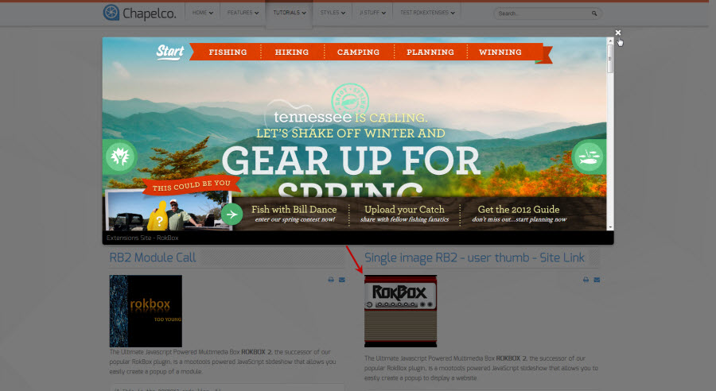  

RokBox2 Examples - Menu Item popup Login
---------------------- 

Here we will create a RokBox2 that opens to a popup Member Login by clicking a menu item. Filling in the Syntax Creator with:   

| Field               | Data                                              |
|:--------------------|:-------------------------------------------------:|
|  Link               |  #                                                |
|  Dom Element        |  #rt-popuplogin                                   |
|  Album              |  Blank                                            |
|  Caption            |  Login                                            |
|  Content:thumbnail  |  Blank                                            |  

Click __"Insert and Close"__ and you will see this RokBox2 statement in your article:

``` .html
<a data-rokbox href="#" data-rokbox-element="#rt-popuplogin" data-rokbox-caption="Login"
data-rokbox-generate-thumbnail></a>
```

From this statement the only part we need is this:
``` .html
#" data-rokbox-element="#rt-popuplogin" data-rokbox-caption="Login"
```
So our menu item will look like this:
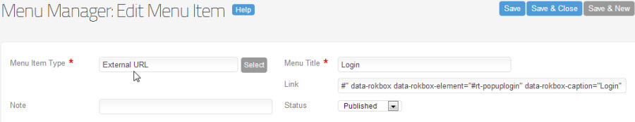  


This will result in a RokBox2 that looks like this:   
   

RokBox2 versus Rokbox1 in a RokSprocket module
----------------------------------------------

One of the shortcomings of Rokbox1 was it was very compliant in our newest technology such as our RokSprocket module. Rokbox1 didn't handle very well being called from things like a page from a RokSprocket Lists module. When you would click on the hyperlink content to launch the Rokbox1 it would simply open that content's actual location in Full screen:   

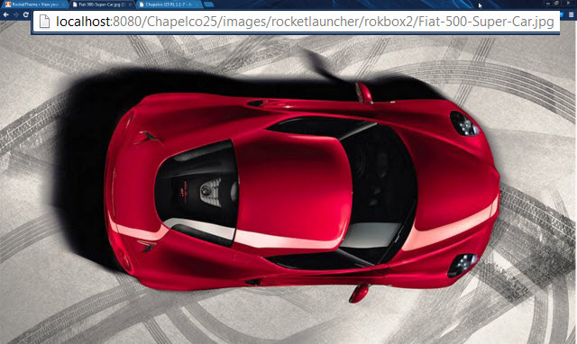 

Whereas RokBox2 handles this situation properly:   

   

---
RokBox2 in a RokGallery module
==============================
-

RokBox2 works seamlessly in our RokGallery module's when you set the __Link Type__ to " __Link to RokBox Full Image__ ".   

#### RokGallery - SlideShow ####
 
 

#### RokGallery - Gallery View ####
 
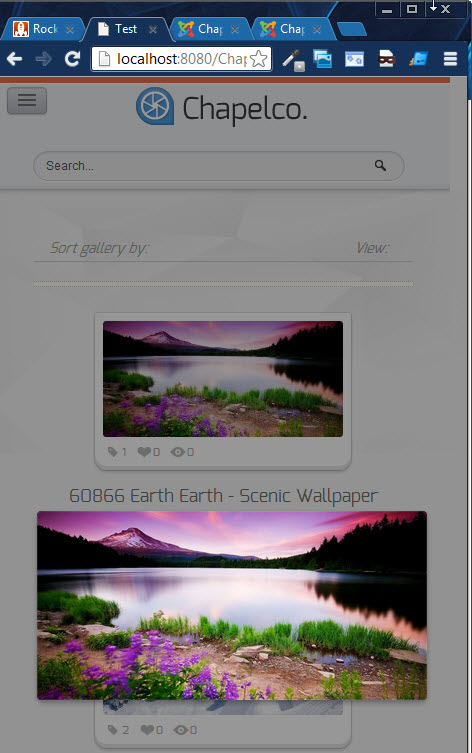   

If you wish to download this exciting new Rockettheme product, please visit us at [Extensions/RokBox](http://www.rockettheme.com/extensions-joomla/rokbox)   

If you require support for this product, please visit us at [Joomla Extensions > Products > RokBox](http://www.rockettheme.com/forum/index.php?f=201&rb_v=viewforum)