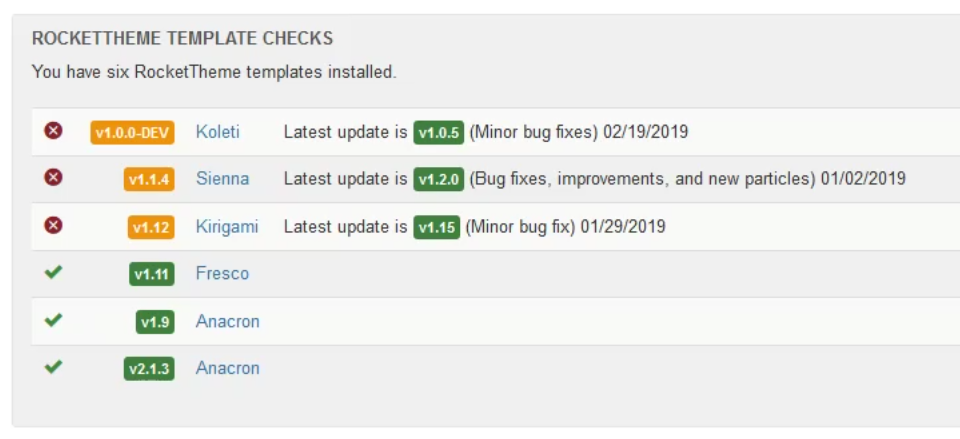
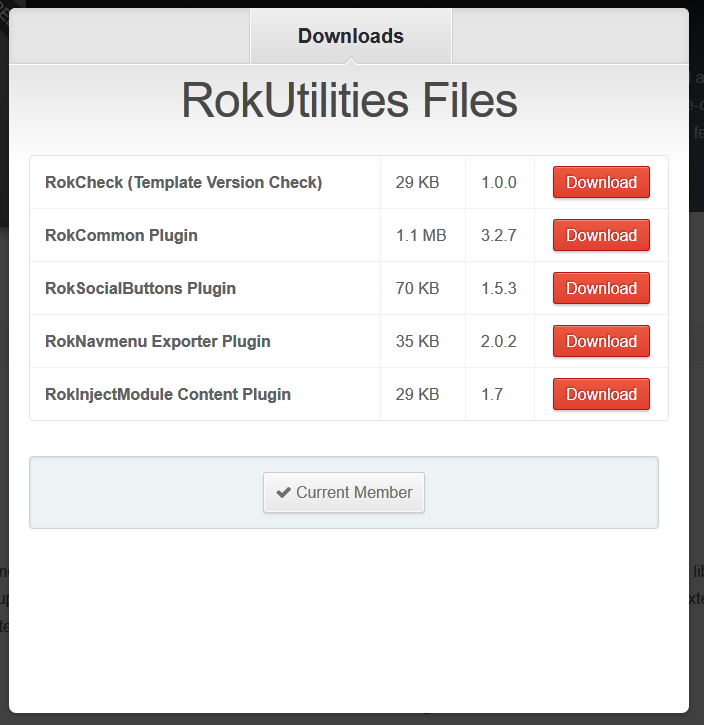

Introduction
--------------

RokCheck is a simple backend plugin that checks the template versions of any RocketTheme templates against the latest stable release to determine if an update is available. Credit to Mark Taylor [(MrT)](https://rockettheme.com/forum/profile/76563-mrt).

RokCheck is a member of the RokUtilities family of extensions.

Requirements
------------

* Joomla 3.x - ensure you are using the latest version.
* Compatible Browsers: Firefox, Chrome, Safari, Opera.

Key Features
-----

* **Checks for the Latest RocketTheme Templates**
* **Lives in the Control Panel of your Admin (when assigned)**

How to install
--------------

Installing RokCheck takes just a matter of few minutes.

The first thing you will need to do is [download](http://www.rockettheme.com/joomla/extensions/rokutilities/) the latest version of RokCheck. The package you will download contains all the files you need to get RokCheck up and running. It is compatible with Joomla 3.x, and does not need to be uncompressed. 

Once you have downloaded the package, go into the Joomla Administrator and:

From Joomla 3.x:

* Select from the top menu: `Extensions -> Extension Manager -> Install`
* Click on Upload Package File **Choose File** button
* Select the `mod_rokcheck.zip` that you just downloaded from your local drive.
* Click the **Upload & Install** button.

>> NOTE: For additional information on installing extensions, visit our detailed extensions installation guide located [here](../../platform/extensions.md#how-to-install-an-extension).

>> RocketTheme packages **do not** require you to uninstall them prior to updating or adding new associated extensions. You can simply install and the package will determine if it requires to update your currently installed RocketTheme extensions.

How to Publish to the Backend
-----

Publishing RokCheck to the backend of your site is an easy process. You do this by going to Joomla Module Manager and changing the module type dropdown from "site" to "administrator". Then, click on "NEW" to create a new module and choose the "rokcheck" module. Assign the module to the "cPanel" module position and give the module a title of "RocketTheme template checks", then SAVE the module. IF you now visit the Joomla control panel you will see the rokcheck module on this page.

>> NOTE: You can easily change the order in which the modules (including rokcheck) appear on the control panel by visiting Joomla module manager again, filtering on the "cpanel" postion, clicking on "order" column and then dragging the cpanel modules into the order that you want.

