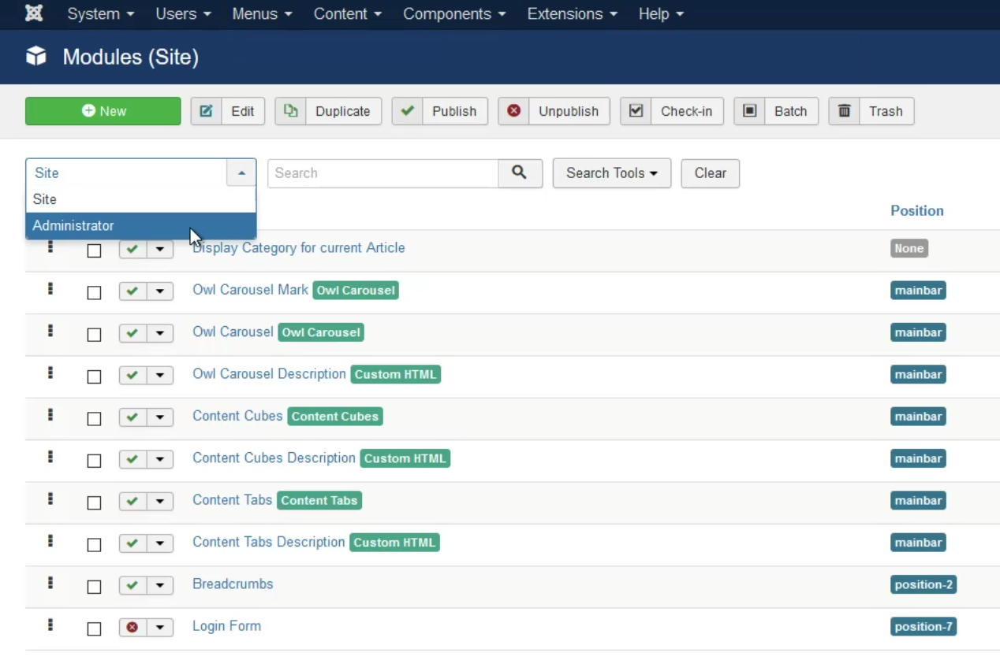
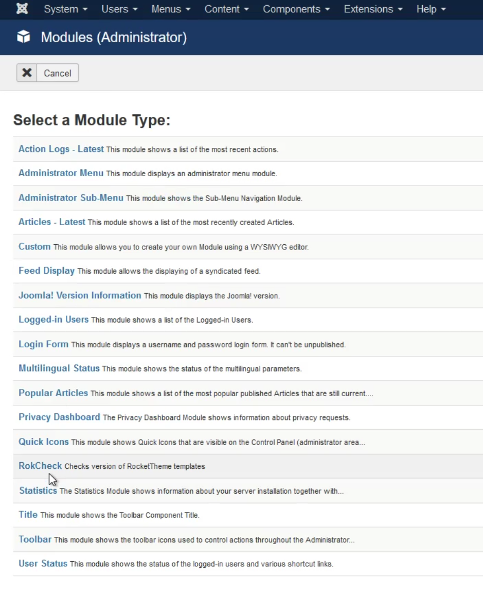
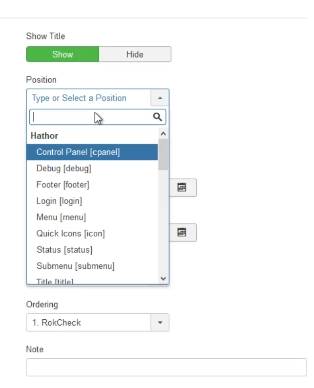
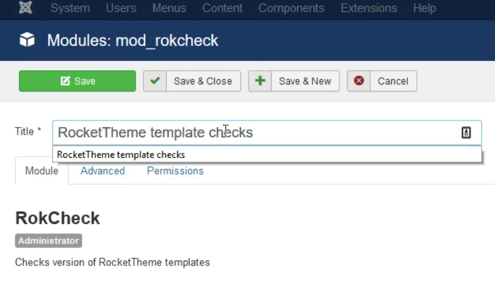

Introduction
-----

Configuring and setting up RokCheck is a two-part process. First, you will need to create the RokCheck module. Then, you will need to assign it to the Control Panel within the Administrator.

Initial Setup
-----

Once you have installed RokCheck, you can create the RokCheck Module by doing the following:

* Navigate to **Extensions** > **Modules** and select **Administrator** from the **dropdown** under the **New** button.
* Select the **New** button.

* Select **RokCheck** from the list of **Module Types**.

* Select **Control Panel** from your presently-active Admin theme's list.

* Give your new **Module** a name.
* Select **Save**.
* Confirm that the new module you just created is active in the **Administrator** modules list and assigned to **cpanel**.

Now, all you need to do is navigate to the Control Panel within the Administrator and confirm that RokCheck is present.
