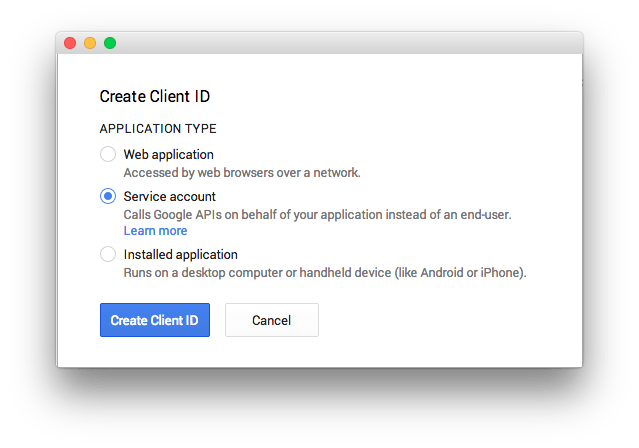
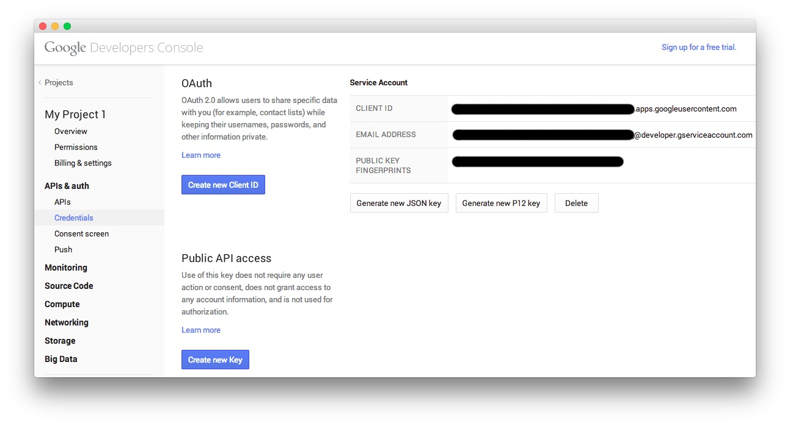
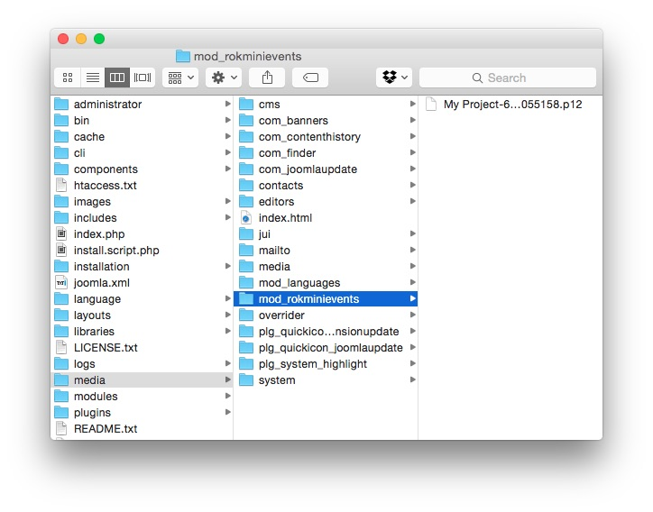

Introduction
-----

In previous versions of RokMiniEvents, we were able to utilize Google's v1 and v2 API to easily link Google calendars to the extension. In November, 2014, Google discontinued support for previous versions of the API in favor of [Google Calendar API v3](https://developers.google.com/google-apps/calendar/). This change meant having to find a new way to connect calendars to RokMiniEvents.

Below is our step-by-step process for achieving this using the new API.

Google Developers Console
-----

The first step you will need to take is to pay a visit to the [Google Developers Console](https://console.developers.google.com/). You will need to have and be signed in to an active Google account.

Once you have logged in, you will be greeted by a page either listing your current projects or letting you know that you need to create a project to continue. You will need to either **Select** or **Create** a **Project**. 

This console will also be where you generate the **OAuth Email Address** and **P12 Key** you will need later.

Here are the steps to create a new project and generate the necessary information:

1. Select **Create Project**.
2. On the popup, give your project a **Project Name**. You can also assign it a unique **Project ID**, though one is automatically generated for you.
3. Click **Create**.
4. You should be automatically forwarded to the **Project Dashboard**. From here, you will want to navigate using the **sidebar** to **APIs and Auth > APIs**.
5. If you have not already, search for the **Calendar API** and set the **Status** to **On**.
6. Navigate to **APIs and Auth > Credentials** from the **sidebar**.
7. Select **Create new Client ID**.
    
8. In the popup, select **Service Account** and click **Create Client ID**.
9. After a few seconds, you should receive a popup indicating that a **New Public/Private key pair** has been generated. Click **Okay, got it** to continue.

You should now see a page similar to the one pictured above. You may have also automatically downloaded a `.p12` file. You will need this file in the next step.

RokMiniEvents Setup
-----

Now that you have generated the **P12 key** and your **Email address** needed by RokMiniEvents, you will will need to put the key file in your site's file system.

We recommend placing the file in `/media/mod_rokminievents/` as this is the default, pre-filled value in the field. You can, however, place the file wherever you would like, as long as you remember to change its location in the **P12 Key Location** field. You will also need to change the name of the file reflected in this field to its actual name as given by Google. **Do not change the name of the file itself!**

>> NOTE: The folder **mod_rokminievents** does not exist in the **/media** directory by default. You will need to create this folder manually.

:   1. **OAuth Email Address** This is the email address assigned by the Google Calendar API to your project's service account. [41%, 47%, se]
    2. **P12 Key Location** This is the local location of the P12 key file you received when setting up the Service Account in Google Developer's Console. [48%, 47%, se]
    3. **Calendar ID** Enter the Google Calendar ID (in email address form) to add a Google calendar as a resource for the module. [55%, 47%, se]

The **OAuth Email Address** field should include the information listed as the **Email Address** in the **Service Account** information screen we pulled up earlier. Just copy and paste this address in its entirety.

The **P12 Key Location** field, as explained previously, should be the path and filename to the file you automatically downloaded from Google during the project setup. If you no longer have this file, you can request a new one by selecting **Generate new P12 key** from the Developers Console.

Enter the Google Calendar ID (in email address form) in the **Calendar ID** field to add a Google calendar as a resource for the module. You can obtain the calendar ID for a calendar you have appropriate permissions to by visiting the calendar in your browser and navigating to **Settings > Calendars**, selecting the calendar you wish you use, and copying the **Calendar ID** located in the **Calendar Address** section of the page. You can find more information about this from [Google](https://support.google.com/calendar/answer/37103?hl=en).
