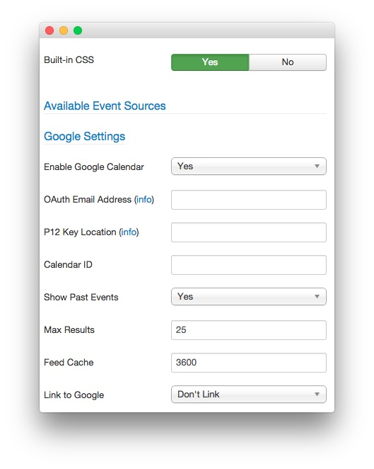
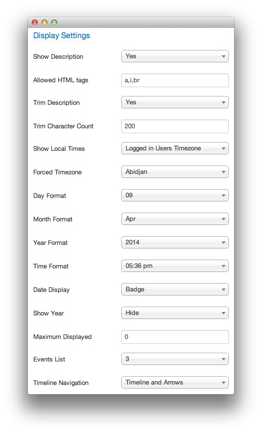

Module Options
-----

Once you have created a new RokMiniEvents module, you can quickly gain access to its customization options by visiting **Administrator -> Extensions -> Module Manager** and selecting your RokMiniEvents module.

Creating a new module is a simple process, as well. You just navigate to the **Module Manager** and select **New** on the toolbar in the upper-left area of the page.

Below, we have outlined the options available to you as you configure your RokMiniEvents module.

>> NOTE: In order to properly link RokMiniEvents to a Google Calendar, you will need to create a project in the [Google Developers Console](https://console.developers.google.com/), activate the **Google Calendar** api, create a new **Service Account Client ID**, and add the P12 key file to your site's file system. We have provided a [step-by-step guide](google.md) to assist you.

### Basic Options

:   1. **Built-in CSS** This setting allows you to opt to use RokMiniEvent's built-in CSS properties, or that of your template. [13%, 46%, se]
    2. **Enable Google Calendar** This enables and/or disables Google Calendar support for the module. [35%, 47%, se]
    3. **OAuth Email Address** This is the email address assigned by the Google Calendar API to your project's service account. [41%, 47%, se]
    4. **P12 Key Location** This is the local location of the P12 key file you received when setting up the Service Account in Google Developer's Console. [48%, 47%, se]
    5. **Calendar ID** Enter the Google Calendar ID (in email address form) to add a Google calendar as a resource for the module. [55%, 47%, se]
    6. **Show Past Events** Shows events that have already passed from the Google Calendar resource. [62%, 47%, se]
    7. **Max Results** A maximum number of results that will appear in the module. [69%, 47%, se]
    8. **Feed Cache** Sets a cache time between feed resets. [76%, 47%, se]
    9. **Link to Google** Allows you to add or remove a link to the Google calendar. [83%, 47%, se]

1. **Built-in CSS**: This setting allows you to opt to use RokMiniEvent's built-in CSS properties, or that of your template.

2. **Enable Google Calendar**: This enables and/or disables Google Calendar support for the module.

3. **OAuth Email Address**: This is the email address assigned by the Google Calendar API to your project's service account. You can find more information about obtaining this address in our [quick guide](google.md).

4. **P12 Key Location**: This is the local location of the P12 key file you received when setting up the Service Account in Google Developer's Console. This file should download automatically upon selecting **Service Account** during the initial project setup. 

    We recommend placing this file in `/media/mod_rokminievents/` as this is the default location pre-filled in the field. You can, of course, place it anywhere you would like. You will also need to change the name of the file in this field to match the name of the file given to you by Google. **Do not change the name of the file itself!**

5. **Calendar ID**: Enter the Google Calendar ID (in email address form) to add a Google calendar as a resource for the module. 

    You can obtain the calendar ID for a calendar you have appropriate permissions to by visiting the calendar in your browser and navigating to **Settings > Calendars**, selecting the calendar you wish you use, and copying the **Calendar ID** located in the **Calendar Address** section of the page.

6. **Show Past Events**: Shows events that have already passed from the Google Calendar resource.

7. **Max Results**: A maximum number of results that will appear in the module.

8. **Feed Cache**: Sets a cache time between feed resets.

9. **Link to Google**: Allows you to add or remove a link to the Google calendar.

:   1. **Sort Order** This option determines the order by which events display. [30%, 47%, se]
    2. **Time Range Type** Allows you to set whether to use a predefined time span or a time range of events to display. [40%, 47%, se]
    5. **Ranges** Sets a predefined range of time events are listed. If you set current year, only events from the current year will display. [68%, 47%, se]

1. **Sort Order**: This option determines the order by which events display.

2. **Time Range Type**: Allows you to set whether to use a predefined time span or a time range of events to display.

5. **Ranges**: Sets a predefined range of time events are listed. If you set current year, only events from the current year will display.

:	1. **Show Description** Shows or Hides the description of a particular item. [12%, 46%, se]
	2. **Allowed HTML Tags** Sets the allowed HTML tags for the module. (default `a,i,br`) [17%, 46%, se]
	3. **Trim Description** This setting allows you to trim the description. [23%, 46%, se]
	4. **Trim Character Count** This number is the character count descriptions will be trimmed to. [28%, 46%, se]
	5. **Show Local Times** You can use this option to choose whether times are displayed in the visitor's timezone or a forced timezone. [33%, 46%, se]
	6. **Forced Timezone** The timezone you would have items display in, if elected. [39%, 46%, se]
	7. **Day Format** Sets the format by which the day is displayed. [44%, 46%, se]
	8. **Month Format** Sets the format by which months are displayed. [50%, 46%, se]
	9. **Year Format** Sets the format by which the year is displayed. [55%, 46%, se]
	10. **Time Format** Sets the format by which the time is displayed. [61%, 46%, se]
	11. **Date Display** Sets the style of the date display. [66%, 46%, se]
	12. **Show Year** This option allows you to show or hide the year. [71%, 46%, se]
	13. **Maximum Displayed** Sets the maximum events displayed. '0' indicates all. [77%, 46%, se]
	14. **Events List** Sets how many events to display per pane. [82%, 46%, se]
	15. **Timeline Navigation** Sets the type of navigation used in the timeline (arrows, timeline, both). [87%, 46%, se]

1. **Show Description**: Shows or Hides the description of a particular item.

2. **Allowed HTML Tags**: Sets the allowed HTML tags for the module (default `a,i,br`). 

3. **Trim Description**: This setting allows you to trim the description size using the following setting.

4. **Trim Character Count**: This number is the character account descriptions will be trimmed to.

5. **Show Local Times**: You can use this option to choose whether times are displayed in the visitor's timezone or a forced timezone.

6. **Forced Timezone**: The timezone you would have items display in, if elected.

7. **Day Format**: Sets the format by which the day is displayed.

8. **Month Format**: Sets the format by which months are displayed.

9. **Year Format**: Sets the format by which the year is displayed.

10. **Time Format**: Sets the format by which the time is displayed.

11. **Date Display**: Sets the style of the date display.

12. **Show Year**: This option allows you to show or hide the year.

13. **Maximum Displayed**: Sets the maximum events displayed. '0' indicates all.

14. **Events List**: Sets how many events to display per pane.

15. **Timeline Navigation**: Sets the type of navigation used in the timeline (arrows, timeline, both).

[intro]: assets/rokminievents.jpeg
[settings]: assets/wp_rokintroscroller_module.jpeg
[module1]: assets/module_1.jpeg
[module2]: assets/module_2.jpeg
[module3]: assets/module_3.jpeg
[module5]: assets/module_5.jpeg
