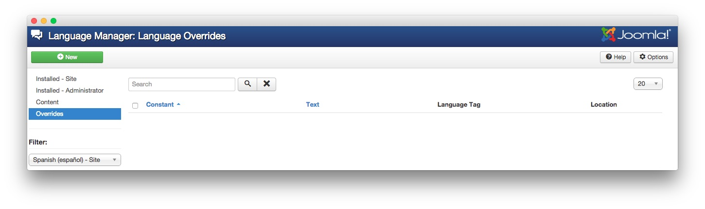
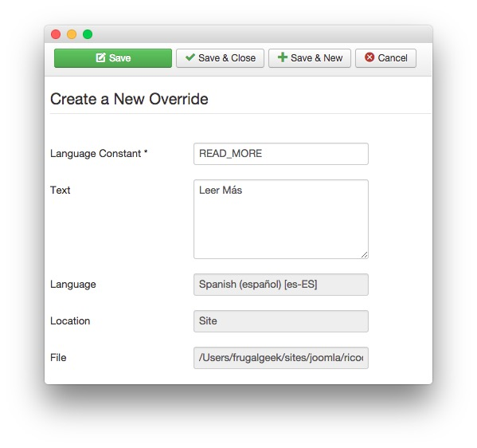

### How to inject a RokSprocket Module into an article?
Injecting a RokSprocket module into an article is a fairly easy thing to do. In fact, RokSprocket provides you with a shortcode to do this in the administrator module manager.

![][module_1]

:   1. **Shortcode** This is the shortcode you can use to add a RokSprocket Module to an article. [58%, 81%, se]

You can click the little clipboard located to the right of the shortcode to have it copy the code directly to your clipboard. From there, you will need to go to your article editing screen and add the shortcode where you would like it to appear in your module.

![][module_3]

You can do this with the HTML editor, or with a WYSIWYG editor, though be aware that some WYSIWYG editors either misinterpret or strip uncommon characters, rendering the shortcode unusable. You should have no problems with the shortcode when using HTML mode on most article editors.

### Why Do Articles Show Up in Administrator After I've Unpublished Them?

The administrator of a Joomla site can see everything, even the stuff that has been unpublished so it does not appear on the main site. It is for this reason that you will still see articles appear in the backend RokSprocket interface, even when they are unpublished. 

Try signing out of Joomla and visiting the module on the frontend of your site to see if these articles really are appearing for visitors.

### How do I Create Multilingual Translations for RokSprocket Features?

RokSprocket has several text-inclusive features, such as the **Read More** button, frontend sorting/filter options, and various settings on the backend. If you have a multilingual site, you may have a situation where you are running RokSprocket with English options on a Spanish page. This situation can be overcome, and there are two ways to do it.

#### Create and Edit a New ini File

There are several ini files included with RokSprocket which can be copied and edited to create an alternative translation.

The first thing you will need to do is navigate to `yourdomain.com/components/com_roksprocket/language/` and duplicate the `en-GB` folder. Once you have done that, you can rename the duplicate to the language symbol for your desired language (for example: es-ES for Spanish). The ini file inside will also need to be renamed to reflect the new language code. For example, `en-GB.com_roksprocket.ini` would become `es-ES.com_roksprocket.ini` in the Spanish directory.

You can now edit the new ini file, which will likely look like the following:

~~~ .html
; Joomla! Project
; Copyright (C) 2005 - 2012 Open Source Matters. All rights reserved.
; License GNU General Public License version 2 or later; see LICENSE.txt, see LICENSE.php
; Note : All ini files need to be saved as UTF-8

READ_MORE="Read More"
~~~

The **Read More** text is right there, ready to be translated. Because (in this example) you're altering the Spanish ini file instead of the English one, any changes you make will only appear on the Spanish area of your site. The `READ_MORE="Read More"` line could be changed to `READ_MORE="Leer Más"`.

Here is a list of all the commands you can put in this ini, and translate as needed.

~~~ .html
ROKSPROCKET_MOSAIC_LAYOUT_TITLE="Mosaic Layout Options"
ROKSPROCKET_MOSAIC_LAYOUT_DEFAULTS_TITLE="Mosaic Article Defaults"
ROKSPROCKET_MOSAIC_COLUMNS="Columns"
ROKSPROCKET_MOSAIC_COLUMNS_DESC="Amount of columns the blocks should be layed down like"
ROKSPROCKET_MOSAIC_ITEMSPERPAGE_LABEL="Blocks per View"
ROKSPROCKET_MOSAIC_ITEMSPERPAGE_DESC="The amount of blocks to show on a page load. If the amount of blocks is lesser than the Display Limit, a 'Load More' functionality will appear."
ROKSPROCKET_ORDERING="Ordering"
ROKSPROCKET_ORDERING_DESC="Ordering items to switch between on the frontend."
ROKSPROCKET_MOSAIC_ORDERING_DEFAULT="Default"
ROKSPROCKET_MOSAIC_ORDERING_TITLE="Title"
ROKSPROCKET_MOSAIC_ORDERING_DATE="Date"
ROKSPROCKET_MOSAIC_ORDERING_RANDOM="Random"

ROKSPROCKET_MOSAIC_ANIMATIONS="Block Animation"
ROKSPROCKET_MOSAIC_ANIMATIONS_DESC="The types of animations desired for the blocks when appearing/disappearing. Default is Fade."
ROKSPROCKET_MOSAIC_ANIMATIONS_FADE="Fade"
ROKSPROCKET_MOSAIC_ANIMATIONS_SCALE="Scale"
ROKSPROCKET_MOSAIC_ANIMATIONS_ROTATE="Rotate"
ROKSPROCKET_MOSAIC_ANIMATIONS_FLIP="Flip"

ROKSPROCKET_MOSAIC_ARTICLEDETAILS="Article Details"
ROKSPROCKET_MOSAIC_ARTICLEDETAILS_DESC="Shows or Hides article details such as Date and Author."

ROKSPROCKET_MOSAIC_LOADMORE="load more"
ROKSPROCKET_MOSAIC_LOADMORE_TIP="hold <strong>SHIFT</strong> key to load all"
ROKSPROCKET_MOSAIC_LOADALL="load all"

ROKSPROCKET_LAYOUT_MOSAIC_TITLE_LABEL="Title"
ROKSPROCKET_LAYOUT_MOSAIC_TITLE_DESC="The title to be used for the Mosaic item. If not set, it will default to the article title."

ROKSPROCKET_LAYOUT_MOSAIC_DESCRIPTION_LABEL="Description"
ROKSPROCKET_LAYOUT_MOSAIC_DESCRIPTION_DESC="The description to be used for the Feature. If not set, it will defaults to the article Introtext."

ROKSPROCKET_LAYOUT_MOSAIC_IMAGE_LABEL="Image"
ROKSPROCKET_LAYOUT_MOSAIC_IMAGE_DESC="The image to be used assigned to the article for the Mosaic items."

ROKSPROCKET_LAYOUT_MOSAIC_LINK_LABEL="Link"
ROKSPROCKET_LAYOUT_MOSAIC_LINK_DESC="If set, the link will show a 'Read More' button, link the title and based on the Theme, link the image as well."

ROKSPROCKET_LAYOUT_MOSAIC_TAGS_LABEL="Tags"
ROKSPROCKET_LAYOUT_MOSAIC_TAGS_DESC="A comma separated list of tags for the filtering on frontend."

ALL="All"
~~~

Once you have made your desired changes, simply save them and test on your site. For additional support setting up a multilingual site: Please check out our [detailed guide][multilingual].

There are two other RokSprocket-specific ini files which can be translated, but these are primarily administrator-side only and won't reflect on the experience of your visitors. For reference, they can be found at `yourdomain.com/modules/mod_roksprocket/language/` and `yourdomain.com/administrator/components/com_roksprocket/language/`.

#### Language Manager

The second option available to you is the **Language Manager**. From here, assuming you have already set up your alternate languages previously, you will need to access the **Overrides** page by navigating to **Administrator > Extension Manager > Language Manager > Overrides**.

This page is where you enter the language constant and the translated text. The **language constant** is the tag assigned to the RokSprocket bit you want to change. For example, the **Read More** button's language constant is `READ_MORE`. In the example pictured above, we're changing the **Read More** text to `Leer Más` on Spanish pages.

[module_1]: assets/add_module_to_article_1.jpeg
[module_2]: assets/add_module_to_article_2.jpeg
[module_3]: assets/add_module_to_article_3.jpeg
[multilingual]: ../../basic/how_to_create_a_multilingual_site.md