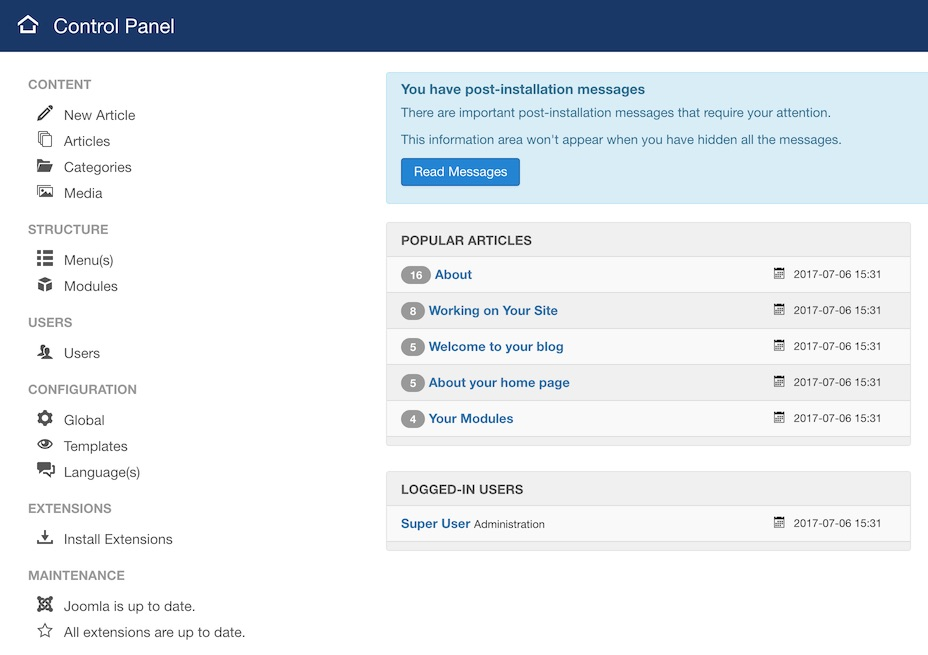
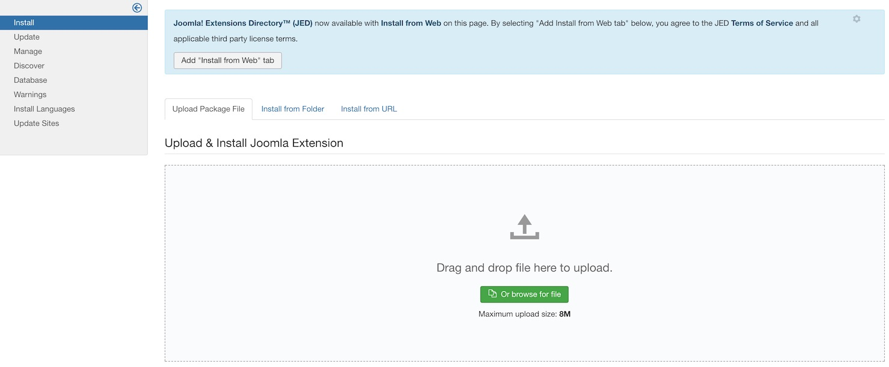
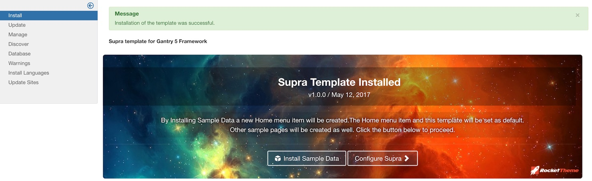
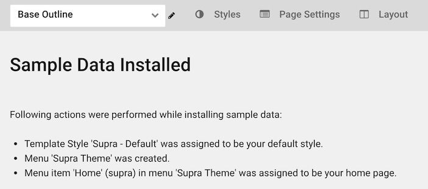

What is a Joomla Template?
-----

Joomla templates are basically the shell of your site. They are comprised of a series of files that determine the look and feel of a site once your content and modules have been put into place. A template determines things like fonts, colors, menu styles, navigation controls, basic layout design, and certain images such as the header and background (in some cases). A template is not an entire website in and of itself at all. It is more accurately described as a base on which your site's appearance and layout are formed.

Templates offer you the ability to completely separate a site's content from its design. This enables you to quickly switch between templates with only a small amount of necessary changes in the back end versus having to completely rebuild the site from the ground up. A CMS, like Joomla, gives you this ability.

While some templates offer a great degree of control over layout to users, others can be significantly more rigid. Templates built on a framework that offers a great deal of user customization options, like Gantry, can extend on the built-in back end options Joomla offers in a way that empowers the user to rearrange and reconfigure a site's layout without having to modify the template's code directly.

You can also modify an existing template to appear slightly different depending on which page you are accessing. For example, many sites are designed with a different layout for the home page than a single article page. You might not want some features to appear in specific areas of your site. By [duplicating the template style][override] and assigning the adjusted layout to specific pages, you can do this fairly easily.

How to install a Joomla template
-----

There are several different ways to install a Joomla template from RocketTheme. You can start your Joomla install from scratch (including building a new database) by downloading the RocketLauncher for your desired template. This will give you everything you need to hit the ground running, including a preconfigured version of the demo for the specific theme, the Gantry framework, and any extensions required for the theme's demo build to work. 

If you have an existing site running a Gantry-enabled template, you just need to download and install the standalone template along with any required and/or recommended extensions listed on the template's product page.

>> If you are using a RocketTheme template based on Gantry 5, you will notice some differences than what is described here. We recommend checking out the [official Gantry 5 guide](http://docs.gantry.org/gantry5/basics/installation#installing-a-gantry-theme) to installing templates.

### Installing a Template Using RocketLauncher

RocketLauncher is a working copy of our demo site which you can install on your own server and bring live within minutes. This is essentially a demo replica which you can modify to create a robust site that fits your individual needs.

You can find the RocketLauncher file by visiting the main template page and selecting **Download**. RocketLauncher packages may be available for Joomla 3.x.

After you have downloaded the RocketLauncher ZIP file, you can unpack it. This will give you a directory filled with the files you will need to install Joomla and the RocketTheme template on your site. A more recommended method involves uploading the ZIP file directly to your server and unpacking it there. This reduces the probability of file corruption and makes for a faster uploading process. Not all hosts allow this, so check with yours to see if this is an option.

Simply upload these files and subdirectories to your server's root web hosting directory. This is usually done via FTP/SFTP though your individual host may have other options available to you. 

Once these files are in place, you can finish installation using your browser by visiting the URL you have elected to have your Joomla installation installed. This could be the root of your domain (http://example.com) or a subdirectory (http://example.com/joomla) depending on where you placed it in your server's file system.

At this point, you will access the Joomla Web Installer to complete installation. We have step-by-step guides for installing a [3.x][joomla3x] site available to take you through the remainder of the installation process.

### Installing a Standalone Template

The standalone template is the bare bones of the template itself. If you already have the Gantry Library installed on your site, then adding another Gantry-enabled template is just a matter of selecting the standalone ZIP file from the template's downloads page and uploading it via the administrative extensions uploader.

Here's how:

:   1. **Install Extensions** This is where you will want to go to install any extensions. [18%, 59%, se]

The easiest way to do this is by going to **Admin → Install Extensions** (point 1) within the Administrator area of your site. This link is accessible directly from the sidebar of the Control Panel. Alternatively, you can navigate to **Admin → Extensions → Manage → Install** using the menu at the top of the page.

:   1. **Install** Simply take the zipped template package you downloaded earlier and drag-and-drop or browse and select it from the upload space. [37%, 13%, nw]

The next step is fairly straightforward. Simply take the zipped template package you downloaded earlier and drag-and-drop or browse and select it from the upload space.

>> NOTE: You will need to have Gantry installed prior to doing this.

Once this is done, you will see a confirmation that the template has been successfully installed. For Gantry 5 templates, you will notice a panel giving you the option to install sample data or to jump right to configuring the template. 

Installing sample data will create a menu you can configure for your site and assign it as appropriate. It will also generate and designate a default outline, setting it as default for your site. This is a great way to get a jump start on using the template. You can refresh your home page, and you should see a page very similar to what appears in our demo.

Alternatively, you can select the option to jump to configuration which gives you more control over how this setup occurs.

### Other Available Files

There are several other files that you might find useful on the template's download page. For example, the **Source PNG(s)** including some of the image files exclusive to the template are made available so that you may customize them to meet your individual needs.

While these files are not directly intended to be installed on your Joomla site, they can serve as a useful resource for further customization and understanding of what went into creating the template.

>> Source PNG download packages are not available for all templates.

[joomla3x]: install_joomla_3x.md