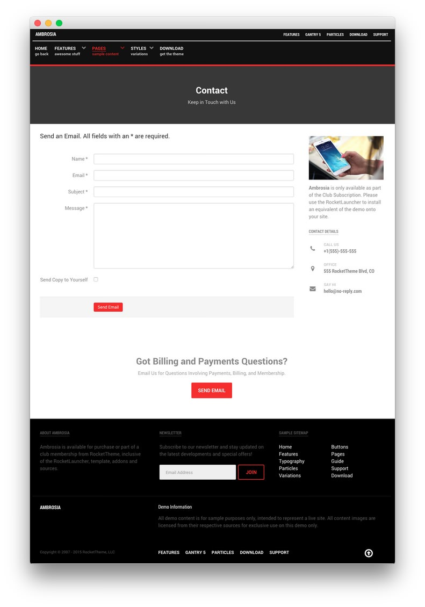

## Introduction

The **Contact** example page demonstrates how you can create a beautiful page with the Ambrosia template. Here is some information to help you replicate this page as it appears in the demo.

## Modules and Particles

Below is a brief rundown of the modules and particles used to make up the demo page.

:   1. **Showcase - Custom HTML (Module)** [12%, 40%, se]
    2. **Mainbar - Page Content** [22%, 9%, se]
    3. **Aside - Custom HTML (Module)** [22%, 67%, se]
    4. **Bottom - Custom HTML (Module)** [60%, 30%, se]
    5. **Footer - Custom HTML (Module)** [70%, 10%, se]
    6. **Footer - Gantry 5 Particle (Module) / Newsletter (Particle)** [70%, 38%, se]
    7. **Footer - Custom HTML (Module)** [70%, 65%, se]

1. [Showcase](#showcase-section)
2. [Mainbar](#mainbar-section)
3. [Aside](#aside-section)
4. [Bottom](#bottom-section)
5. [Footer](#footer-section)

## Showcase Section

This area of the page is a **Custom HTML** module. You will find the settings used in our demo below.

>> Any **mod_custom** (Custom HTML) modules are best handled using either RokPad or no editor as a WYSIWYG editor can cause issues with any code that exists in the **Custom Output** field.

### Custom HTML (Module)

### Details

| Field      | Setting            |
| :-----     | :-----             |
| Title      | `Contact - Header` |
| Show Title | Hide               |
| Position   | `showcase-a`       |
| Status     | Published          |

### Custom Output

Enter the following in the **Custom Output** text editor.

~~~ .html

  <h2 class="g-layercontent-title">Contact</h2>
  
Keep in Touch with Us

~~~

### Basic

| Option                    | Setting     |
| :----------               | :---------- |
| Prepare Content           | No          |
| Select a Background Image | Blank       |

### Advanced

| Option              | Setting        |
| :----------         | :----------    |
| Module Class Suffix | `flush center` |

## Mainbar Section

The **Mainbar** section is set to `60`% width and both the **Sidebar** and **Aside** sections are set to `20`%.

The page's content is sourced from a **Single Contact** menu item assigned to the outline. This creates the contact form as seen in our demo.

Settings used in our demo for each of these particles can be found below.

### Page Content

#### Particle Settings

| Field         | Setting        |
| :-----        | :-----         |
| Particle Name | `Page Content` |

#### Block Settings

| Field          | Setting |
| :-----         | :-----  |
| CSS ID         | Blank   |
| CSS Classes    | Blank   |
| Variations     | Blank   |
| Tag Attributes | Blank   |
| Block Size     | `100%`  |

## Aside Section

The **Aside** section is set to `20`% width.

This area of the page is an **Aside** particle. You will find the settings used in our demo below.

### Aside (Particle)

#### Particle Settings

| Field         | Setting  |
| :-----        | :-----   |
| Particle Name | `Aside`  |
| Key           | `aside`  |
| Chrome        | `gantry` |

#### Block Settings

| Field          | Setting |
| :-----         | :-----  |
| CSS ID         | Blank   |
| CSS Classes    | Blank   |
| Variations     | Blank   |
| Tag Attributes | Blank   |
| Block Size     | `100%`  |

## Bottom Section

This area of the page is a **Custom HTML** module. You will find the settings used in our demo below.

>> Any **mod_custom** (Custom HTML) modules are best handled using either RokPad or no editor as a WYSIWYG editor can cause issues with any code that exists in the **Custom Output** field.

### Custom HTML (Module)

### Details

| Field      | Setting                               |
| :-----     | :-----                                |
| Title      | `Got Billing and Payments Questions?` |
| Show Title | Hide                                  |
| Position   | `bottom-a`                            |
| Status     | Published                             |

### Custom Output

Enter the following in the **Custom Output** text editor.

~~~ .html

  <h2 class="g-layercontent-title">Got Billing and Payments Questions?</h2>
  
Email Us for Questions Involving Payments, Billing, and Membership.

  <a href="http://www.rockettheme.com/joomla/templates/ambrosia" class="button">Send Email</a>

~~~

### Basic

| Option                    | Setting     |
| :----------               | :---------- |
| Prepare Content           | No          |
| Select a Background Image | Blank       |

### Advanced

| Option              | Setting        |
| :----------         | :----------    |
| Module Class Suffix | `flush center` |

## Footer Section

:   1. **Custom HTML (Module) 1** [20%, 5%, se]
    2. **Gantry 5 Particle (Module) / Newsletter (Particle)** [20%, 38%, se]
    3. **Custom HTML (Module) 3** [20%, 65%, se]

This area of the page is made up of three **Custom HTML** modules spanning three different module positions: `footer-a`, `footer-b`, and `footer-c`. You will find the settings used in our demo below.

>> Any **mod_custom** (Custom HTML) modules are best handled using either RokPad or no editor as a WYSIWYG editor can cause issues with any code that exists in the **Custom Output** field.

### Custom HTML (Module) 1

### Details

| Field      | Setting          |
| :-----     | :-----           |
| Title      | `About Ambrosia` |
| Show Title | Show             |
| Position   | `footer-a`       |
| Status     | Published        |

### Custom Output

Enter the following in the **Custom Output** text editor.

~~~ .html
Ambrosia is available for purchase or part of a club membership from RocketTheme, inclusive of the RocketLauncher, template, addons and sources.
~~~

### Basic

| Option                    | Setting     |
| :----------               | :---------- |
| Prepare Content           | No          |
| Select a Background Image | Blank       |

### Advanced

| Option              | Setting     |
| :----------         | :---------- |
| Module Class Suffix | Blank       |

### Gantry 5 Particle (Module) / Newsletter (Particle)

A **Gantry 5 Particle** module containing a **Newsletter** particle makes up the content in the `footer-b` position. Simply create a new **Gantry 5 Particle** module, and select **Newsletter** as the particle you wish to have linked to this module. You will find the settings for this particle below.

#### Particle Settings

| Option         | Setting                                                                                       |
| :-----         | :-----                                                                                        |
| CSS Classes    | Blank                                                                                         |
| Title          | `Newsletter`                                                                                  |
| Heading Text   | `Subscribe to our newsletter and stay updated on the latest developments and special offers!` |
| Feedburner URI | `rocketthemeblog`                                                                             |
| Button Classes | `button-4`                                                                                    |

### Custom HTML (Module) 2

### Details

| Field      | Setting          |
| :-----     | :-----           |
| Title      | `Sample Sitemap` |
| Show Title | Show             |
| Position   | `footer-c`       |
| Status     | Published        |

### Custom Output

Enter the following in the **Custom Output** text editor.

~~~ .html

  

    <ul class="nomarginall noliststyle">
      <li><a href="index.php">Home</a></li>
      <li><a href="index.php?option=com_content&amp;view=article&amp;id=1&amp;Itemid=105">Features</a></li>
      <li><a href="index.php?option=com_content&amp;view=article&amp;id=2&amp;Itemid=106">Typography</a></li>
      <li><a href="index.php?option=com_content&amp;view=article&amp;id=2&amp;Itemid=106">Particles</a></li>
      <li><a href="index.php?option=com_content&amp;view=article&amp;id=3&amp;Itemid=107">Variations</a></li>
    </ul>
  

  

    <ul class="nomarginall noliststyle">
      <li><a href="index.php?option=com_content&amp;view=article&amp;id=2&amp;Itemid=106">Buttons</a></li>
      <li><a href="index.php?option=com_content&amp;view=article&amp;id=4&amp;Itemid=111">Pages</a></li>
      <li><a href="http://www.rockettheme.com/docs/joomla/templates/ambrosia">Guide</a></li>
      <li><a href="http://www.rockettheme.com/forum/joomla-template-ambrosia">Support</a></li>
      <li><a href="http://www.rockettheme.com/joomla/templates/ambrosia">Download</a></li>
    </ul>   
  
  

~~~

### Basic

| Option                    | Setting     |
| :----------               | :---------- |
| Prepare Content           | No          |
| Select a Background Image | Blank       |

### Advanced

| Option              | Setting     |
| :----------         | :---------- |
| Module Class Suffix | Blank       |
