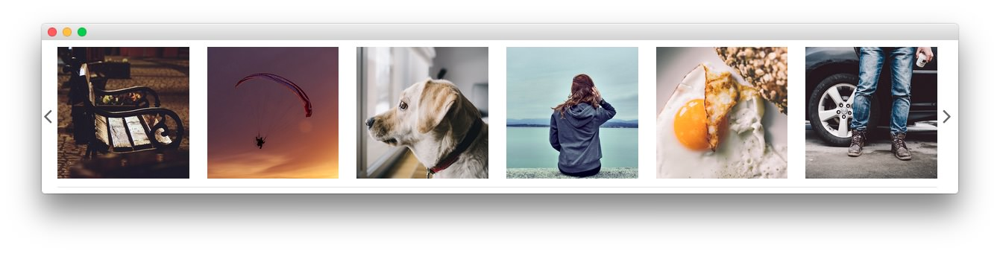
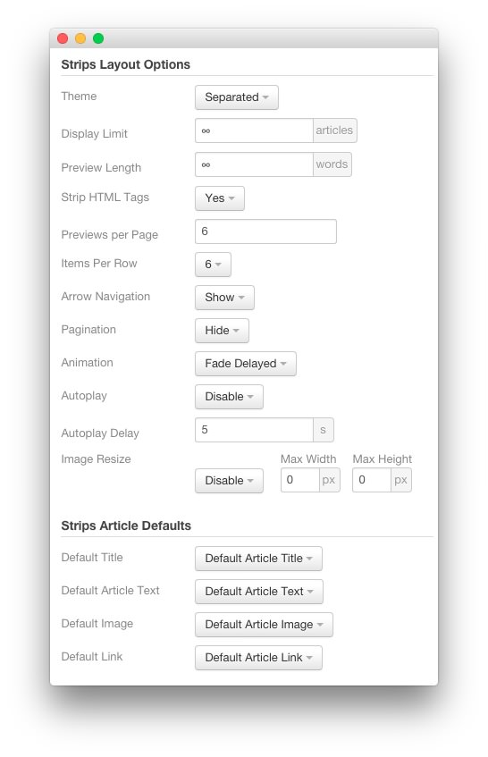

## Introduction

The **Bottom** section contains a **Module Position** particle, creating the `bottom-a` position.

Here is a breakdown of the particles used in this section:

* [Module Position (Particle)](#module-position-(bottom-a))
    - [RokSprocket (Strips)](#assigned-module(s)---roksprocket-(strips))

Settings used in our demo for each of these particles can be found below.

## Section Settings

| Field          | Setting   |
| :-----         | :-----    |
| Layout         | Fullwidth |
| CSS Classes    | Blank     |
| Tag Attributes | Blank     |

### Module Position (bottom-a)

#### Particle Settings

| Field         | Setting                 |
| :-----        | :-----                  |
| Particle Name | `FP RokSprocket Strips` |
| Key           | `bottom-a`              |
| Chrome        | `gantry`                |

#### Block Settings

| Field          | Setting    |
| :-----         | :-----     |
| CSS ID         | Blank      |
| CSS Classes    | Blank      |
| Variations     | No Padding |
| Tag Attributes | Blank      |
| Block Size     | `100%`     |

## Assigned Module(s) - RokSprocket (Strips)

We used a **RokSprocket** module with the **Strips** layout to make up this area of the front page. You will find the settings used in our demo below.

We utilized the **Simple** Content Provider, linking each item in the RokSprocket module to an article. You can find examples of the **Simple** items used in this module in the **Filtered Article List** section below.

### Details

| Option           | Setting                 |
| :-----           | :-----                  |
| Title            | `FP RokSprocket Strips` |
| Show Title       | Hide                    |
| Access           | Public                  |
| Position         | `bottom-a`              |
| Status           | Published               |
| Content Provider | Simple                  |
| Type             | Strips                  |

### Filtered Article List

#### Item 1

| Option      | Setting |
| :-----      | :------ |
| Title       | None    |
| Image       | Custom  |
| Link        | `#`     |
| Description | None    |

#### Item 2

| Option      | Setting |
| :-----      | :------ |
| Title       | None    |
| Image       | Custom  |
| Link        | `#`     |
| Description | None    |

#### Item 3

| Option      | Setting |
| :-----      | :------ |
| Title       | None    |
| Image       | Custom  |
| Link        | `#`     |
| Description | None    |

### Layout Options

| Option            | Setting      |
| :----------       | :----------  |
| Theme             | Separated    |
| Display Limit     | `∞`          |
| Preview Length    | `∞`          |
| Strip HTML Tags   | Yes          |
| Previews Per Page | `6`          |
| Items Per Row     | 6            |
| Arrow Navigation  | Show         |
| Pagination        | Hide         |
| Animation         | Fade Delayed |
| Autoplay          | Disable      |
| Autoplay Delay    | 5            |
| Image Resize      | Disable      |

### Advanced

| Option              | Setting                         |
| :----------         | :----------                     |
| Module Class Suffix | `fp-roksprocket-strips-style-1` |

