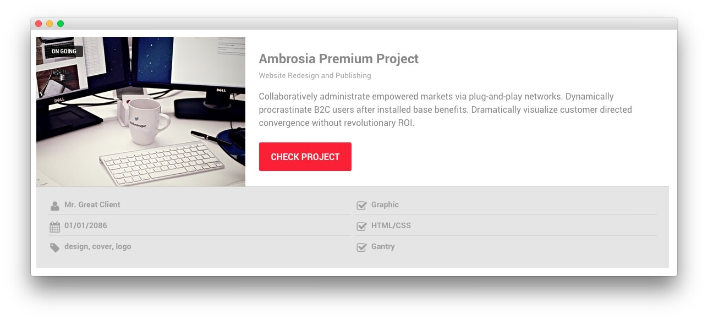

## Introduction

The **Portfolio** example page demonstrates how you can create a beautiful page with the Ambrosia template. Here is some information to help you replicate this page as it appears in the demo.

## Modules and Particles

Below is a brief rundown of the modules and particles used to make up the demo page.

:   1. **Showcase - Custom HTML (Module)** [10%, 45%, se]
    3. **Feature - Custom HTML (Module)** [16%, 13%, se]
    4. **Mainbar - Promo Image (Particle)** [32%, 13%, se]
    4. **Extension - Custom HTML (Module)** [56%, 13%, se]
    5. **Bottom - Custom HTML (Module)** [70%, 30%, se]

1. [Showcase](#showcase-section)
2. [Feature](#feature-section)
3. [Mainbar](#mainbar-section)
3. [Extension](#extension-section)
4. [Bottom](#bottom-section)

## Showcase Section

This area of the page is a **Custom HTML** module. You will find the settings used in our demo below.

>> Any **mod_custom** (Custom HTML) modules are best handled using either RokPad or no editor as a WYSIWYG editor can cause issues with any code that exists in the **Custom Output** field.

### Custom HTML (Module)

### Details

| Field      | Setting              |
| :-----     | :-----               |
| Title      | `Portfolio - Header` |
| Show Title | Hide                 |
| Position   | `showcase-a`         |
| Status     | Published            |

### Custom Output

Enter the following in the **Custom Output** text editor.

~~~ .html

    <h2 class="g-layercontent-title">Portfolio</h2>
    
What We Have Already Done

~~~

### Basic

| Option                    | Setting     |
| :----------               | :---------- |
| Prepare Content           | No          |
| Select a Background Image | Blank       |

### Advanced

| Option              | Setting        |
| :----------         | :----------    |
| Module Class Suffix | `flush center` |

## Feature Section

This area of the page is a **Content List** particle rendered via a **Gantry 5 Particle** module placed in the `feature-a` position.

### Content List (Particle)

### Details

| Field                    | Setting                                                                                                                                                                                                                         |
| :-----                   | :-----                                                                                                                                                                                                                          |
| Particle Name            | `Content List`                                                                                                                                                                                                                  |
| CSS Classes              | Blank                                                                                                                                                                                                                           |
| Title                    | Blank                                                                                                                                                                                                                           |
| Image                    | Custom                                                                                                                                                                                                                          |
| Image Tag                | `On Going`                                                                                                                                                                                                                      |
| Headline                 | `Ambrosia Premium Project`                                                                                                                                                                                                      |
| Subtitle                 | `Website Redesign and Publishing`                                                                                                                                                                                               |
| Description              | `Collaboratively administrate empowered markets via plug-and-play networks. Dynamically procrastinate B2C users after installed base benefits. Dramatically visualize customer directed convergence without revolutionary ROI.` |
| Label                    | `Check Project`                                                                                                                                                                                                                 |
| Link                     | `#`                                                                                                                                                                                                                             |
| Icon                     | Blank                                                                                                                                                                                                                           |
| Read More Classes        | Blank                                                                                                                                                                                                                           |
| Grid Column              | 2 Columns                                                                                                                                                                                                                       |
| Content List Item 1 Name | `Mr. Great Client`                                                                                                                                                                                                              |
| Content List Item 1 Icon | `fa fa-user fa-fw`                                                                                                                                                                                                              |
| Content List Item 1 Text | `Mr. Great Client`                                                                                                                                                                                                              |
| Content List Item 1 Link | Blank                                                                                                                                                                                                                           |

## Mainbar Section

The **Mainbar** section includes six **Promo Image** particles rendered through **Gantry 5 Particle** modules. These modules are placed in `main-a`, `main-b`, and `main-c` module positions. Each particle displays an image with descriptive text and animation on hover. The settings for one of these particles is listed below.

| Option            | Setting                          |
| :-----            | :-----                           |
| Particle Name     | `Promo Image`                    |
| CSS Classes       | `center`                         |
| Promo Image       | Custom                           |
| Promo Image Title | `Magazine`                       |
| Description       | `Short project description here` |
| Icon Button       | `fa fa-file-text-o`              |
| Icons             | Blank                            |

## Extension Section

This area of the page is an **Info List** particle rendered via a **Gantry 5 Particle** module placed in the `extension-a` position.

### Info List (Particle)

### Details

| Field                        | Setting                                                                     |
| :-----                       | :-----                                                                      |
| Particle Name                | `Info List`                                                                 |
| CSS Classes                  | Blank                                                                       |
| Title                        | `Upcoming Projects`                                                         |
| Intro                        | Blank                                                                       |
| Grid Column                  | 3 Columns                                                                   |
| Info List Item 1 Name        | `404 Pages`                                                                 |
| Info List Item 1 Location    | Left                                                                        |
| Info List Item 1 Text Style  | Compact                                                                     |
| Info List Item 1 Image Style | Compact                                                                     |
| Info List Item 1 Description | `Collaboratively administrate empowered markets via plug-and-play networks` |
| Info List Item 1 Tag         | Blank                                                                       |
| Info List Item 1 Sub Tag     | Blank                                                                       |
| Info List Item 1 Label       | Blank                                                                       |
| Info List Item 1 Link        | `#`                                                                         |
| Info List Item 1 Icon        | Blank                                                                       |
| Info List Item 1 CSS Classes | Blank                                                                       |

## Bottom Section

This area of the page is a **Custom HTML** module. You will find the settings used in our demo below.

>> Any **mod_custom** (Custom HTML) modules are best handled using either RokPad or no editor as a WYSIWYG editor can cause issues with any code that exists in the **Custom Output** field.

### Custom HTML (Module)

### Details

| Field      | Setting                        |
| :-----     | :-----                         |
| Title      | `100% Satisfaction Guaranteed` |
| Show Title | Hide                           |
| Position   | `bottom-a`                     |
| Status     | Published                      |

### Custom Output

Enter the following in the **Custom Output** text editor.

~~~ .html

  <h2 class="g-layercontent-title">100% Satisfaction Guaranteed</h2>
  
Will You be the Next to Join Our Happy Clients?

  <a href="http://www.rockettheme.com/joomla/templates/ambrosia" class="button">Join Now</a>

~~~

### Basic

| Option                    | Setting     |
| :----------               | :---------- |
| Prepare Content           | No          |
| Select a Background Image | Blank       |

### Advanced

| Option              | Setting        |
| :----------         | :----------    |
| Module Class Suffix | `flush center` |
