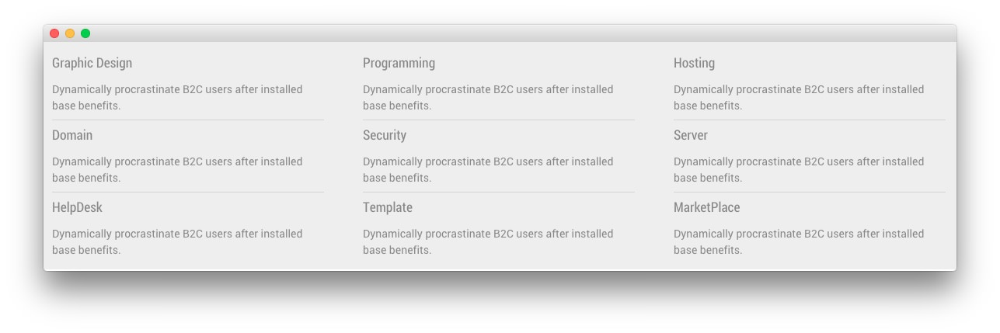

## Introduction

The **Services** example page demonstrates how you can create a beautiful page with the Ambrosia template. Here is some information to help you replicate this page as it appears in the demo.

## Modules and Particles

Below is a brief rundown of the modules and particles used to make up the demo page.

:   1. **Showcase - Custom HTML (Module)** [11%, 45%, se]
    2. **Feature - Custom HTML (Module)** [19%, 11%, se]
    3. **Mainbar - Page Content** [35%, 11%, se]
    4. **Extension - Info List (Particle)** [50%, 11%, se]
    5. **Bottom - Custom HTML (Module)** [64%, 40%, se]

1. [Showcase](#showcase-section)
2. [Feature](#feature-section)
2. [Mainbar](#mainbar-section)
3. [Extension](#extension-section)
4. [Bottom](#bottom-section)

## Showcase Section

This area of the page is a **Custom HTML** module. You will find the settings used in our demo below.

>> Any **mod_custom** (Custom HTML) modules are best handled using either RokPad or no editor as a WYSIWYG editor can cause issues with any code that exists in the **Custom Output** field.

### Custom HTML (Module)

### Details

| Field      | Setting               |
| :-----     | :-----                |
| Title      | `What We Do - Header` |
| Show Title | Hide                  |
| Position   | `showcase-a`          |
| Status     | Published             |

### Custom Output

Enter the following in the **Custom Output** text editor.

~~~ .html

    <h2 class="g-layercontent-title">What We Do</h2>
    
Learn More About Our Great Services

~~~

### Basic

| Option                    | Setting     |
| :----------               | :---------- |
| Prepare Content           | No          |
| Select a Background Image | Blank       |

### Advanced

| Option              | Setting        |
| :----------         | :----------    |
| Module Class Suffix | `flush center` |

## Feature Section

This area of the page is a **Custom HTML** module. You will find the settings used in our demo below.

>> Any **mod_custom** (Custom HTML) modules are best handled using either RokPad or no editor as a WYSIWYG editor can cause issues with any code that exists in the **Custom Output** field.

### Custom HTML (Module)

### Details

| Field      | Setting         |
| :-----     | :-----          |
| Title      | `Services List` |
| Show Title | Hide            |
| Position   | `feature-a`     |
| Status     | Published       |

### Custom Output

Enter the following in the **Custom Output** text editor.

~~~ .html

  

    

      <h2 class="g-title">
        Desktop Apps
      </h2>
      

        Collaboratively administrate empowered markets via available great networks.
      

    

  

  

    

      <h2 class="g-title">
        Mobile Apps
      </h2>
      

        Collaboratively administrate empowered markets via available great networks.
      

    

  

  

    

      <h2 class="g-title">
        Cloud Servers
      </h2>
      

        Collaboratively administrate empowered markets via available great networks.
      

    

  

  

    

      <h2 class="g-title">
        Databases
      </h2>
      

        Collaboratively administrate empowered markets via available great networks.
      

    

  

  

    

      <h2 class="g-title">
        Graphics
      </h2>
      

        Collaboratively administrate empowered markets via available great networks.
      

    

  

  

    

      <h2 class="g-title">
        Analyst
      </h2>
      

        Collaboratively administrate empowered markets via available great networks.
      

    

  

~~~

### Basic

| Option                    | Setting     |
| :----------               | :---------- |
| Prepare Content           | No          |
| Select a Background Image | Blank       |

### Advanced

| Option              | Setting     |
| :----------         | :---------- |
| Module Class Suffix | Blank       |

## Mainbar Section

The **Mainbar** section includes the **Services** article, displayed through the **Page Content** particle. Here are the settings found in the **Services** article.

| Option   | Setting        |
| :-----   | :-----         |
| Title    | `Services`     |
| Alias    | `services`     |
| Status   | Published      |
| Featured | No             |
| Category | `Sample Pages` |

**Content Body**

~~~ .html

  

    

      

        

          

            

              Services
            

          

          

            

              <h3 class="g-contentlist-headline">
                Why Choose Us
              </h3>
              <h5 class="g-contentlist-subtitle">
                Absolutely Stunning Design and Functionality
              </h5>
              

                Efficiently unleash cross-media information without cross-media value. Quickly maximize timely deliverables for real-time schemas. Dramatically maintain clicks-and-mortar solutions without functional solutions. Collaboratively administrate empowered markets via plug-and-play networks. Dynamically procrastinate B2C users after installed base benefits. Dramatically visualize customer directed convergence without revolutionary ROI. Dynamically innovate resource-leveling customer service for state of the art customer service.
              
<a class="button button-2" href="#">Learn More</a>
            

          

        

      

    

  

~~~

## Extension Section

This area of the page is made up of three **Info List** particles, each placed into a module position (`extension-a`, `extension-b`, `extension-c`) by way of a **Gantry 5 Particle** module. You will find the settings used in one of these **Info List** particles below.

### Info List (Particle)

### Particle Settings

| Field                            | Setting                                                              |
| :-----                           | :-----                                                               |
| Particle Name                    | `Info List`                                                          |
| Title                            | Blank                                                                |
| Intro                            | Blank                                                                |
| Grid Column                      | 1 Column                                                             |
| Info Lists Item 1 Name           | `Graphic Design`                                                     |
| Info Lists Item 1 Image          | Blank                                                                |
| Info Lists Item 1 Image Location | Left                                                                 |
| Info Lists Item 1 Text Style     | Compact                                                              |
| Info Lists Item 1 Image Style    | Compact                                                              |
| Info Lists Item 1 Description    | `Dynamically procrastinate B2C users after installed base benefits.` |
| Info Lists Item 1 Tag            | Blank                                                                |
| Info Lists Item 1 Sub Tag        | Blank                                                                |
| Info Lists Item 1 Label          | Blank                                                                |
| Info Lists Item 1 Link           | Blank                                                                |
| Info Lists Item 1 Icon           | Blank                                                                |
| Info Lists Item 1 CSS Classes    | Blank                                                                |

## Bottom Section

This area of the page is a **Custom HTML** module. You will find the settings used in our demo below.

>> Any **mod_custom** (Custom HTML) modules are best handled using either RokPad or no editor as a WYSIWYG editor can cause issues with any code that exists in the **Custom Output** field.

### Custom HTML (Module)

### Details

| Field      | Setting                |
| :-----     | :-----                 |
| Title      | `Save Time and Effort` |
| Show Title | Hide                   |
| Position   | `bottom-a`             |
| Status     | Published              |

### Custom Output

Enter the following in the **Custom Output** text editor.

~~~ .html

  <h2 class="g-layercontent-title">Save Time and Effort</h2>
  
We Always Create the Real Value and Work with All Passion

  <a href="http://www.rockettheme.com/joomla/templates/ambrosia" class="button">Purchase Ambrosia</a>

~~~

### Basic

| Option                    | Setting     |
| :----------               | :---------- |
| Prepare Content           | No          |
| Select a Background Image | Blank       |

### Advanced

| Option              | Setting        |
| :----------         | :----------    |
| Module Class Suffix | `flush center` |