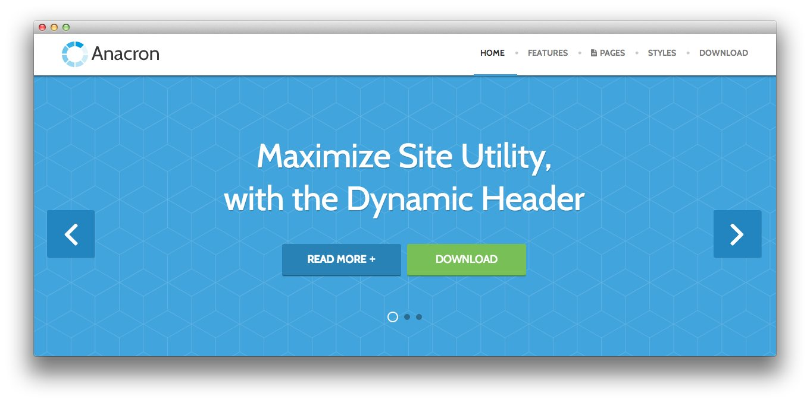

Introduction
-----

Anacron is a vibrant, highly adaptable and engaging theme, ideal for a vast selection of possible sites, from community to business. Subtle visual elements in the sectioned design, add character and division to the page, without compromising on content focus.

New to Gantry 5?
-----
If you are new to Gantry 5, a good place to start would be our [dedicated Gantry documentation](http://docs.gantry.org).

As a Joomla user, you are most likely accustomed to editing modules when working with our Gantry 4 templates. While our RocketLauncher package contains modules for our subpages, the Home page content is specifically found in the template's Layout. This can be found via your Joomla administrator -> Extensions -> Templates - > Home -> Layout. Click on any of the cog icons on the Particles to edit the content.

To understand more how the Layout manager works, please [click here](http://docs.gantry.org/gantry5/configure/layout-manager).

Requirements
-----

* PHP 7.1+
* Curl
* OpenSSL Libraries
* Multibyte String Support
* MySQL

>> NOTE: Gantry 5.4.19+ is required for Fluent to work correctly. For more details on the Gantry Framework, please visit its [Dedicated Website](http://gantry.org).

Key Features
-----

### Included Particles

* Animate on Scroll
* Branding
* Contact
* Content List
* Content Tabs
* Copyright
* Custom HTML
* Date
* Fixed Header
* Joomla Content
* Image Grid
* Info List
* Lists
* Login
* Logo / Image
* Menu
* Mobile Menu
* Mosaic
* Newsletter
* Pricing Table
* Promo Image
* Search
* Showcase
* Simple Counter
* Social
* Strips Slider
* Tab Image
* Testimonials
* To Top
* Video 

### Theme Features

* Responsive Layout
* 8 Preset Styles
* Fixed / Dynamic Header
* Custom Typography
* Unlimited Positions
* Custom Particles
* Mobile Menu
* Coming Soon Page
* Font Awesome Icons 

### Gantry Core Features

* YAML-based Configuration
* Twig Templating
* Powerful Particle System
* Visual Menu Editor
* MegaMenu Support
* Off-Canvas Panel
* Ajax Admin
* Layout Manager
* Theme Inheritance
* SCSS Support
* Sophisticated Fields
* Unlimited Undo/Redo
* Styles Panel

## Dynamic Header

The Dynamic, Scrolling Header, is a custom design feature that adds an animation effect the header, where the logo and menu are contained, whereby the header elegantly collapses upon downward scroll and smoothly reappears on upward scroll.

## Color Chooser

Anacron has an extensive Color Chooser in the template manager to provide intricate controls for each section of Anacron, inclusive of overlay type, text color, background color, as well as background images. Edit preexisting or create new presets

## Responsive

Anacron is a responsive theme which means it adapts to the viewing device's width, such as mobile, tablet or desktop. Mobile modes have a unique menu to aid usability. Support classes can also be used to display or hide various types of content for each device.
