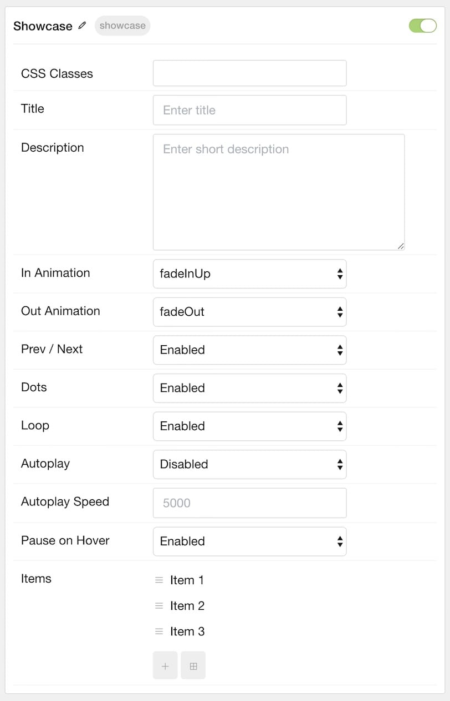
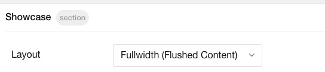

## Introduction

The **Showcase** particle makes it easy to create smooth, modern sliders for your website.

Here are the topics covered in this guide:

* [Configuration](#configuration)
    - [Main Options](#main-options)
    - [Item Options](#item-options)
* [Animated Background](#animated-background)
* [Fullwidth Slideshow](#fullwidth-slideshow)     

## Configuration

### Main Options 

These options affect the main area of the particle, and not the individual items within.

 

| Option          | Setting                                                               |
| :-----          | :-----                                                                |
| Particle Name   | The name of the particle for organizational use in the backend.       |
| CSS Classes     | CSS Class(es) you would like to have apply to the particle's content. |
| Title           | Title of the particle as it will appear on the front end.             |
| Description     | A text description to appear on the front end for the particle.       |
| Display at Once | Set the number of items to display at one time.                       |
| Prev Next       | Enable or Disable the Prev/Next Buttons.                              |
| Dots            | Enable or Disable navigation dots.                                    |
| Loop            | Enable or Disable looping of slides.                                  |
| Autoplay        | **Enable** or **Disable** autoplay for the particle.                  |
| Autoplay Speed  | Set the speed (in milliseconds) of the particle's animation.          |
| Pause on Hover  | **Enable** or **Disable** the pause-on-hover effect for the particle. |

### Item Options

These items make up the individual featured items in the particle.

| Option      | Description                                                       |
| :-----      | :-----                                                            |
| Name        | Enter a name for your item. This only appears on the back end.    |
| Image       | Set an image for the item.                                        |
| Title       | Enter a title for the item.                                       |
| Description | Enter a description for the item.                                 |
| Link        | Enter a link for the item.                                        |
| Link Text   | Enter text that appears as the link for the item.                 |
| Target      | Select between **Self** and **New Window** for the link's target. |

## Animated Background

To create an animated background (where background rotates with a click of navigation or pagination), place the Showcase particle in the Showcase section. Then add either **top-to-bottom** or **left-to-right** to the CSS Classes field in the Showcase section settings:

You can utilize any background via the Styles -> Showcase Colors -> Background Image field:

## Fullwidth Slideshow

If you are looking to turn the Showcase particle into a Fullwidth Slideshow as shown above, start by adding an Image to each of your Showcase particle items. 

Then simply change the section layout to Fullwidth (Flushed Content) as shown here:

If you are working off of our Home outline or layout, you will also need to remove the fp-showcase class from the Block settings of the Showcase particle:

