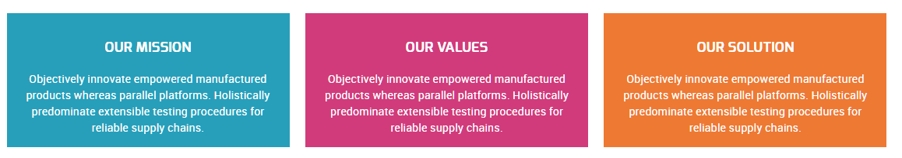
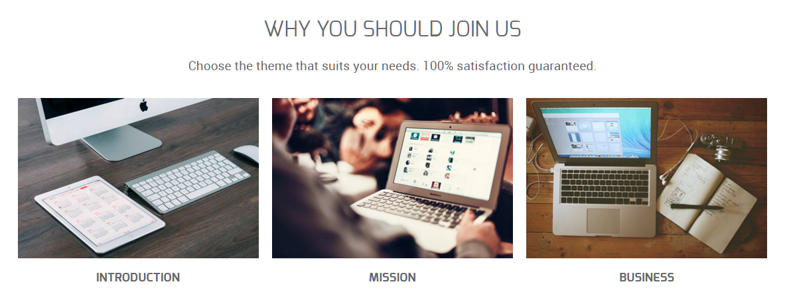
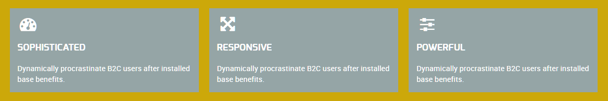
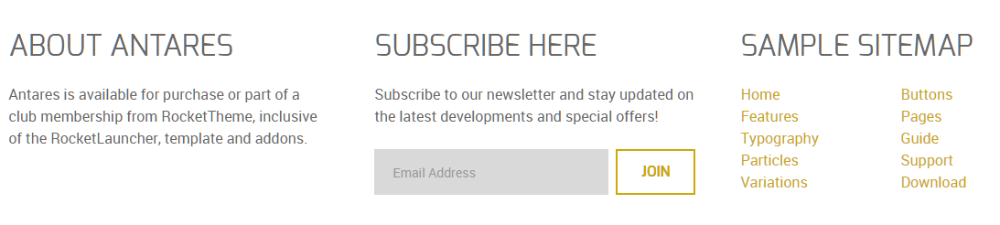

## Introduction

The **About Us** example page demonstrates how you can create a beautiful page with the Antares template. Here is some information to help you replicate this page as it appears in the demo.

## Modules and Particles

Below is a brief rundown of the modules and particles used to make up the demo page.

:   1. **Header - Info List (Particle)** [7%, 45%, se]
    2. **Above - Block Content (Particle)** [15%, 10%, se]
    3. **Mainbar - Block Content (Particle)** [28%, 10%, se]
    4. **Expanded - Block Content (Particle)** [45%, 10%, se]
    5. **Extension - Info List (Particle)** [60%, 25%, se]
    6. **Bottom - Custom HTML (Module)** [73%, 8%, se]
    7. **Bottom - Newsletter (Particle)** [73%, 35%, se]
    8. **Bottom - Custom HTML (Module)** [73%, 65%, se]

1. [Header](#header-section)
2. [Above](#above-section)
3. [Mainbar](#mainbar-section)
4. [Expanded](#expanded-section)
5. [Extension](#extension-section)
6. [Bottom](#bottom-section)

## Header Section

This area of the page is an **Info List** particle. You will find the settings used in our demo below.

### Info List Particle

#### Gantry 5 Particle Module Details

| Field      | Setting             |
|:-----------|:--------------------|
| Title      | `About Us - Header` |
| Show Title | Hide                |
| Position   | `header-a`          |
| Status     | Published           |

### Particle Settings

| Option                              | Setting                                |
|:------------------------------------|:---------------------------------------|
| CSS Classes                         | `center`, `g-layercontent`, `noborder` |
| Title                               | Blank                                  |
| Intro                               | Blank                                  |
| Grid Column                         | 1 Column                               |
| Info Lists Item 1 Name              | `About Us`                             |
| Info Lists Item 1 Image             | Blank                                  |
| Info Lists Item 1 Image Location    | Left                                   |
| Info Lists Item 1 Text Style        | Header                                 |
| Info Lists Item 1 Image Style       | Compact                                |
| Info Lists Item 1 Description       | `Who We Are`                           |
| Info Lists Item 1 Tag               | Blank                                  |
| Info Lists Item 1 Sub Tag           | Blank                                  |
| Info Lists Item 1 Label             | Blank                                  |
| Info Lists Item 1 Link              | Blank                                  |
| Info Lists Item 1 Icon              | Blank                                  |
| Info Lists Item 1 Read More Classes | Blank                                  |

## Above Section

This area of the page is a **Block Content** particle. You will find the settings used in our demo below.

### Block Content Particle

#### Gantry 5 Particle Module Details

| Field      | Setting                                  |
|:-----------|:-----------------------------------------|
| Title      | `About Us - Mission - Values - Solution` |
| Show Title | Hide                                     |
| Position   | `above-a`                                |
| Status     | Published                                |

### Particle Settings

| Option                          | Setting                                                                                                                                                                 |
| :------------------------------ | :---------------------------------------------------------------------------------------------------------------------------------------------------------------------- |
| Title                           | `Our Mission`                                                                                                                                                           |
| Icon                            | Blank                                                                                                                                                                   |
| Image                           | Blank                                                                                                                                                                   |
| Headline                        | Blank                                                                                                                                                                   |
| Description                     | Blank                                                                                                                                                                   |
| Link                            | Blank                                                                                                                                                                   |
| Link Text                       | Blank                                                                                                                                                                   |
| CSS Classes                     | Blank                                                                                                                                                                   |
| Content Item 1 Name             | `Our Mission`                                                                                                                                                           |
| Content Item 1 Title            | `Our Mission`                                                                                                                                                           |
| Content Item 1 Icon             | Blank                                                                                                                                                                   |
| Content Item 1 Image            | Blank                                                                                                                                                                   |
| Content Item 1 Sub title        | Blank                                                                                                                                                                   |
| Content Item 1 Description      | `Objectively innovate empowered manufactured products whereas parallel platforms. Holistically predominate extensible testing procedures for reliable supply chains.`   |
| Content Item 1 CSS Classes      | `center`, `box-blue`                                                                                                                                                    |
| Content Item 1 Button Label     | Blank                                                                                                                                                                   |
| Content Item 1 Button Link      | Blank                                                                                                                                                                   |
| Content Item 1 Button Classes   | Blank                                                                                                                                                                   |

## Mainbar Section

The **Mainbar** section includes an **Block Content** particle. You will find the settings used in our demo below.

### Block Content Particle

#### Gantry 5 Particle Module Details

| Field        | Setting                                        |
| :----------- | :-----------------------------------------     |
| Title        | `About Us - Introduction - Mission - Business` |
| Show Title   | Hide                                           |
| Position     | `mainbar-a`                                    |
| Status       | Published                                      |

#### Particle Settings

| Option                | Setting                                                                 |
| :-----                | :-----                                                                  |
| CSS Classes           | `center`                                                                |
| Title                 | Blank                                                                   |
| Image                 | Blank                                                                   |
| Headline              | `Why You Should Join Us`                                                |
| Description           | `Choose the theme that suits your needs. 100% satisfaction guaranteed.` |
| Button                | Blank                                                                   |
| Button Text           | Blank                                                                   |
| Button Target         | Self                                                                    |
| Button Classes        | Blank                                                                   |
| Icon                  | Blank                                                                   |
| Alt Text              | Blank                                                                   |
| Item 1 Name           | `Introduction`                                                          |
| Item 1 Title          | `Introduction`                                                          |
| Item 1 Icon           | Blank                                                                   |
| Item 1 Image          | Blank                                                                   |
| Item 1 RokBox Image   | Blank                                                                   |
| Item 1 Caption        | Blank                                                                   |
| Item 1 Sub Title      | Blank                                                                   |
| Item 1 Description    | Blank                                                                   |
| Item 1 CSS Classes    | `nopaddingall`                                                          |
| Item 1 Button Label   | Blank                                                                   |
| Item 1 Button Link    | Blank                                                                   |
| Item 1 Button Classes | Blank                                                                   |

## Expanded Section

This area of the page is a **Block Content** particle. You will find the settings used in our demo below.

### Block Content Particle

#### Gantry 5 Particle Module Details

| Field        | Setting                                              |
| :----------- | :--------------------------------------------------- |
| Title        | `About Us - Sophisticated - Responsive - Powerful`   |
| Show Title   | Hide                                                 |
| Position     | `expanded-a`                                         |
| Status       | Published                                            |

### Particle Settings

| Option                        | Setting                                                              |
|:------------------------------|:---------------------------------------------------------------------|
| Image                         | Blank                                                                |
| Headline                      | Blank                                                                |
| Description                   | Blank                                                                |
| Link                          | Blank                                                                |
| Link Text                     | Blank                                                                |
| CSS Classes                   | Blank                                                                |
| Content Item 1 Name           | `Our Mission`                                                        |
| Content Item 1 Title          | `Sophisticated`                                                      |
| Content Item 1 Icon           | `fa fa-dashboard fa-fw fa-2x`                                        |
| Content Item 1 Image          | Blank                                                                |
| Content Item 1 Sub title      | Blank                                                                |
| Content Item 1 Description    | `Dynamically procrastinate B2C users after installed base benefits.` |
| Content Item 1 CSS Classes    | `box-gray`                                                           |
| Content Item 1 Button Label   | Blank                                                                |
| Content Item 1 Button Link    | Blank                                                                |
| Content Item 1 Button Classes | Blank                                                                |

## Extension Section

This area of the page is an **Info List** particle. You will find the settings used in our demo below.

### Info List Particle

#### Gantry 5 Particle Module Details

| Field        | Setting                                             |
| :----------- | :-------------------------------------------------- |
| Title        | `About Us - We Always Try to Create a Difference`   |
| Show Title   | Hide                                                |
| Position     | `extension-a`                                       |
| Status       | Published                                           |

#### Particle Settings

| Option                                | Setting                                                              |
| :------------------------------------ | :------------------------------------------------------------------- |
| CSS Classes                           | `center`, `g-layercontent`, `noborder`                               |
| Title                                 | Blank                                                                |
| Intro                                 | Blank                                                                |
| Grid Column                           | 1 Column                                                             |
| Info Lists Item 1 Name                | `We Always Try to Create a Difference`                               |
| Info Lists Item 1 Image               | Blank                                                                |
| Info Lists Item 1 Image Location      | Left                                                                 |
| Info Lists Item 1 Text Style          | Header                                                               |
| Info Lists Item 1 Image Style         | Compact                                                              |
| Info Lists Item 1 Description         | `Versatile and Flexible Features Powered by the Gantry Framework.`   |
| Info Lists Item 1 Tag                 | Blank                                                                |
| Info Lists Item 1 Sub Tag             | Blank                                                                |
| Info Lists Item 1 Label               | `Download Antares`                                                   |
| Info Lists Item 1 Link                | `http://www.rockettheme.com/joomla/templates/antares`                |
| Info Lists Item 1 Icon                | Blank                                                                |
| Info Lists Item 1 Read More Classes   | Blank                                                                |

## Bottom Section

:   1. **Custom HTML (Module)** [20%, 2%, se]
    2. **Newsletter (Particle)** [20%, 35%, se]
    3. **Custom HTML (Module)** [20%, 67%, se]

This area of the page is made up of three items. Two of them are **Custom HTML** modules, with a **Newsletter** particle in-between. These items are placed in the **Bottom A**, **Bottom B**, and **Bottom C** module positions which each are set at `33.3%` width.

### Custom HTML (Module)

The **Custom HTML** module here was placed in the **Bottom A** module position. The module position is created within the layout manager by using a **Module Position** particle. The particle is assigned `bottom-a` as a key and `gantry` as its Chrome.

Below, you will find the module settings we used in the demo:

### Module Settings

| Field      | Setting                                                                                                                                  |
| :-----     | :-----                                                                                                                                   |
| Title      | `About Antares`                                                                                                                          |
| Content    | `Antares is available for purchase or part of a club membership from RocketTheme, inclusive of the RocketLauncher, template and addons.` |
| Show Title | Show                                                                                                                                     |
| Position   | bottom-a                                                                                                                                 |

### Newsletter (Particle)

The **Newsletter** particle here was placed in the **Bottom B** module position. The module position is created within the layout manager by using a **Particle Position** particle. The particle is assigned `bottom-b` as a key and `gantry` as its Chrome.

Below, you will find the particle settings we used in the demo:

### Particle Settings

| Field          | Setting                                                                                       |
| :-----         | :-----                                                                                        |
| Particle Name  | `Newsletter`                                                                                  |
| CSS Classes    | Blank                                                                                         |
| Title          | `Subscribe Here`                                                                              |
| Heading Text   | `Subscribe to our newsletter and stay updated on the latest developments and special offers!` |
| InputBox Text  | `Email Address`                                                                               |
| Button Text    | `Join`                                                                                        |
| Feedburner URI | Custom                                                                                        |
| Button Classes | `button-4`                                                                                    |

### Custom HTML (Module)

The **Custom HTML** module here was placed in the **Bottom C** module position. The module position is created within the layout manager by using a **Module Position** particle. The particle is assigned `bottom-c` as a key and `gantry` as its Chrome.

Below, you will find the module settings we used in the demo:

### Module Settings

| Field      | Setting          |
| :-----     | :-----           |
| Title      | `Sample Sitemap` |
| Show Title | Show             |
| Position   | `bottom-c`       |

**Content**

~~~ .html

  

    <ul class="nomarginall noliststyle">
      <li><a href="index.php">Home</a></li>
      <li><a href="index.php?option=com_gantry5&amp;view=custom&amp;Itemid=105">Features</a></li>
      <li><a href="index.php?option=com_gantry5&amp;view=custom&amp;Itemid=106">TypographyContent</a></li>
      <li><a href="index.php?option=com_gantry5&amp;view=custom&amp;Itemid=168">Particles</a></li>
      <li><a href="index.php?option=com_content&amp;view=article&amp;id=3&amp;Itemid=107">Variations</a></li>
    </ul>
  

  

    <ul class="nomarginall noliststyle">
      <li><a href="index.php?option=com_gantry5&amp;view=custom&amp;Itemid=106">Buttons</a></li>
      <li><a href="index.php?option=com_gantry5&amp;view=custom&amp;Itemid=105">Pages</a></li>
      <li><a href="http://www.rockettheme.com/docs/joomla/templates/antares">Guide</a></li>
      <li><a href="http://www.rockettheme.com/forum/joomla-template-antares">Support</a></li>
      <li><a href="http://www.rockettheme.com/joomla/templates/antares">Download</a></li>
    </ul>   
  
  

~~~
