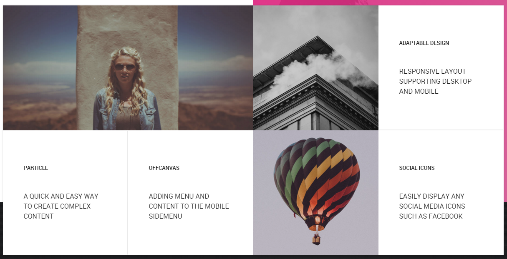
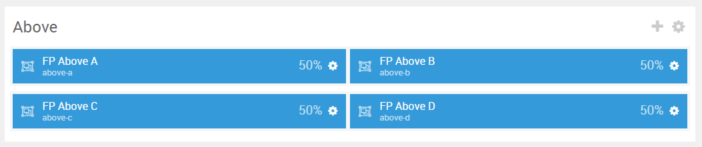
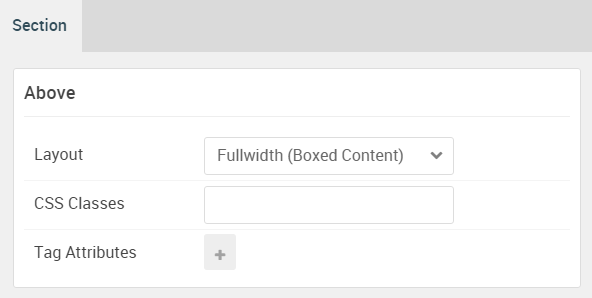

## Introduction

:	1. **Grid Promo Gallery (Particle)** [10%, 5%, se]
	2. **Grid Promo Gallery (Particle)** [10%, 55%, se]
	3. **Grid Promo Gallery (Particle)** [55%, 5%, se]
	4. **Grid Promo Gallery (Particle)** [55%, 55%, se]

The **Above** section includes four **Grid Promo Gallery** particles assigned to four different module positions: **Above A**, **Above B**, **Above C**, and **Above D**.

Here is a breakdown of the module(s) and particle(s) that appear in this section:

* [Grid Promo Gallery (particle)](#grid-promo-gallery-(particle)-1)
* [Grid Promo Gallery (particle)](#grid-promo-gallery-(particle)-2)
* [Grid Promo Gallery (particle)](#grid-promo-gallery-(particle)-3)
* [Grid Promo Gallery (particle)](#grid-promo-gallery-(particle)-4)

## Section Settings

| Option           | Setting                   |
| :--------------- | :----------               |
| Layout           | Fullwidth (Boxed Content) |
| CSS Classes      | Blank                     |
| Tag Attributes   | Blank                     |

## Grid Promo Gallery (Particle) 1

The **Grid Promo Gallery** particle is a **Gantry 5 Particle** module placed within the **above-a** module position. Adding a particle to a module position can be done by creating a **Gantry 5 Particle** module, adding the particle using the settings found in the section below, and assigning it to the position.

### Module Position Particle Settings

#### Particle Settings

| Option        | Setting      |
| :-----        | :-----       |
| Particle Name | `FP Above A` |
| Key           | `above-a`    |
| Chrome        | `gantry`     |

#### Block Settings

| Option                    | Setting      |
| :-----                    | :-----       |
| Grid Promo Gallery CSS ID | Blank        |
| CSS Classes               | `fp-above-a` |
| Variations                | Blank        |
| Tag Attributes            | Blank        |
| Fixed Size                | Unchecked    |
| Block Size                | `50%`        |

### Grid Promo Gallery Particle Settings

#### Particle Settings

| Option               | Setting                                                                                                                                                                  |
| :-----               | :-----                                                                                                                                                                   |
| Particle Name        | `Grid Promo Gallery`                                                                                                                                                     |
| CSS Classes          | Blank                                                                                                                                                                    |
| Title                | Blank                                                                                                                                                                    |
| Description          | Blank                                                                                                                                                                    |
| Readmore Text        | Blank                                                                                                                                                                    |
| Readmore Link        | Blank                                                                                                                                                                    |
| Readmore Link Target | Self                                                                                                                                                                     |
| Readmore Style       | Button 3                                                                                                                                                                 |
| Grid Column          | 1 Column                                                                                                                                                                 |
| Item 1 Name          | `Easily configure complex layouts with Gantry 5 Drag & Drop interface for the whole site or specific pages`                                                              |
| Item 1 CSS Classes   | `g-promogallery-style-1`                                                                                                                                                 |
| Item 1 Image         | Custom                                                                                                                                                                   |
| Item 1 Tag           | `Layout Configuration`                                                                                                                                                   |
| Item 1 Title         | Blank                                                                                                                                                                    |
| Item 1 Description   | `Easily configure complex layouts with the Powerful Gantry 5 Drag & Drop interface for the whole site or specific pages` |
| Link                 | `#`                                                                                                                                                                      |
| Target               | Self                                                                                                                                                                     |

## Grid Promo Gallery (Particle) 2

The **Grid Promo Gallery** particle is a **Gantry 5 Particle** module placed within the **above-b** module position. Adding a particle to a module position can be done by creating a **Gantry 5 Particle** module, adding the particle using the settings found in the section below, and assigning it to the position.

### Module Position Particle Settings

#### Particle Settings

| Option        | Setting      |
| :-----        | :-----       |
| Particle Name | `FP Above B` |
| Key           | `above-b`    |
| Chrome        | `gantry`     |

#### Block Settings

| Option         | Setting      |
| :-----         | :-----       |
| CSS ID         | Blank        |
| CSS Classes    | `fp-above-b` |
| Variations     | Blank        |
| Tag Attributes | Blank        |
| Fixed Size     | Unchecked    |
| Block Size     | `50%`        |

### Grid Promo Gallery Particle Settings

#### Particle Settings

| Option               | Setting                                         |
| :-----               | :-----                                          |
| Particle Name        | `Grid Promo Gallery`                            |
| CSS Classes          | Blank                                           |
| Title                | Blank                                           |
| Description          | Blank                                           |
| Readmore Text        | Blank                                           |
| Readmore Link        | Blank                                           |
| Readmore Link Target | Self                                            |
| Readmore Style       | Button 3                                        |
| Grid Column          | 2 Columns                                       |
| Item 1 Name          | `Advanced menu with dropdown, columns and more` |
| Item 1 CSS Classes   | `g-promogallery-style-1`                        |
| Item 1 Image         | Custom                                          |
| Item 1 Tag           | `Menu Editor`                                   |
| Item 1 Title         | Blank                                           |
| Item 1 Description   | `Advanced menu with dropdown, columns and more` |
| Link                 | `#`                                             |
| Target               | Self                                            |

## Grid Promo Gallery (Particle) 3

The **Grid Promo Gallery** particle is a **Gantry 5 Particle** module placed within the **above-c** module position. Adding a particle to a module can be done by creating a **Gantry 5 Particle** module, adding the particle using the settings found in the section below, and assigning it to the position.

### Module Position Particle Settings

#### Particle Settings

| Option        | Setting      |
| :-----        | :-----       |
| Particle Name | `FP Above C` |
| Key           | `above-c`    |
| Chrome        | `gantry`     |

#### Block Settings

| Option         | Setting      |
| :-----         | :-----       |
| CSS ID         | Blank        |
| CSS Classes    | `fp-above-c` |
| Variations     | Blank        |
| Tag Attributes | Blank        |
| Fixed Size     | Unchecked    |
| Block Size     | `50%`        |

### Grid Promo Gallery Particle Settings

#### Particle Settings

| Option               | Setting                                          |
| :-----               | :-----                                           |
| Particle Name        | `Grid Promo Gallery`                             |
| CSS Classes          | Blank                                            |
| Title                | Blank                                            |
| Description          | Blank                                            |
| Readmore Text        | Blank                                            |
| Readmore Link        | Blank                                            |
| Readmore Link Target | Self                                             |
| Readmore Style       | Button 3                                         |
| Grid Column          | 2 Columns                                        |
| Item 1 Name          | `A quick and easy way to create complex content` |
| Item 1 CSS Classes   | `g-promogallery-style-2` `g-border-right`        |
| Item 1 Image         | Custom                                           |
| Item 1 Tag           | `Particle`                                       |
| Item 1 Title         | Blank                                            |
| Item 1 Description   | `A quick and easy way to create complex content` |
| Link                 | `#`                                              |
| Target               | Self                                             |

## Grid Promo Gallery (Particle) 4

The **Grid Promo Gallery** particle is a **Gantry 5 Particle** module placed within the **above-d** module position. Adding a particle to a module position can be done by creating a **Gantry 5 Particle** module, adding the particle using the settings found in the section below, and assigning it to the position.

### Module Position Particle Settings

#### Particle Settings

| Option        | Setting      |
| :-----        | :-----       |
| Particle Name | `FP Above D` |
| Key           | `above-d`    |
| Chrome        | `gantry`     |

#### Block Settings

| Option         | Setting      |
| :-----         | :-----       |
| CSS ID         | Blank        |
| CSS Classes    | `fp-above-d` |
| Variations     | Blank        |
| Tag Attributes | Blank        |
| Fixed Size     | Unchecked    |
| Block Size     | `50%`        |

### Grid Promo Gallery Particle Settings

#### Particle Settings

| Option               | Setting                                               |
| :-----               | :-----                                                |
| Particle Name        | `Grid Promo Gallery`                                  |
| CSS Classes          | Blank                                                 |
| Title                | Blank                                                 |
| Description          | Blank                                                 |
| Readmore Text        | Blank                                                 |
| Readmore Link        | Blank                                                 |
| Readmore Link Target | Self                                                  |
| Readmore Style       | Button 3                                              |
| Grid Column          | 2 Columns                                             |
| Item 1 Name          | `A quick and easy way to create complex content`      |
| Item 1 CSS Classes   | `g-promogallery-style-1`                              |
| Item 1 Image         | Custom                                                |
| Item 1 Tag           | `FlexSlider`                                          |
| Item 1 Title         | Blank                                                 |
| Item 1 Description   | `Display volumes of content with FlexSlider particle` |
| Link                 | `#`                                                   |
| Target               | Self                                                  |