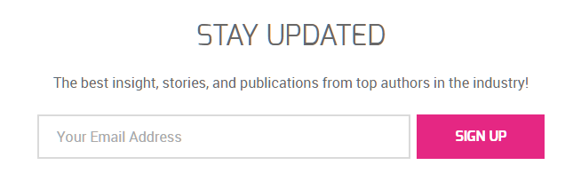
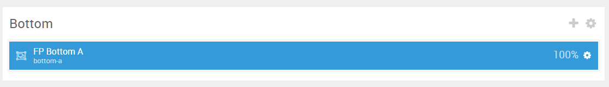
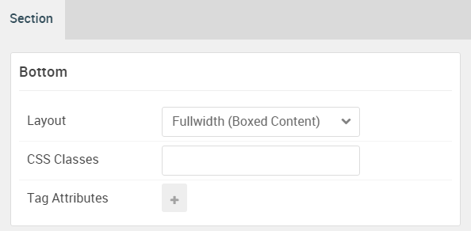

## Introduction

The **Bottom** section includes a single **Newsletter** particles placed within the **Bottom A** module position.

Here is a breakdown of the module(s) and particle(s) that appear in this section:

* [Newsletter (particle)](#newsletter-(particle))

## Section Settings

| Option           | Setting                   |
| :--------------- | :----------               |
| Layout           | Fullwidth (Boxed Content) |
| CSS Classes      | Blank                     |
| Tag Attributes   | Blank                     |

## Newsletter (Particle)

The **Newsletter** particle is a **Gantry 5 Particle** module placed within the **bottom-a** module position. Adding a particle to a module position can be done by creating a **Gantry 5 Particle** module, adding the particle using the settings found in the section below, and assigning it to the position.

### Module Position Particle Settings

#### Particle Settings

| Option        | Setting       |
| :-----        | :-----        |
| Particle Name | `FP Bottom A` |
| Key           | `bottom-a`    |
| Chrome        | `gantry`      |

#### Block Settings

| Option         | Setting       |
| :-----         | :-----        |
| CSS ID         | Blank         |
| CSS Classes    | `fp-bottom-a` |
| Variations     | Blank         |
| Tag Attributes | Blank         |
| Fixed Size     | Unchecked     |
| Block Size     | `100%`        |

### Newsletter Particle Settings

#### Particle Settings

| Option         | Setting                                                                         |
| :-----         | :-----                                                                          |
| Particle Name  | `Newsletter`                                                                    |
| CSS Classes    | Blank                                                                           |
| Title          | `Stay Updated`                                                                  |
| Heading Text   | `The best insight, stories, and publications from top authors in the industry!` |
| InputBox Text  | `Your Email Address`                                                            |
| Button Text    | `Sign Up`                                                                       |
| Feedburner URI | Blank                                                                           |
| Button Classes | `button-alt`                                                                    |