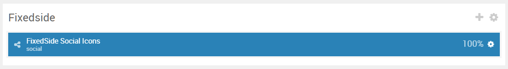
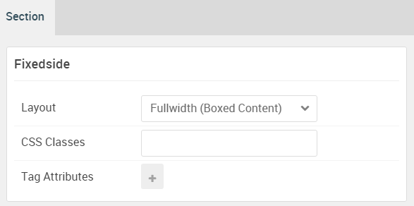

## Introduction

The **FixedSide** section includes a single **Social** particle.

Here is a breakdown of the module(s) and particle(s) that appear in this section:

* [Social (particle)](#social-(particle))

## Section Settings

| Option           | Setting                   |
| :--------------- | :----------               |
| Layout           | Fullwidth (Boxed Content) |
| CSS Classes      | Blank                     |
| Tag Attributes   | Blank                     |

## Social (Particle)

### Particle Settings

| Option        | Setting                               |
| :-----        | :-----                                |
| Particle Name | `FixedSide Social Icons`              |
| CSS Classes   | `g-social`                            |
| Title         | Blank                                 |
| Target        | New Window                            |
| Item 1 Name   | `Facebook`                            |
| Item 1 Icon   | `fa fa-facebook fa-fw`                |
| Item 1 Text   | Blank                                 |
| Item 1 Link   | `http://www.facebook.com/RocketTheme` |

### Block Settings

| Option         | Setting              |
| :-----         | :-----               |
| CSS ID         | Blank                |
| CSS Classes    | `g-fixedside-social` |
| Variations     | Blank                |
| Tag Attributes | Blank                |
| Fixed Size     | Unchecked            |
| Block Size     | `100%`               |