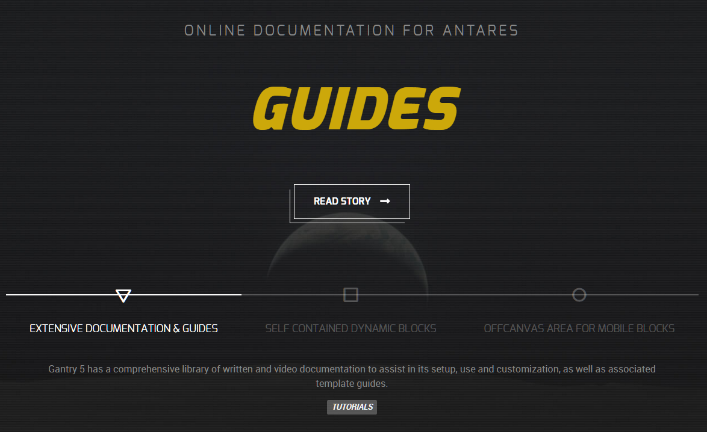
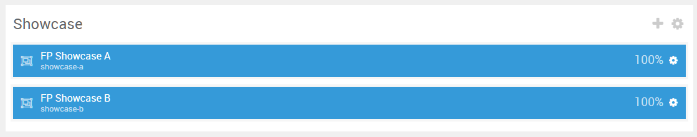
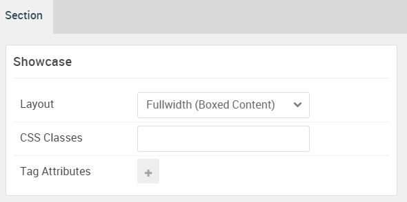

## Introduction

:   1. **Promo Content** [10%, 5%, se]
    2. **Content Tabs** [65%, 5%, se]

The **Showcase** section includes a **Promo Content** and a **Content Tabs** particle assigned to the **showcase-a** module position.

Here is a breakdown of the module(s) and particle(s) that appear in this section:

* [Promo Content (particle)](#promo-content-(particle))
* [Content Tabs (Particle)](#content-tabs-(particle))

## Section Settings

| Option           | Setting                   |
| :--------------- | :----------               |
| Layout           | Fullwidth (Boxed Content) |
| CSS Classes      | Blank                     |
| Tag Attributes   | Blank                     |

## Promo Content (Particle)

The **Promo Content** particle is a **Gantry 5 Particle** module placed within the **showcase-a** module position. Adding a particle to a module position can be done by creating a **Gantry 5 Particle** module, adding the particle using the settings found in the section below, and assigning it to the position.

### Module Position Particle Settings

#### Particle Settings

| Option        | Setting       |
| :-----        | :-----        |
| Particle Name | `FP Showcase A` |
| Key           | `showcase-a`    |
| Chrome        | `gantry`      |

#### Block Settings

| Option         | Setting         |
| :-----         | :-----          |
| CSS ID         | Blank           |
| CSS Classes    | `fp-showcase-a` |
| Variations     | Blank           |
| Tag Attributes | Blank           |
| Fixed Size     | Unchecked       |
| Block Size     | `100%`          |

### Promo Content Particle Settings

#### Particle Settings

| Option             | Setting                                          |
| :-----             | :-----                                           |
| Particle Name      | `Promo Content`                                  |
| CSS Classes        | Blank                                            |
| Title              | Blank                                            |
| Promo Style        | Super Promo                                      |
| Subpromo Text      | `Online Documentation for Antares`               |
| Promo Text         | `Guides`                                         |
| Description        | Blank                                            |
| Readmore Text      | `Read Story`                                     |
| Readmore Classes   | `button-special` `button-arrow` `button-outline` |
| Link               | `#`                                              |
| Link Target        | Self                                             |
| Readmore Style     | Block                                            |
| Tags               | Blank                                            |
| Alt Button Label   | Blank                                            |
| Alt Button Link    | Blank                                            |
| Alt Button Target  | Self                                             |
| Alt Button Classes | Blank                                            |

## Content Tabs (Particle)

The **Content Tabs** particle is a **Gantry 5 Particle** module placed within the **showcase-b** module position. Adding a particle to a module position can be done by creating a **Gantry 5 Particle** module, adding the particle using the settings found in the section below, and assigning it to the position.

### Module Position Particle Settings

#### Particle Settings

| Option        | Setting         |
| :-----        | :-----          |
| Particle Name | `FP Showcase B` |
| Key           | `showcase-b`    |
| Chrome        | `gantry`        |

#### Block Settings

| Option         | Setting         |
| :-----         | :-----          |
| CSS ID         | Blank           |
| CSS Classes    | `fp-showcase-a` |
| Variations     | Blank           |
| Tag Attributes | Blank           |
| Fixed Size     | Unchecked       |
| Block Size     | `100%`          |

### Content Tabs Particle Settings

#### Particle Settings

| Option             | Setting                                                                                                                                                         |
| :-----             | :-----                                                                                                                                                          |
| Particle Name      | `Content Tabs`                                                                                                                                                  |
| CSS Classes        | `g-contenttabs-style-center`                                                                                                                                    |
| Title              | Blank                                                                                                                                                           |
| Animation Type     | Slide                                                                                                                                                           |
| Item 1 Name        | `Extensive Documentation & Guides`                                                                                                                              |
| Item 1 Tab Name    | `tab1`                                                                                                                                                          |
| Item 1 Subtitle    | ``                                                                                                                 |
| Item 1 Title       | `Extensive Documentation &amp; Guides`                                                                                                                          |
| Item 1 Description | `Gantry 5 has a comprehensive library of written and video documentation to assist in its setup, use and customization, as well as associated template guides.` |
| Item 1 Tag         | `Tutorials`                                                                                                                                                     |