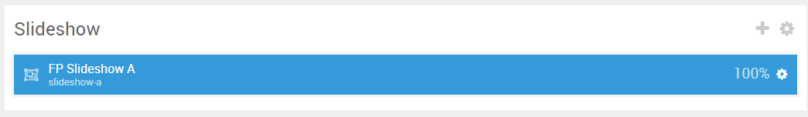
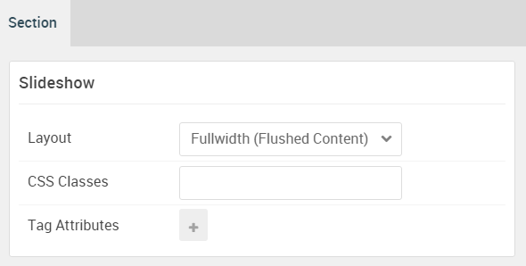

## Introduction

The **Slideshow** section includes one **FlexSlider** particle. This particle is placed within the **Slideshow A** module position.

Here is a breakdown of the module(s) and particle(s) that appear in this section:

* [FlexSlider (particle)](#flexslider-(particle))

## Section Settings

| Option           | Setting                     |
| :--------------- | :----------                 |
| Layout           | Fullwidth (Flushed Content) |
| CSS Classes      | Blank                       |
| Tag Attributes   | Blank                       |

## FlexSlider (Particle)

The **FlexSlider** particle is a **Gantry 5 Particle** module placed within the **slideshow-a** module position. Adding a particle to a module position can be done by creating a **Gantry 5 Particle** module, adding the particle using the settings found in the section below, and assigning it to the position.

### Module Position Particle Settings

#### Particle Settings

| Option        | Setting          |
| :-----        | :-----           |
| Particle Name | `FP Slideshow A` |
| Key           | `slideshow-a`    |
| Chrome        | `gantry`         |

#### Block Settings

| Option         | Setting          |
| :-----         | :-----           |
| CSS ID         | Blank            |
| CSS Classes    | `fp-slideshow-a` |
| Variations     | Blank            |
| Tag Attributes | Blank            |
| Fixed Size     | Unchecked        |
| Block Size     | `100%`           |

### FlexSlider Particle Settings

#### Particle Settings

| Option                      | Setting                                                   |
| :-----                      | :-----                                                    |
| Particle Name               | `FlexSlider`                                              |
| CSS Classes                 | `fp-flexslider-slideshow`                                 |
| Title                       | Blank                                                     |
| Layout                      | Slideshow                                                 |
| Thumbnail Width             | `150`                                                     |
| Autoplay                    | Enable                                                    |
| Autoplay Speed              | `5000`                                                    |
| Pause on Hover              | Enable                                                    |
| Animation Type              | Slide                                                     |
| Prev Button Text            | `Prev`                                                    |
| Next Button Text            | `Next`                                                    |
| Slider Button Icon          | `fa fa-bookmark-o fa-fw`                                  |
| Slider Button Link          | `http://www.rockettheme.com/joomla/templates/antares`     |
| Target                      | New Window                                                |
| RTL Mode                    | Disable                                                   |
| Item 1 Name                 | `Ultimate Framework`                                      |
| Item 1 Background Image     | Blank                                                     |
| Item 1 Overlay Image        | `gantry-media://rocketlauncher/home/slideshow/img-01.jpg` |
| Item 1 Overlay Parallax     | Disabled                                                  |
| Item 1 Parallax Ratio       | `0.5`                                                     |
| Item 1 SubTitle             | `Intuitive Interface`                                     |
| Item 1 Title                | `Ultimate Framework!`                        |
| Item 1 Description          | Blank                                                     |
| Item 1 Testimonial Image    | Blank                                                     |
| Item 1 Testimonial Name     | Blank                                                     |
| Item 1 Testimonial Position | Blank                                                     |
| Item 1 Link                 | `#`                                                       |
| Item 1 Link Text            | `Read Story`                                              |
| Item 1 Target               | Self                                                      |
| Item 1 Button Class         | `button-special button-arrow`                             |
