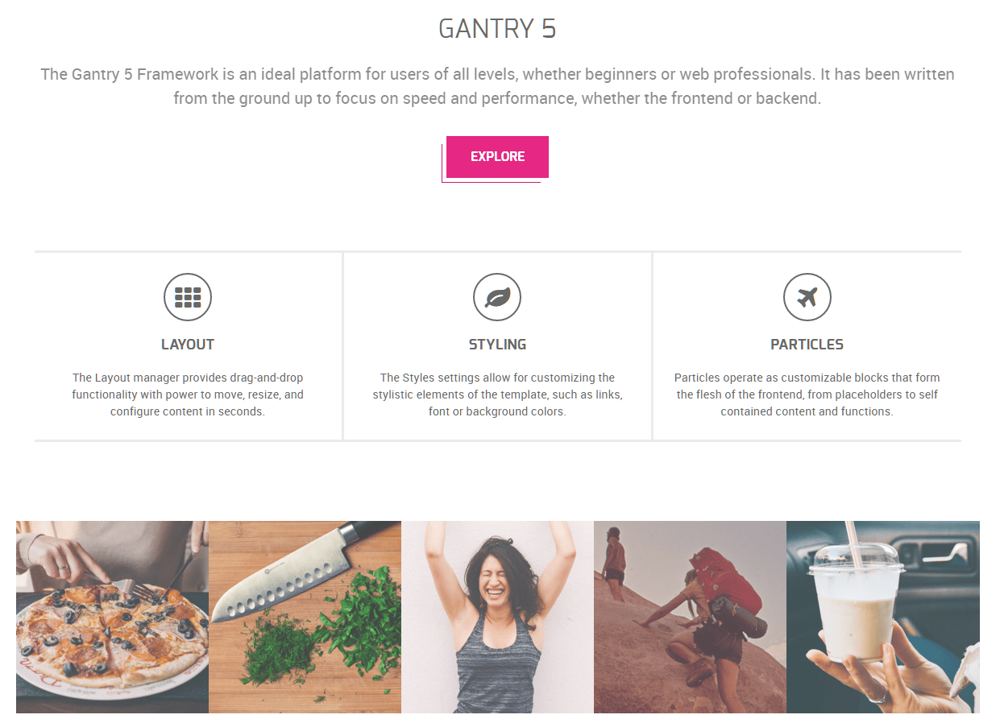
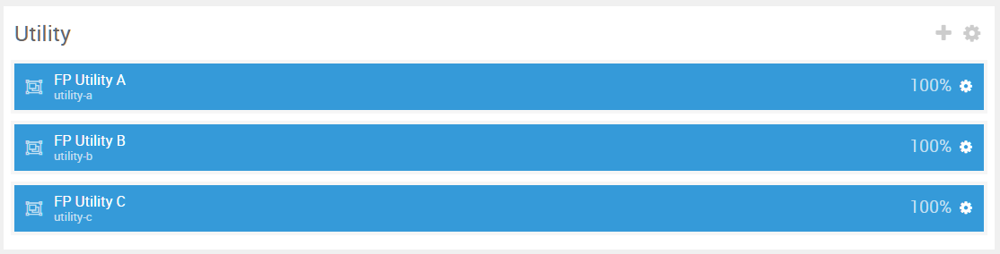
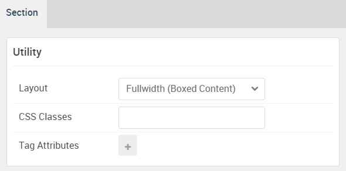

## Introduction

The **Utility** section includes three particles: **Promo Content**, **Block Content**, and **Animated Block**. These particles occupy one of three module positions: **Utility A**, **Utility B**, and **Utility C**.

Here is a breakdown of the module(s) and particle(s) that appear in this section:

* [Promo Content (Particle)](#promo-content-(particle))
* [Block Content (Particle)](#block-content-(particle))
* [Animated Block (Particle)](#animated-block-(particle))

## Section Settings

| Option           | Setting                   |
| :--------------- | :----------               |
| Layout           | Fullwidth (Boxed Content) |
| CSS Classes      | Blank                     |
| Tag Attributes   | Blank                     |

## Promo Content (Particle)

The **Promo Content** particle is a **Gantry 5 Particle** module placed within the **utility-a** module position. Adding a particle to a module position can be done by creating a **Gantry 5 Particle** module, adding the particle using the settings found in the section below, and assigning it to the position.

### Module Position Particle Settings

#### Particle Settings

| Option        | Setting        |
| :-----        | :-----         |
| Particle Name | `FP Utility A` |
| Key           | `utility-a`    |
| Chrome        | `gantry`       |

#### Block Settings

| Option         | Setting        |
| :-----         | :-----         |
| CSS ID         | Blank          |
| CSS Classes    | `fp-utility-a` |
| Variations     | Blank          |
| Tag Attributes | Blank          |
| Fixed Size     | Unchecked      |
| Block Size     | `100%`         |

### Promo Content Particle Settings

#### Particle Settings

| Option             | Setting                                                                                                                                                                                                                   |
| :-----             | :-----                                                                                                                                                                                                                    |
| Particle Name      | `Promo Content`                                                                                                                                                                                                           |
| CSS Classes        | Blank                                                                                                                                                                                                                     |
| Title              | `Gantry 5`                                                                                                                                                                                                                |
| Promo Style        | Standard                                                                                                                                                                                                                  |
| Subpromo Text      | Blank                                                                                                                                                                                                                     |
| Promo Text         | Blank                                                                                                                                                                                                                     |
| Description        | `The Gantry 5 Framework is an ideal platform for users of all levels, whether beginners or web professionals. It has been written from the ground up to focus on speed and performance, whether the frontend or backend.` |
| Readmore Text      | `Explore`                                                                                                                                                                                                                 |
| Readmore Classes   | `button-alt` `button-special`                                                                                                                                                                                             |
| Link               | `#`                                                                                                                                                                                                                       |
| Link Target        | Self                                                                                                                                                                                                                      |
| Readmore Style     | Block                                                                                                                                                                                                                     |
| Tags               | Blank                                                                                                                                                                                                                     |
| Alt Button Label   | Blank                                                                                                                                                                                                                     |
| Alt Button Link    | Blank                                                                                                                                                                                                                     |
| Alt Button Target  | Self                                                                                                                                                                                                                      |
| Alt Button Classes | Blank                                                                                                                                                                                                                     |

## Block Content (Particle)

The **Block Content** particle is a **Gantry 5 Particle** module placed within the **utility-b** module position. Adding a particle to a module position can be done by creating a **Gantry 5 Particle** module, adding the particle using the settings found in the section below, and assigning it to the position.

### Module Position Particle Settings

#### Particle Settings

| Option        | Setting        |
| :-----        | :-----         |
| Particle Name | `FP Utility B` |
| Key           | `utility-b`    |
| Chrome        | `gantry`       |

#### Block Settings

| Option         | Setting        |
| :-----         | :-----         |
| CSS ID         | Blank          |
| CSS Classes    | `fp-utility-b` |
| Variations     | Blank          |
| Tag Attributes | Blank          |
| Fixed Size     | Unchecked      |
| Block Size     | `100%`         |

### Block Content Particle Settings

#### Particle Settings

| Option                | Setting                                                                                                                  |
| :-----                | :-----                                                                                                                   |
| Particle Name         | `Block Content`                                                                                                          |
| CSS Classes           | `g-blockcontent-style-1`                                                                                                 |
| Title                 | Blank                                                                                                                    |
| Image                 | Blank                                                                                                                    |
| Headline              | Blank                                                                                                                    |
| Description           | Blank                                                                                                                    |
| Button                | Blank                                                                                                                    |
| Button Text           | Blank                                                                                                                    |
| Button Target         | Self                                                                                                                     |
| Button Classes        | Blank                                                                                                                    |
| Icon                  | Blank                                                                                                                    |
| Alt Text              | Blank                                                                                                                    |
| Item 1 Name           | `Layout`                                                                                                                 |
| Item 1 Title          | `Layout`                                                                                                                 |
| Item 1 Icon           | `fa fa-th fa-fw fa-2x`                                                                                                   |
| Item 1 Image          | Blank                                                                                                                    |
| Item 1 RokBox Image   | Blank                                                                                                                    |
| Item 1 Caption        | Blank                                                                                                                    |
| Item 1 Sub Title      | Blank                                                                                                                    |
| Item 1 Description    | `The Layout manager provides drag-and-drop functionality with power to move, resize, and configure content in seconds. ` |
| Item 1 CSS Classes    | Blank                                                                                                                    |
| Item 1 Button Label   | Blank                                                                                                                    |
| Item 1 Button Link    | Blank                                                                                                                    |
| Item 1 Button Classes | Blank                                                                                                                    |

## Animated Block (Particle)

The **Animated Block** particle is a **Gantry 5 Particle** module placed within the **utility-c** module position. Adding a particle to a module position can be done by creating a **Gantry 5 Particle** module, adding the particle using the settings found in the section below, and assigning it to the position.

### Module Position Particle Settings

#### Particle Settings

| Option        | Setting        |
| :-----        | :-----         |
| Particle Name | `FP Utility C` |
| Key           | `utility-c`    |
| Chrome        | `gantry`       |

#### Block Settings

| Option         | Setting        |
| :-----         | :-----         |
| CSS ID         | Blank          |
| CSS Classes    | `fp-utility-c` |
| Variations     | Blank          |
| Tag Attributes | Blank          |
| Fixed Size     | Unchecked      |
| Block Size     | `100%`         |

### Animated Block Particle Settings

#### Particle Settings

| Option             | Setting               |
| :-----             | :-----                |
| Particle Name      | `Animated Block`      |
| CSS Classes        | Blank                 |
| Title              | Blank                 |
| Grid Column        | 5 Columns             |
| Button             | Blank                 |
| Link               | Blank                 |
| Target             | Self                  |
| Item 1 Name        | `Menu`                |
| Item 1 Image       | Custom                |
| Item 1 Headline    | Blank                 |
| Item 1 Tag         | `Menu`                |
| Item 1 Description | Blank                 |
| Item 1 Icon        | `fa fa-list-ul fa-fw` |
| Item 1 Read More   | `+`                   |
| Item 1 Link        | `#`                   |
| Item 1 Target      | Self                  |