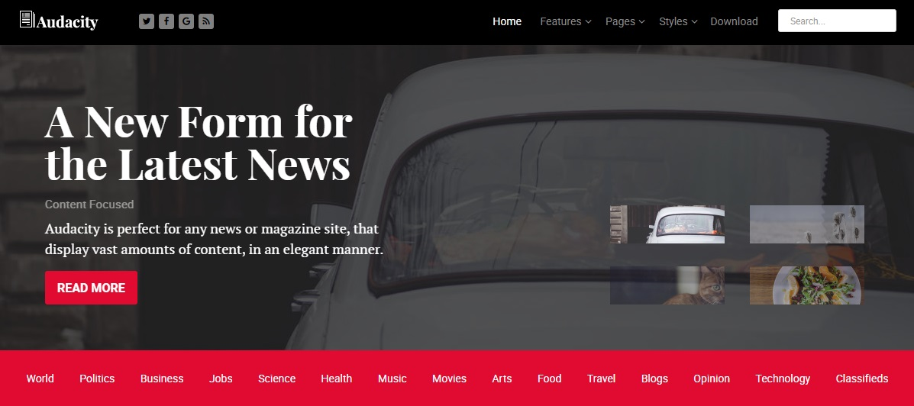

Introduction
-----

Audacity is a modern, sectioned based design, with a diverse infusion of background textures and patterns. These enrich and differentiate your site whilst maintaining an overall conservative approach, for flexible site application.

Requirements
-----
* PHP 7.1+
* Curl
* OpenSSL Libraries
* Multibyte String Support

>> NOTE: Gantry v5.4.27+ is required for Audacity to work correctly. For more details on the Gantry Framework, please visit its [Dedicated Website](http://gantry.org).

Key Features
-----

### Included Particles

* Audio Player
* Block Content
* Branding
* Breadcrumbs
* Calendar
* Contact
* Content List
* Content Tabs
* Copyright
* Custom HTML
* Date
* Feature Tabs
* Joomla Content
* Headlines
* Horizontal Menu
* Image Grid
* Image Slider
* Info List
* Link Tabs
* Lists
* Login
* Logo / Image
* MailChimp
* Menu
* Mobile Menu
* Mosaic
* Pricing Table
* Progress Bar
* Promo Image
* Search
* Showcase
* Simple Counter
* Slider
* Social
* Strips Slider
* Tab Image
* Testimonials
* To Top
* Vertical Menu
* Video 

### Template Features

* Responsive Layout
* 6 Preset Styles
* Custom Typography
* Unlimited Positions
* Custom Particles
* Mobile Menu
* Coming Soon Page
* Font Awesome Icons 

### Gantry Core Features

* YAML-based Configuration
* Twig Templating
* Powerful Particle System
* Visual Menu Editor
* MegaMenu Support
* Off-Canvas Panel
* Ajax Admin
* Layout Manager
* Template Inheritance
* SCSS Support
* Sophisticated Fields
* Unlimited Undo/Redo
* Styles Panel

## Color Chooser

Audacity has an extensive Color Chooser in the template settings to provide intricate controls for each section, inclusive of overlay type, text color, background color, as well as accent colors. Edit preexisting or create new presets.

## Dropdown Menu

The Dropdown Menu is an advanced, CSS based menu system, which offers a wide range of per menu item options, such as: inline subtext, icons, images, custom column widths and number, as well as control over how menu items are distributed between columns.

## Responsive

Audacity is a responsive template which means it adapts to the viewing device's width, such as mobile, tablet or desktop. Mobile modes have a unique menu to aid usability. Support classes can also be used to display or hide various types of content for each device.
