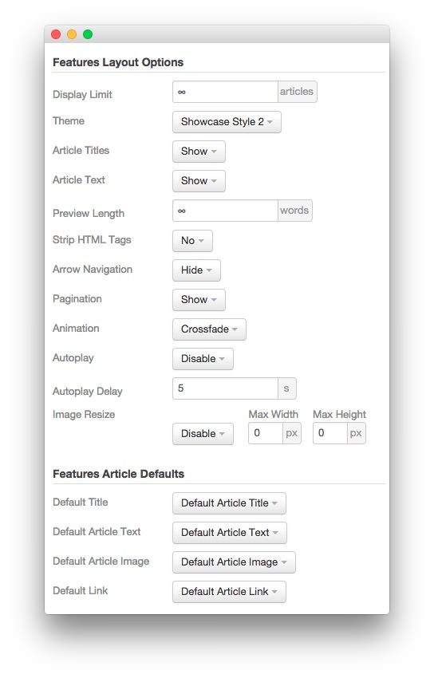

FP RokSprocket Features - Showcase 2
-----

The **RokSprocket** module used in this area of the front page is a great way to feature some of your site's more notable articles or areas of interest.

We utilized the **Simple** Content Provider, linking each item in the RokSprocket module to an article. You can find examples of the **Simple** items used in this module in the **Filtered Article List** section below.

### Details

| Option           | Setting                                |
| :--------------- | :------------------------------------  |
| Title            | `FP RokSprocket Features - Showcase 2` |
| Show Title       | Hide                                   |
| Access           | Public                                 |
| Position         | bottom-b                               |
| Status           | Published                              |
| Content Provider | Simple                                 |
| Type             | Features                               |

### Filtered Article List

#### Article 1

| Option | Setting |
| :----- | :------ |
| Image  | Custom  |
| Link   | Custom  |

**Title**

~~~ .html
RokSprocket features a diverse collection of differentdistinct themes and layouts
~~~

**Description**

~~~ .html

Powerful Extension

RokSprocket is a versatile and high configurable content extension that has a rich user interface, and many types of layouts to suit any content purpose.

~~~

#### Article 2

| Option | Setting |
| :----- | :------ |
| Image  | Custom  |
| Link   | Custom  |

**Title**

~~~
A responsive layout dynamically adjusts to the viewing device, such as tablet
~~~

**Description**

~~~ .html

Layout Controls

A responsive structure allows for a seamless experience across your entire site, automatically adjusting to different screen resolutions and devices.

~~~

#### Article 3

| Option | Setting |
| :----- | :------ |
| Image  | Custom  |
| Link   | Custom  |

**Title**

~~~ .html
The Color Chooser provides an intuitive and extensive UI for swift customization
~~~

**Description**

~~~ .html

Custom Style

Each of Audacity's module rows have administrator configurable settings for background and text color, allowing for swift changes without the need to code.

~~~

### Layout Options

| Option                | Setting               |
| :-------------------- | :-------------------- |
| Display Limit         | ∞                     |
| Theme                 | Showcase Style 2      |
| Article Titles        | Show                  |
| Article Text          | Show                  |
| Preview Length        | ∞                     |
| Strip HTML Tags       | No                    |
| Arrow Navigation      | Hide                  |
| Pagination            | Show                  |
| Animation             | Crossfade             |
| Autoplay              | Disable               |
| Autoplay Delay        | 5                     |
| Image Resize          | Disable               |
| Default Title         | Default Article Title |
| Default Article Text  | Default Article Text  |
| Default Article Image | Default Article Image |
| Default Link          | Default Article Link  |

>> The **Showcase Style 2** theme is unique to Audacity and was created to give the RokSprocket mode a certain set of attributes that enables it to look the way it does in this template. You can find more information about overriding themes [here](../../extensions/roksprocket/layout_modes.md#custom-layout-theme-overrides).

### Advanced

| Option              | Setting                                |
| :------------------ | :----------------------------------    |
| Module Class Suffix | `fp-roksprocket-showcase2-bottom box1` |
