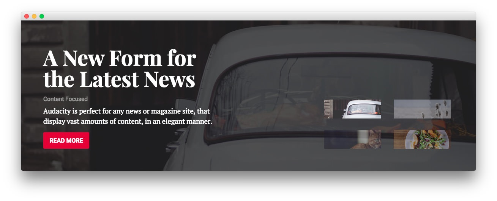
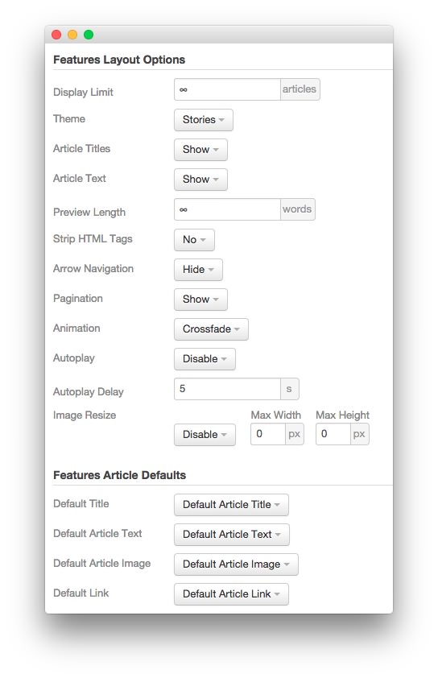

The **RokSprocket** module used in this area of the front page is a great way to feature some of your site's more notable articles or areas of interest.

We utilized the **Simple** Content Provider, linking each item in the RokSprocket module to an article. You can find examples of the **Simple** items used in this module in the **Filtered Article List** section below.

### Details

| Option           | Setting                               |
| :--------------- | :------------------------------------ |
| Title            | `FP RokSprocket Features - Slideshow` |
| Show Title       | Hide                                  |
| Access           | Public                                |
| Position         | showcase-a                            |
| Status           | Published                             |
| Content Provider | Simple                                |
| Type             | Features                              |

### Filtered Article List

#### Article 1

| Option | Setting                          |
| :----- | :------                          |
| Title  | `A New Form for the Latest News` |
| Image  | Custom                           |
| Link   | Custom                           |

**Description**

~~~ .html

Content Focused

Audacity is perfect for any news or magazine site, that display vast amounts of content, in an elegant manner.

~~~

#### Article 2

| Option | Setting                         |
| :----- | :------                         |
| Title  | `An Easy to Use Content System` |
| Image  | Custom                          |
| Link   | Custom                          |

**Description**

~~~ .html

RokSprocket Extension

RokSprocket is a versatile, content switchblade extension that has multiple layouts, themes and a rich user interface.

~~~

#### Article 3

| Option | Setting                  |
| :----- | :------                  |
| Title  | `A Versatile Foundation` |
| Image  | Custom                   |
| Link   | Custom                   |

**Description**

~~~ .html

Gantry Framework

Gantry is a powerful cross-platform framework that sits at the heart of the template, powering various features.

~~~

### Layout Options

| Option                | Setting               |
| :-----                | :-----                |
| Display Limit         | ∞                     |
| Theme                 | Stories               |
| Article Titles        | Show                  |
| Article Text          | Show                  |
| Preview Length        | ∞                     |
| Strip HTML Tags       | No                    |
| Arrow Navigation      | Hide                  |
| Pagination            | Show                  |
| Animation             | Crossfade             |
| Autoplay              | Disable               |
| Autoplay Delay        | 5                     |
| Image Resize          | Disable               |
| Default Title         | Default Article Title |
| Default Article Text  | Default Article Text  |
| Default Article Image | Default Article Image |
| Default Link          | Default Article Link  |

>> The **Stories** theme is unique to Audacity and was created to give the RokSprocket mode a certain set of attributes that enables it to look the way it does in this template. You can find more information about overriding themes [here](../../extensions/roksprocket/layout_modes.md#custom-layout-theme-overrides).

### Advanced

| Option              | Setting                           |
| :-----              | :-----                            |
| Module Class Suffix | `fp-roksprocket-stories-showcase` |
