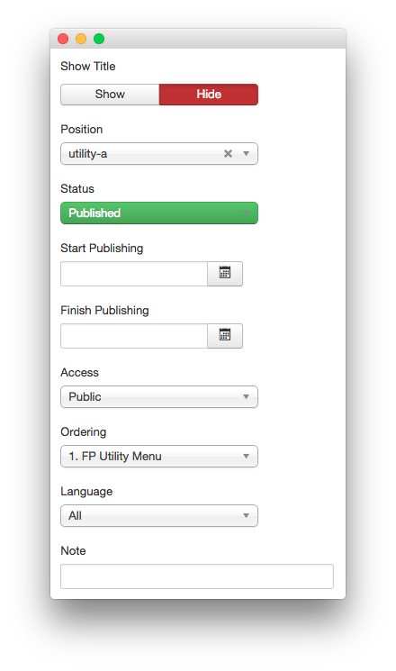
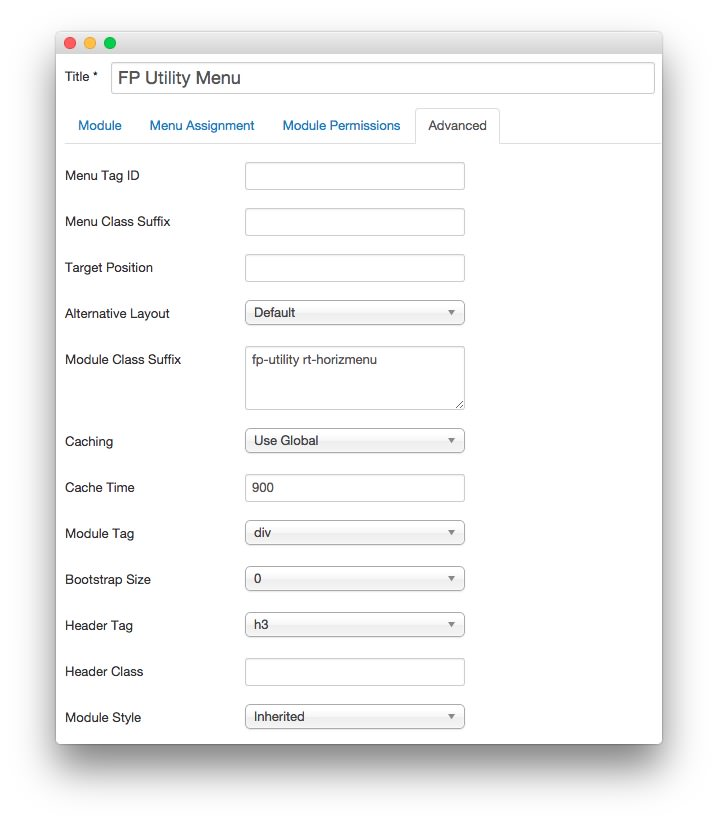

---
title: Audacity: Recreating the Demo - FP Utility Menu
description: Your Guide to Recreating Elements of the Audacity Demo for Joomla
breadcrumb: /joomla:Joomla/!templates:Templates/audacity:Audacity

---

FP Utility Menu
-----

The **FP Utility Menu** module is a standard **Menu** module. Here is a breakdown of the options selected to make it appear as it does on the front page of our demo.

### Details

| Option      | Setting             |
| :---------- | :----------         |
| Title       | `FP Utility Menu` |
| Show Title  | Hide                |
| Position    | utility-a           |
| Status      | Published           |
| Access      | Public              |

### Basic Options

| Option              | Setting      |
| :----------         | :----------  |
| Select Menu         | Utility Menu |
| Base Item           | Current      |
| Start Level         | 1            |
| End Level           | All          |
| Show Sub-menu Items | No           |

### Advanced Options

| Option              | Setting                   |
| :----------         | :----------               |
| Module Class Suffix | `fp-utility rt-horizmenu` |
