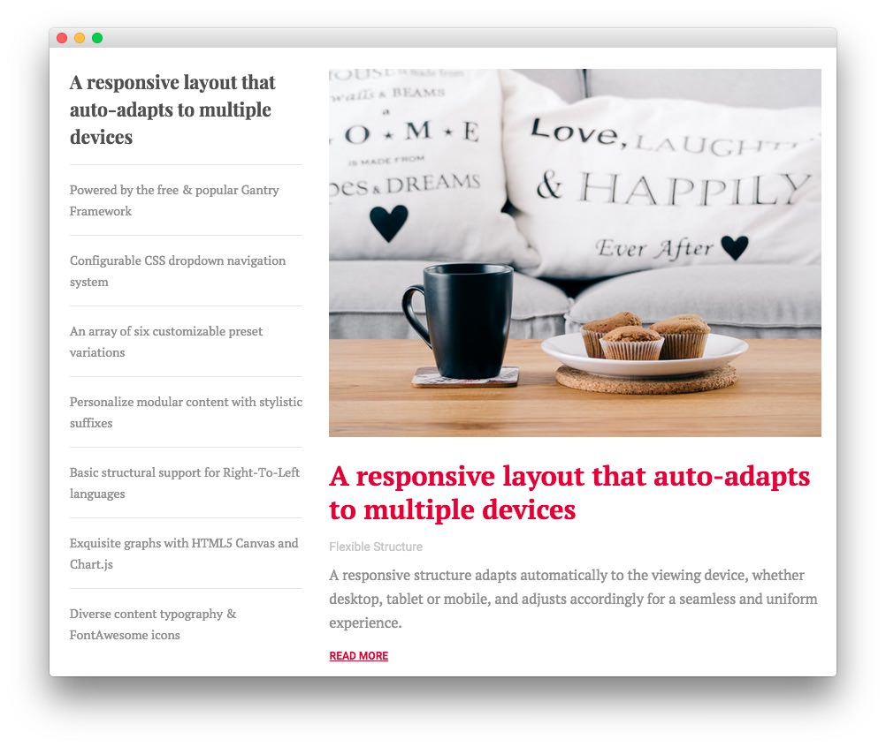
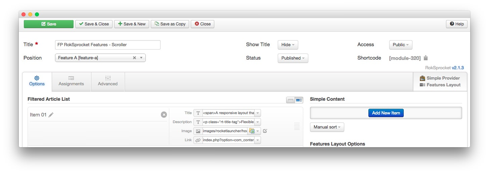
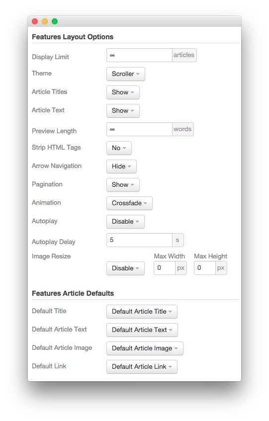

FP RokSprocket Features - Scroller
----

The **RokSprocket** module used in this area of the page is a great way to feature some of your site's more notable articles or areas of interest.

### Details

| Option           | Setting                              |
| :----------      | :----------                          |
| Title            | `FP RokSprocket Features - Scroller` |
| Show Title       | Hide                                 |
| Access           | Public                               |
| Position         | feature-a                            |
| Status           | Published                            |
| Content Provider | Simple                               |
| Type             | Features                             |

### Filtered Article List

We utilized the **Simple** Content Provider, linking each item in the RokSprocket module to an article. The **Title**, **Description**, **Link**, and **Image** fields in each article have been altered. A few examples of these article changes can be found below, excluding the **Image** and **Link** fields which will likely not work on your local copy as the links will be different.

#### Article 1

**Title**

~~~ .html
A responsive layout that auto-adapts to multiple most devices
~~~

**Description**

~~~ .html

Flexible Structure

A responsive structure adapts automatically to the viewing device, whether desktop, tablet or mobile, and adjusts accordingly for a seamless and uniform experience.

~~~

#### Article 2

**Title**

~~~
Powered by the free &amp; popular Gantry Framework
~~~

**Description**

~~~ .html

Free/GPL Framework

Gantry is the cross-platform framework that sits at the center of the theme, providing a rich library of standardized features, packaged with an intuitive control panel.

~~~

#### Article 3

**Title**

~~~ .html
Configurable CSS dropdown navigation system
~~~

**Description**

~~~ .html

CSS Based

The dropdown menu benefits from inline icons, subtext, modules and positions, alongside multiple columns, all configurable on a per-menu-item basis.

~~~

### Layout Options

| Option                | Setting               |
| :----------           | :----------           |
| Display Limit         | ∞                     |
| Theme                 | Scroller              |
| Article Titles        | Show                  |
| Article Text          | Show                  |
| Preview Length        | ∞                     |
| Strip HTML Tags       | No                    |
| Arrow Navigation      | Hide                  |
| Pagination            | Show                  |
| Animation             | Crossfade             |
| Autoplay              | Disable               |
| Autoplay Delay        | 5                     |
| Image Resize          | Disable               |
| Default Title         | Default Article Title |
| Default Article Text  | Default Article Text  |
| Default Article Image | Default Article Image |
| Default Link          | Default Article Link  |

### Advanced

| Option              | Setting                           |
| :----------         | :----------                       |
| Module Class Suffix | `fp-roksprocket-scroller-feature` |
