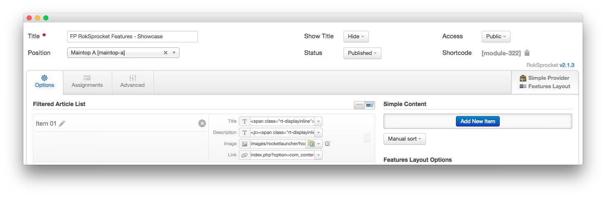

FP RokSprocket Features - Showcase
-----

The **RokSprocket** module used in this area of the front page is a great way to feature some of your site's more notable articles or areas of interest.

We utilized the **Simple** Content Provider, linking each item in the RokSprocket module to an article. You can find examples of the **Simple** items used in this module in the **Filtered Article List** section below.

### Details

| Option           | Setting                               |
| :--------------- | :------------------------------------ |
| Title            | `FP RokSprocket Features - Showcase`  |
| Show Title       | Hide                                  |
| Access           | Public                                |
| Position         | maintop-a                             |
| Status           | Published                             |
| Content Provider | Simple                                |
| Type             | Features                              |

### Filtered Article List

#### Article 1

| Option | Setting |
| :----- | :------ |
| Image  | Custom  |
| Link   | Custom  |

**Title**

~~~ .html
The Gantry Framework provides, a powerful foundation
~~~

**Description**

~~~ .html

Gantry is a cross-platform framework with a vast library of standardized features and functions, to make powerful, flexible themes.

Templates are easy to manage with Gantry, with its a rich and intuitive user interface, allowing for swift but extensive customization.

~~~

#### Article 2

| Option | Setting |
| :----- | :------ |
| Image  | Custom  |
| Link   | Custom  |

**Title**

~~~
Choose from Two Menu Systems with Smartphone Support
~~~

**Description**

~~~ .html

Dropdown Menu is a CSS based navigation system with powerful features such as multiple columns and inline modules.

SplitMenu is a static menu option, that places its child menu items in a separate module (usually sidebar) to the parent items.

~~~

#### Article 3

| Option | Setting |
| :----- | :------ |
| Image  | Custom  |
| Link   | Custom  |

**Title**

~~~ .html
An AssortmentArray of Examples Pages to Exhibit Layout Flexibility
~~~

**Description**

~~~ .html

The frontpage offers only one view of how Audacity can appear, therefore, to show its full flexibility, we provide sample pages.

Also demonstrated are the core Joomla components such as Contact and Blog, alongside different module layouts, and Chart.js graphs.

~~~

### Layout Options

| Option                | Setting               |
| :-------------------- | :-------------------- |
| Display Limit         | ∞                     |
| Theme                 | Showcase              |
| Article Titles        | Show                  |
| Article Text          | Show                  |
| Preview Length        | ∞                     |
| Strip HTML Tags       | No                    |
| Arrow Navigation      | Hide                  |
| Pagination            | Show                  |
| Animation             | Crossfade             |
| Autoplay              | Disable               |
| Autoplay Delay        | 5                     |
| Image Resize          | Disable               |
| Default Title         | Default Article Title |
| Default Article Text  | Default Article Text  |
| Default Article Image | Default Article Image |
| Default Link          | Default Article Link  |

### Advanced

| Option              | Setting                                |
| :------------------ | :----------------------------------    |
| Module Class Suffix | `fp-roksprocket-showcase-maintop box1` |
