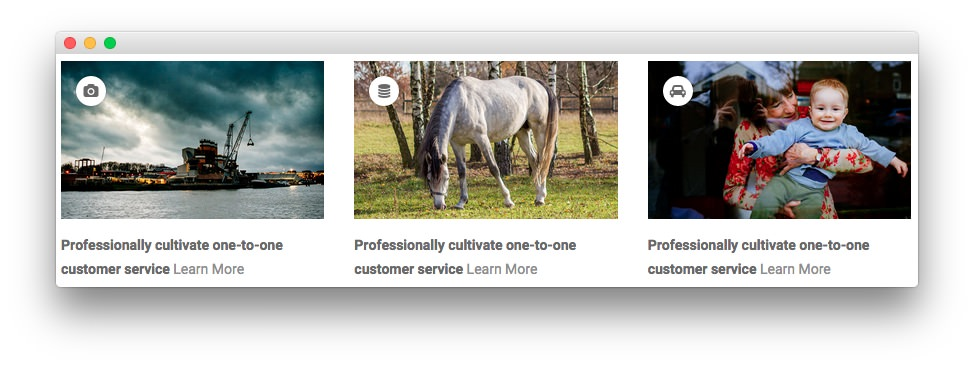
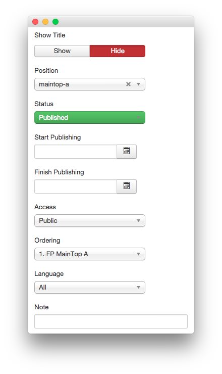
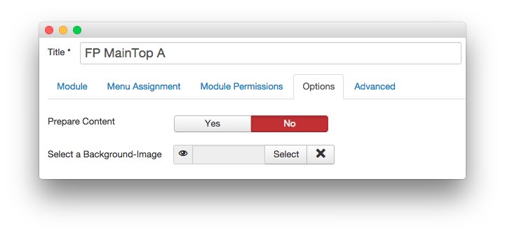
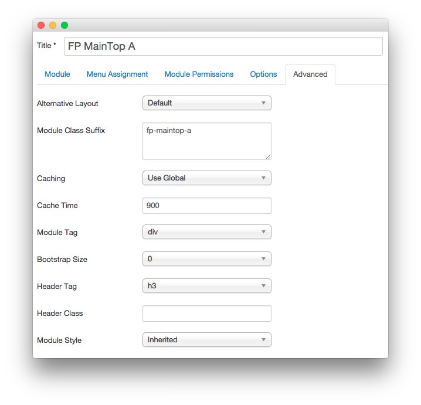

FP MainTop A
-----

This area of the front page is a **Custom HTML** module. You will find the settings used in our demo below.

>> Any **mod_custom** (Custom HTML) modules are best handled using either RokPad or no editor as a WYSIWYG editor can cause issues with any code that exists in the **Custom Output** field.

### Details

| Option     | Setting        |
| :--------- | :-----------   |
| Title      | `FP MainTop A` |
| Show Title | Hide           |
| Position   | maintop-a      |
| Status     | Published      |
| Access     | Public         |

### Custom Output

~~~ .html

    

        

            

                
                <i class="fa fa-camera"></i>
            

            
Professionally cultivate one-to-one customer service <a class="learnmore" href="#">Learn More</a>

        

    

    

        

            

                
                <i class="fa fa-database"></i>
            

            
Professionally cultivate one-to-one customer service <a class="learnmore" href="#">Learn More</a>

        

    

    

        

            

                
                <i class="fa fa-car"></i>
            

            
Professionally cultivate one-to-one customer service <a class="learnmore" href="#">Learn More</a>

        

    
      
    

~~~

### Basic

| Option                    | Setting |
| :------------------------ | :------ |
| Prepare Content           | No      |
| Select a Background Image | Blank   |

### Advanced

| Option              | Setting                            |
| :------------------ | :--------------------------------- |
| Module Class Suffix | `fp-maintop-a`                     |
