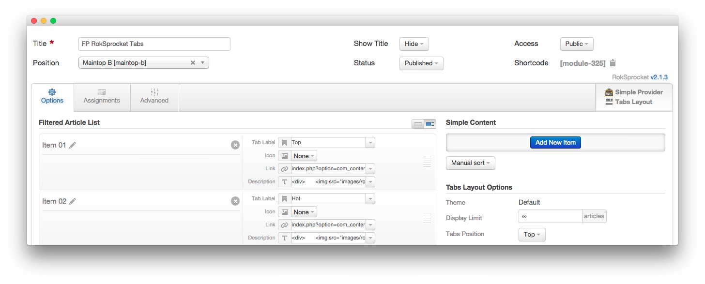

FP RokSprocket Tabs
-----

This area of the page is a **RokSprocket** module utilizing the **Simple** content provider and the **Tabs** layout.

The settings used in our demo are listed below.

### Details

| Option           | Setting               |
| :--------------- | :-------------------- |
| Title            | `FP RokSprocket Tabs` |
| Show Title       | Hide                  |
| Access           | Public                |
| Position         | maintop-b             |
| Status           | Published             |
| Content Provider | Simple                |
| Layout Mode      | Grids                 |

### Simple Content Provider

The **Tab Label**, **Link**, and **Description** fields in each item have been altered. A few examples of these article changes can be found below.

#### Article 1

| Option    | Setting |
| :-----    | :-----  |
| Tab Label | `Top`   |
| Icon      | None    |
| Link      | Custom  |

**Description**

~~~ .html

    

    <h2 class="title">Maximum Performance
    with RokBooster</h2>

    
Speed

    
Combine and consolidate CSS, JavaScript, Fonts
    and Images.

    

    <h2 class="title">Right-To-Left Gantry &amp;
    Template Support</h2>

    
Multi-Language

    
Audacity has basic structural
    support for Right-To-Left languages.

~~~

#### Article 2

| Option    | Setting |
| :-----    | :-----  |
| Tab Label | `Hot`   |
| Icon      | None    |
| Link      | Custom  |

**Description**

~~~ .html

    

    <h2 class="title">Uniquely Design your
    Modular ContentModule
    Design</h2>

    
Style

    
A series of classes to individualize title and background style.

    

    <h2 class="title">Individualize
    your Modular Structure</h2>

    
Layout

    
Individually adjust margins and padding for modules.

~~~

### Layout Options

| Option                | Setting               |
| :-------------------- | :-------------------- |
| Theme                 | Default               |
| Display Limit         | `∞`                   |
| Tabs Position         | Top                   |
| Animation             | Slide and Fade        |
| Autoplay              | Disable               |
| Autoplay Delay        | `5`                   |
| Image Resize          | Disable               |
| Preview Length        | `0`                   |
| Strip HTML Tags       | No                    |
| Default Title         | Default Article Title |
| Default Article Text  | Default Article Text  |
| Default Article Image | Default Article Image |
| Default Link          | Default Article Link  |

### Advanced

| Option              | Setting                       |
| :------------------ | :--------------------         |
| Module Class Suffix | `fp-roksprocket-tabs-maintop` |
