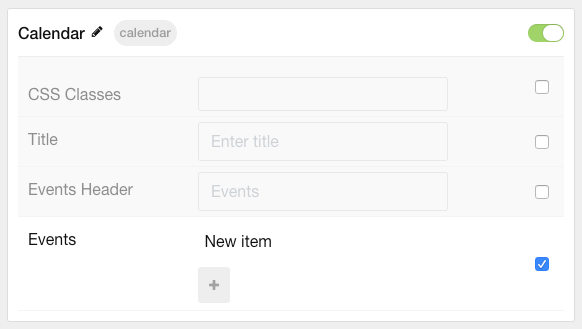
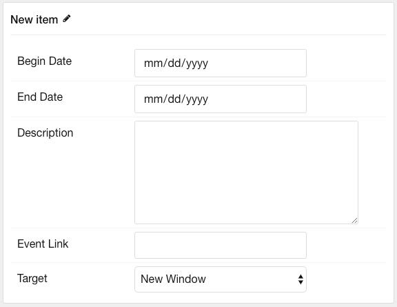

## Introduction

The **Calendar** particle handles displaying dated events on your website. From activity calendars to test times, this particle is a powerful way to keep your visitors in the know.

Here are the topics covered in this guide:

* [Configuration](#configuration)
  * [Main Options](#main-options)
  * [Item Options](#item-options)

## Configuration

### Main Options

These options affect the main area of the particle, and not the individual items within.

| Option        | Description                                                                     |
| :------------ | :------------------------------------------------------------------------------ |
| CSS Classes   | Set the CSS class(es) you would like to have apply at the particle level.       |
| Title         | Enter the title of the particle you would like to have appear on the front end. |
| Events Header | Enter a header to appear over the events.                                       |

### Item Options

These items make up the individual featured items in the particle.

| Option      | Description                                                                      |
| :---------- | :------------------------------------------------------------------------------- |
| Item Name   | Enter a name for the item. This appears on the front end.                        |
| Begin Date  | Select the starting date of the event.                                           |
| End Date    | Select the ending date of the event.                                             |
| Description | Enter the description of the event.                                              |
| Event Link  | Add a URL that the event will link to so visitors can find out more information. |
| Target      | Select the target window for the event link to open in.                          |